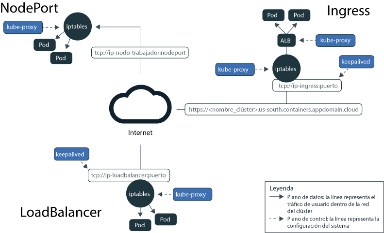
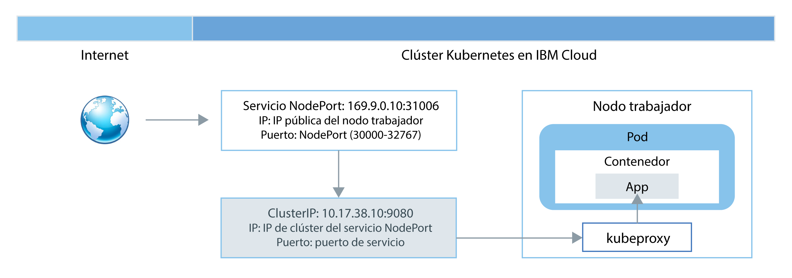
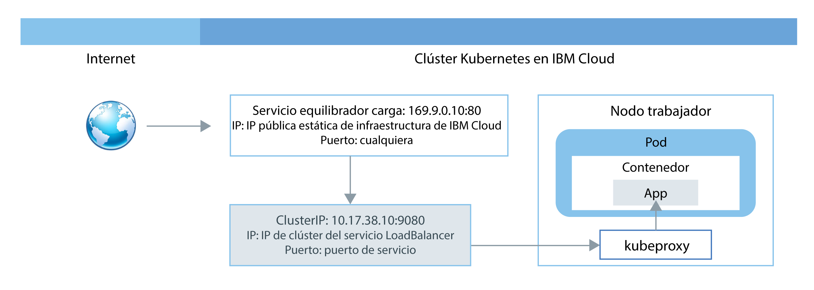
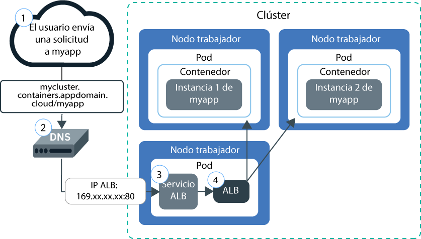

---

copyright:
  years: 2014, 2018
lastupdated: "2018-01-12"

---

{:new_window: target="_blank"}
{:shortdesc: .shortdesc}
{:screen: .screen}
{:pre: .pre}
{:table: .aria-labeledby="caption"}
{:codeblock: .codeblock}
{:tip: .tip}
{:download: .download}

# Planificación del trabajo en red externo
{: #planning}

Cuando crea un clúster, cada clúster debe estar conectado a una VLAN pública. La VLAN pública determina la dirección IP pública que se asigna a un nodo trabajador durante la creación del clúster.
{:shortdesc}

La interfaz de red pública para los nodos trabajadores tanto en clústeres lite como estándares está protegido por las políticas de red de Calico. Estas políticas bloquean la mayor parte del tráfico de entrada de forma predeterminada. Sin embargo, se permite el tráfico de entrada que se necesita para que Kubernetes funcione, así como las conexiones con los servicios NodePort, Loadbalancer e Ingress. Para obtener más información sobre estas políticas, incluido cómo modificarlas, consulte [Políticas de red](cs_network_policy.html#network_policies).

|Tipo de clúster|Gestor de la VLAN pública del clúster|
|------------|------------------------------------------|
|Clústeres lite en {{site.data.keyword.Bluemix_notm}}|{{site.data.keyword.IBM_notm}}|
|Clústeres estándares en {{site.data.keyword.Bluemix_notm}}|En la cuenta de infraestructura de IBM Cloud (SoftLayer)|
{: caption="Responsabilidades de la gestión de VLAN" caption-side="top"}

## Cómo permitir el acceso público a apps
{: #public_access}

Para que una app esté disponible a nivel público en Internet, debe actualizar el archivo de configuración antes de desplegar la app en un clúster.
{:shortdesc}

*Plano de datos de Kubernetes en {{site.data.keyword.containershort_notm}}*

El diagrama muestra cómo Kubernetes lleva el tráfico de red de usuario en {{site.data.keyword.containershort_notm}}. Dependiendo de si ha creado un clúster lite o estándar, existen diversas formas de permitir el acceso a su app desde Internet.

<dl>
<dt><a href="#nodeport" target="_blank">Servicio NodePort</a> (clústeres de tipo lite y estándar)</dt>
<dd>
 <ul>
  <li>Exponga un puerto público en cada nodo trabajador y utilice la dirección IP pública de cualquier nodo trabajador para acceder de forma pública al servicio en el clúster.</li>
  <li>Iptables es una característica de kernel de Linux que equilibra la carga de las solicitudes en los pods de la app y proporciona un direccionamiento de red de alto rendimiento y control de acceso de red.</li>
  <li>La dirección IP pública del nodo trabajador no es permanente. Cuando un nodo trabajador se elimina o se vuelve a crear, se le asigna una nueva dirección IP pública.</li>
  <li>El servicio NodePort es una muy buena opción para probar el acceso público. También se puede utilizar si sólo se necesita acceso público para un breve periodo de tiempo.</li>
 </ul>
</dd>
<dt><a href="#loadbalancer" target="_blank">Servicio LoadBalancer</a> (solo clústeres estándares)</dt>
<dd>
 <ul>
  <li>Cada clúster estándar se suministra con 4 direcciones IP públicas portátiles y 4 direcciones IP privadas portátiles que puede utilizar para crear un equilibrador de carga TCP/UDP externo para la app.</li>
  <li>Iptables es una característica de kernel de Linux que equilibra la carga de las solicitudes en los pods de la app y proporciona un direccionamiento de red de alto rendimiento y control de acceso de red.</li>
  <li>La dirección IP pública portátil asignada al equilibrador de carga es permanente y no cambia cuando un nodo trabajador se vuelve a crear en el clúster.</li>
  <li>Puede personalizar el equilibrador de carga exponiendo cualquier puerto que necesite la app.</li></ul>
</dd>
<dt><a href="#ingress" target="_blank">Ingress</a> (solo clústeres estándares)</dt>
<dd>
 <ul>
  <li>Exponga varias apps en el clúster creando un equilibrador de carga HTTP o HTTPS externo que utilice un punto de entrada público seguro y exclusivo para direccionar las solicitudes entrantes a las apps.</li>
  <li>Puede utilizar una ruta pública para exponer varias apps en el clúster como servicios.</li>
  <li>Ingress consta de tres componentes principales: el recurso de Ingress, el controlador de Ingress y el equilibrador de carga de aplicación.
   <ul>
    <li>El recurso de Ingress define las reglas sobre cómo direccionar y equilibrar la carga de las solicitudes de entrada para una app.</li>
    <li>El controlador de Ingress habilita el equilibrador de carga de aplicación, que escucha solicitudes de entrada de servicio HTTP o HTTPS y reenvía las solicitudes según las reglas definidas para cada recurso de Ingress.</li>
    <li>El equilibrador de carga de aplicación equilibra la carga de las solicitudes en los pods de las apps.
   </ul>
  <li>Utilice Ingress si desea implementar su propio equilibrador de carga con reglas de direccionamiento personalizadas y si necesita terminación SSL para sus apps.</li>
 </ul>
</dd></dl>

Para seleccionar la mejor opción de red para su aplicación, puede seguir este árbol de decisiones:

<map name="networking_map" id="networking_map">
<area href="/docs/containers/cs_nodeport.html#config" alt="Servicio NodePort" shape="circle" coords="52, 283, 45"/>
<area href="/docs/containers/cs_loadbalancer.html#config" alt="Servicio Loadbalancer" shape="circle" coords="247, 419, 44"/>
<area href="/docs/containers/cs_ingress.html#config" alt="Servicio Ingress" shape="circle" coords="445, 420, 45"/>
</map>

 

## Exposición de una app a Internet mediante un servicio NodePort
{: #nodeport}

Exponga un puerto público en el nodo trabajador y utilice la dirección IP pública del nodo trabajador para acceder de forma pública al servicio en el clúster desde Internet.
{:shortdesc}

Cuando expone una app creando un servicio de Kubernetes de tipo NodePort, se asigna al servicio
un NodePort comprendido entre 30000 y 32767 y una dirección IP de clúster interno. El servicio NodePort sirve como punto de entrada externo para las solicitudes entrantes para la app. El NodePort asignado se expone de forma pública en los valores kubeproxy de cada nodo trabajador del clúster. Cada nodo trabajador empieza a escuchar en el NodePort asignado para detectar solicitudes entrantes para el servicio. Para acceder al servicio desde Internet, puede utilizar la dirección IP pública de cualquier nodo trabajador asignado durante la creación del clúster y el NodePort en el formato `<ip_address>:<nodeport>`. Además de la dirección IP pública, está disponible un servicio NodePort en la dirección IP privada de un nodo trabajador.

El siguiente diagrama muestra cómo se dirige la comunicación desde Internet a una app cuando se configura un servicio NodePort.

Tal como se muestra en el diagrama, cuando llega una solicitud al servicio NodePort, se reenvía automáticamente a la IP del clúster interno del servicio y se transfiere desde el componente `kube-proxy` a la dirección IP privada del pod en el que se ha desplegado la app. Solo se puede acceder a la IP del clúster dentro del clúster. Si tiene varias réplicas de la app que se ejecutan en pods diferentes, el componente `kube-proxy` equilibra la carga de las solicitudes entrantes entre todas las réplicas.

**Nota:** La dirección IP pública del nodo trabajador no es permanente. Cuando un nodo trabajador se elimina o se vuelve a crear, se le asigna una nueva dirección IP pública. Puede utilizar el servicio NodePort para probar el acceso público para la app o cuando se necesita acceso público solo durante un breve periodo de tiempo. Si necesita una dirección IP pública estable y más disponibilidad para el servicio, exponga la app utilizando un [servicio LoadBalancer](#loadbalancer) o [Ingress](#ingress).

Para obtener instrucciones sobre cómo crear un servicio de tipo NodePort con {{site.data.keyword.containershort_notm}}, consulte [Configuración del acceso público a una app mediante el tipo de servicio NodePort](cs_nodeport.html#config).

 

## Exposición de una app a Internet mediante un servicio LoadBalancer
{: #loadbalancer}

Exponga un puerto y utilice la dirección IP pública o privada para que el equilibrador de carga acceda a la app.
{:shortdesc}

Cuando se crea un clúster estándar, {{site.data.keyword.containershort_notm}} solicita automáticamente cinco direcciones IP públicas portátiles y cinco direcciones IP privadas portátiles y las suministra a la cuenta de infraestructura de IBM Cloud (SoftLayer) durante la creación de un clúster. Dos de las direcciones IP portátiles, una pública y una privada, se utilizan para los [equilibradores de carga de aplicación de Ingress](#ingress). Se pueden utilizar cuatro direcciones IP públicas portátiles y cuatro direcciones IP privadas portátiles para exponer apps al público mediante la creación de un servicio LoadBalancer.

Cuando se crea un servicio LoadBalancer de Kubernetes en un clúster en una VLAN pública, se crea un equilibrador de carga externo. Una de los cuatro direcciones IP públicas disponibles se asigna al equilibrador de carga. Si no hay ninguna dirección IP pública portátil disponible, la creación del servicio LoadBalancer falla. El servicio LoadBalancer sirve como punto de entrada externo para las solicitudes entrantes para la app. A diferencia de los servicios NodePort, puede asignar cualquier puerto al equilibrador de carga y no está vinculado a ningún rango de puertos determinado. La dirección IP pública portátil asignada al servicio LoadBalancer es permanente y no cambia cuando se elimina o se vuelve a crear un nodo trabajador. Por lo tanto, el servicio LoadBalancer está más disponible que el servicio NodePort. Para acceder al servicio LoadBalancer desde Internet, utilice la dirección IP pública del equilibrador de carga y el puerto asignado en el formato `<ip_address>:<port>`.

El siguiente diagrama muestra cómo se dirige la comunicación de LoadBalancer desde Internet a una app:

Tal como se muestra en el diagrama, cuando llega una solicitud al servicio LoadBalancer, se reenvía automáticamente a la dirección IP del clúster interno asignada al servicio LoadBalancer durante la creación del servicio. Solo se puede acceder a la dirección IP del clúster dentro del clúster. Desde la dirección IP del clúster, las solicitudes entrantes se reenvían al componente `kube-proxy` del nodo trabajador. A continuación, las solicitudes se reenvían a la dirección IP privada del pod en el que se ha desplegado la app. Si tiene varias réplicas de la app que se ejecutan en pods diferentes, el componente `kube-proxy` equilibra la carga de las solicitudes entrantes entre todas las réplicas.

Si utiliza un servicio LoadBalancer, también hay un puerto de nodo disponible en cada dirección IP de cualquier nodo trabajador. Para bloquear el acceso al puerto del nodo mientras está utilizando un servicio LoadBalancer, consulte [Bloqueo del tráfico de entrada](cs_network_policy.html#block_ingress).

Las opciones para las direcciones IP cuando se crea un servicio LoadBalancer son las siguientes:

- Si el clúster está en una VLAN pública, se utiliza una dirección IP pública portátil.
- Si el clúster solo está disponible en una VLAN privada, se utiliza dirección IP privada portátil.
- Puede solicitar una dirección IP privada o pública portátil para un servicio LoadBalancer añadiendo una anotación al archivo de configuración: `service.kubernetes.io/ibm-load-balancer-cloud-provider-ip-type: <public_or_private>`.

Para obtener instrucciones sobre cómo crear un servicio LoadBalancer con {{site.data.keyword.containershort_notm}}, [Configuración del acceso público a una app mediante el tipo de servicio LoadBalancer](cs_loadbalancer.html#config).

 

## Exponga una app en Internet con Ingress
{: #ingress}

Ingress le permite exponer varios servicios en el clúster y ponerlos a disponibilidad pública mediante el uso de un solo punto de entrada público.
{:shortdesc}

En lugar de crear un servicio equilibrador de carga para cada app que desea exponer al público, Ingress proporciona una ruta pública exclusiva que le permite reenviar solicitudes públicas a apps dentro y fuera del clúster en función de sus vías de acceso individuales. Ingress consta de dos componentes principales. El recurso de Ingress define las reglas sobre cómo direccionar solicitudes de entrada para una app. Todos los recursos de Ingress deben estar registrados con el controlador de Ingress que escucha solicitudes de entrada de servicio HTTP o HTTPS y reenvía las solicitudes según las reglas definidas para cada recurso de Ingress.

Cuando se crea un clúster estándar, {{site.data.keyword.containershort_notm}} crea automáticamente un controlador de Ingress altamente disponible para el clúster y le asigna una ruta pública exclusiva con el formato `<cluster_name>.<region>.containers.mybluemix.net`. La ruta pública se enlaza a una dirección IP pública portátil que se suministra a la cuenta de infraestructura de IBM Cloud (SoftLayer) durante la creación del clúster.

El siguiente diagrama muestra cómo se dirige la comunicación de Ingress desde Internet a una app:

Para exponer una app mediante Ingress, debe crear un servicio Kubernetes para la app y registrar este servicio con el controlador de Ingress mediante la definición de un recurso de Ingress. El recurso de Ingress especifica la vía de acceso que desee agregar a la ruta pública para formar un URL exclusivo para la app expuesta, como por ejemplo: `mycluster.us-south.containers.mybluemix.net/myapp`. Cuando especifica esta ruta en el navegador web, tal como se muestra en el diagrama, la solicitud se envía a la dirección IP pública portátil vinculada del controlador de Ingress. El controlador de Ingress comprueba si existe una regla de direccionamiento para la vía de acceso `myapp` en el clúster `mycluster`. Si se encuentra una regla coincidente, la solicitud que incluye la vía de acceso individual se reenvía al pod en el que se ha desplegado la app, teniendo en cuenta las reglas que se han definido en el objeto del recurso de Ingress original. Para que la app procese las solicitudes de entrada, asegúrese de que la app esté a la escucha en la vía de acceso individual que ha definido en el recurso de Ingress.

Puede configurar el controlador de Ingress de modo que gestione el tráfico de entrada de red para las apps en los siguientes casos:

-   Se utiliza el dominio proporcionado por IBM sin terminación TLS
-   Se utiliza el dominio proporcionado por IBM con terminación TLS
-   Se utiliza un dominio personalizado con terminación TLS
-   Se utiliza un dominio personalizado o proporcionado por IBM con terminación TLS para acceder a las apps fuera del clúster
-   Se utiliza un equilibrador de carga privado y un dominio personalizado sin terminación TLS
-   Se utiliza un equilibrador de carga privado y un dominio de cliente sin terminación TLS
-   Se añaden prestaciones al equilibrador de carga de aplicación utilizando anotaciones

Para obtener instrucciones sobre cómo utilizar Ingress con {{site.data.keyword.containershort_notm}}, consulte [Configuración del acceso público a una app utilizando Ingress](cs_ingress.html#ingress).

 

