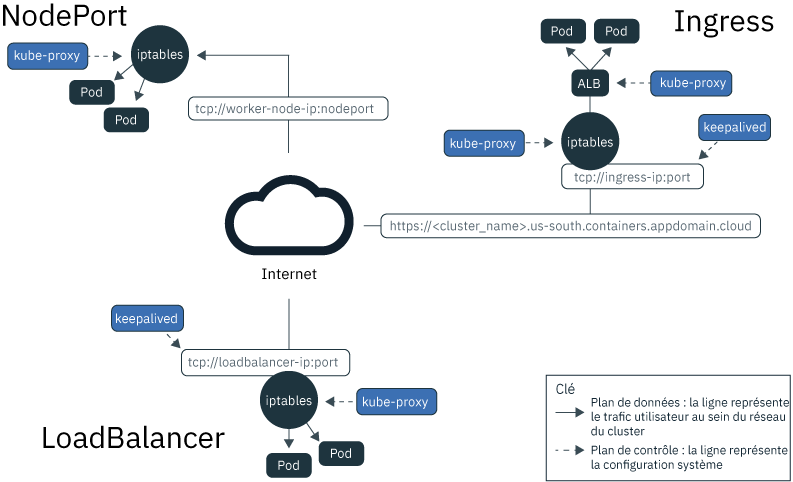

---

copyright:
  years: 2014, 2018
lastupdated: "2018-4-20"

---

{:new_window: target="_blank"}
{:shortdesc: .shortdesc}
{:screen: .screen}
{:pre: .pre}
{:table: .aria-labeledby="caption"}
{:codeblock: .codeblock}
{:tip: .tip}
{:download: .download}

# Planification réseau avec les services NodePort, LoadBalancer ou Ingress
{: #planning}

Lorsque vous créez un cluster Kubernetes dans {{site.data.keyword.containerlong}}, tous les clusters doivent être connectés à un réseau local virtuel (VLAN) public. Le VLAN public détermine l'adresse IP publique affectée à un noeud worker lors de la création du cluster.
{:shortdesc}

L'interface de réseau public des noeuds worker tant dans les clusters gratuits que standard est protégée par les règles réseau Calico. Ces règles bloquent par défaut la plupart du trafic entrant. Le trafic entrant nécessaire au fonctionnement de Kubernetes est toutefois autorisé, comme les connexions aux services NodePort, LoadBalancer et Ingress. Pour plus d'informations sur ces règles, y compris comment les modifier, voir [Règles réseau](cs_network_policy.html#network_policies).

|Type de cluster|Gestionnaire du VLAN public pour le cluster|
|------------|------------------------------------------|
|Clusters gratuits dans {{site.data.keyword.Bluemix_notm}}|{{site.data.keyword.IBM_notm}}|
|Clusters standard dans {{site.data.keyword.Bluemix_notm}}|Vous dans votre compte d'infrastructure IBM Cloud (SoftLayer)|

Pour plus d'informations sur la communication réseau en interne dans le cluster entre les noeuds worker et les pods, voir [Mise en réseau au sein d'un cluster](cs_secure.html#in_cluster_network). Pour plus d'informations sur la sécurisation des connexions d'applications qui s'exécutent dans un cluster Kubernetes vers un réseau sur site ou vers des applications externes au cluster, voir [Configuration de la connectivité VPN](cs_vpn.html).

## Autorisation d'accès public aux applications
{: #public_access}

Pour rendre une application accessible au public sur Internet, vous devez mettre à jour votre fichier de configuration avant de déployer l'application dans un cluster.
{:shortdesc}

*Plan de données Kubernetes dans {{site.data.keyword.containershort_notm}}*

Le diagramme illustre comment Kubernetes véhicule le trafic réseau dans {{site.data.keyword.containershort_notm}}. Selon que vous avez créé un cluster gratuit ou standard, différentes méthodes sont disponibles pour rendre votre application accessible depuis Internet.

<dl>
<dt><a href="cs_nodeport.html#planning" target="_blank">Service NodePort</a> (clusters gratuits et standard)</dt>
<dd>
 <ul>
  <li>Vous pouvez exposer un port public sur chaque noeud worker et utiliser l'adresse IP publique de n'importe quel noeud worker pour accès public à votre service dans le cluster.</li>
  <li>Iptables est une fonction du noyau Linux qui charge les demandes d'équilibrage de charge entre les pods de l'application, assure un routage réseau à hautes performances et fournit un contrôle d'accès réseau.</li>
  <li>L'adresse IP publique du noeud worker n'est pas permanente. Lorsqu'un noeud worker est supprimé ou recréé, une nouvelle adresse IP publique lui est affectée.</li>
  <li>Le service NodePort est idéal pour tester l'accès public. Vous pouvez également l'utiliser si vous n'avez besoin de l'accès public que pendant un bref délai.</li>
 </ul>
</dd>
<dt><a href="cs_loadbalancer.html#planning" target="_blank">Service LoadBalancer</a> (clusters standard uniquement)</dt>
<dd>
 <ul>
  <li>Chaque cluster standard est mis à disposition avec quatre adresses IP publiques portables et quatre adresses IP privées portables que vous pouvez utiliser pour créer un équilibreur de charge TCP/UDP externe pour votre application.</li>
  <li>Iptables est une fonction du noyau Linux qui charge les demandes d'équilibrage de charge entre les pods de l'application, assure un routage réseau à hautes performances et fournit un contrôle d'accès réseau.</li>
  <li>L'adresse IP publique portable affectée à l'équilibreur de charge est permanente et ne change pas en cas de recréation d'un noeud worker dans le cluster.</li>
  <li>Vous pouvez personnaliser votre équilibreur de charge en exposant n'importe quel port dont votre application a besoin.</li></ul>
</dd>
<dt><a href="cs_ingress.html#planning" target="_blank">Ingress</a> (clusters standard uniquement)</dt>
<dd>
 <ul>
  <li>Exposez plusieurs applications dans votre cluster en créant un équilibreur de charge externe HTTP ou HTTPS, TCP ou UDP qui utilise un point d'entrée public sécurisé et unique pour acheminer les demandes entrantes vers vos applications.</li>
  <li>Vous pouvez utiliser une seule route publique pour exposer plusieurs applications dans votre cluster en tant que services.</li>
  <li>Ingress comporte deux composants :
   <ul>
    <li>La ressource Ingress définit les règles de routage et d'équilibrage de charge des demandes entrantes pour une application.</li>
    <li>L'équilibreur de charge d'application (ALB) est à l'écoute des demandes entrantes de service HTTP ou HTTPS, TCP ou UDP et achemine ces demandes aux pods des applications en fonction des règles que vous avez définies dans la ressource Ingress.</li>
   </ul>
  <li>Utilisez Ingress si vous désirez implémenter votre propre équilibreur de charge ALB avec des règles de routage personnalisées et si vous avez besoin d'une terminaison SSL pour vos applications.</li>
 </ul>
</dd></dl>

Pour sélectionner l'option réseau optimale pour votre application, vous pouvez suivre l'arbre de décisions suivant. Pour obtenir des informations sur la planification et des instructions de configuration, cliquez sur l'option de service réseau de votre choix.

<map name="networking_map" id="networking_map">
<area href="/docs/containers/cs_nodeport.html" alt="Service Nodeport" shape="circle" coords="52, 283, 45"/>
<area href="/docs/containers/cs_loadbalancer.html" alt="Service LoadBalancer" shape="circle" coords="247, 419, 44"/>
<area href="/docs/containers/cs_ingress.html" alt="Service Ingress" shape="circle" coords="445, 420, 45"/>
</map>

