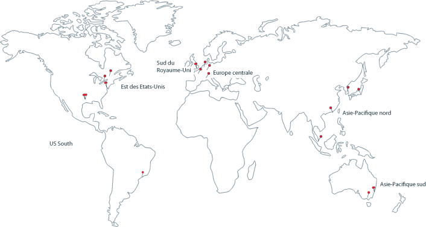

---

copyright:
  years: 2014, 2018
lastupdated: "2018-01-24"

---

{:new_window: target="_blank"}
{:shortdesc: .shortdesc}
{:screen: .screen}
{:pre: .pre}
{:table: .aria-labeledby="caption"}
{:codeblock: .codeblock}
{:tip: .tip}
{:download: .download}

# Régions et emplacements
{{site.data.keyword.Bluemix}} est présent dans le monde entier. Une région est un lieu géographique auquel accède un noeud final. Les emplacements sont des centres de données figurant dans la région. Les services au sein de {{site.data.keyword.Bluemix_notm}} peuvent être disponibles partout ou dans une région spécifique.
{:shortdesc}

[Les régions {{site.data.keyword.Bluemix_notm}}](#bluemix_regions) sont différentes des régions [{{site.data.keyword.containershort_notm}}](#container_regions).



Figure 1. Régions et centres de données {{site.data.keyword.containershort_notm}}

Régions {{site.data.keyword.containershort_notm}} prises en charge :
  * Asie-Pacifique nord
  * Asie-Pacifique sud
  * Europe centrale
  * Sud du Royaume-Uni
  * Est des Etats-Unis
  * Sud des Etats-Unis


## Noeuds finaux d'API de régions {{site.data.keyword.Bluemix_notm}}
{: #bluemix_regions}

Vous pouvez organisez vos ressources entre les services {{site.data.keyword.Bluemix_notm}} en utilisant des régions {{site.data.keyword.Bluemix_notm}}. Par exemple, vous pouvez créer un cluster Kubernetes en utilisant une image Docker privée stockée dans le service {{site.data.keyword.registryshort_notm}} de la même région.
{:shortdesc}

Pour vérifier dans quelle région {{site.data.keyword.Bluemix_notm}} vous vous trouvez, exécutez la commande `bx info` et consultez la zone **Region**.

Vous pouvez accéder aux régions {{site.data.keyword.Bluemix_notm}} en spécifiant le noeud final d'API utilisé lorsque vous vous êtes connecté. Si vous ne spécifiez pas de région, vous êtes automatiquement connecté à la région la plus proche de vous.

{{site.data.keyword.Bluemix_notm}} Noeuds finaux d'API de région avec exemples de commandes de connexion :

  * Sud et Est des Etats-Unis
      ```
      bx login -a api.ng.bluemix.net
      ```
      {: pre}

  * Sydney et Asie-Pacifique nord
      ```
      bx login -a api.au-syd.bluemix.net
      ```
      {: pre}

  * Allemagne
      ```
      bx login -a api.eu-de.bluemix.net
      ```
      {: pre}

  * Royaume-Uni
      ```
      bx login -a api.eu-gb.bluemix.net
      ```
      {: pre}


<br />


## Noeuds finaux d'API et emplacements des régions {{site.data.keyword.containershort_notm}}
{: #container_regions}

En utilisant des régions {{site.data.keyword.containershort_notm}}, vous pouvez créer des clusters  Kubernetes ou y accéder dans une région différente de la région {{site.data.keyword.Bluemix_notm}} où vous êtes connecté. Les noeuds finaux de régions {{site.data.keyword.containershort_notm}} se réfèrent spécifiquement au service {{site.data.keyword.containershort_notm}}, et non pas à {{site.data.keyword.Bluemix_notm}} dans son ensemble.
{:shortdesc}

Vous pouvez accéder à {{site.data.keyword.containershort_notm}} via un noeud final global : `https://containers.bluemix.net/`.
* Pour vérifier dans quelle région {{site.data.keyword.containershort_notm}} vous êtes actuellement,  exécutez la commande `bx cs region`.
* Pour extraire la liste des régions disponibles et de leurs noeuds finaux, exécutez la commande `bx cs regions`.

Pour utiliser l'API avec le noeud final global, dans toutes vos demandes, transmettez le nom de région dans un en-tête `X-Region`.
{: tip}

### Connexion à une autre région du service de conteneur
{: #container_login_endpoints}

Vous souhaiterez peut-être vous connecter à une autre région {{site.data.keyword.containershort_notm}} pour les raisons suivantes :
  * Vous avez créé des services {{site.data.keyword.Bluemix_notm}} ou des images Docker privées dans une région et vous souhaitez les utiliser avec {{site.data.keyword.containershort_notm}} dans une autre région.
  * Vous souhaitez accéder à un cluster dans une région différente de la région {{site.data.keyword.Bluemix_notm}} par défaut à laquelle vous êtes connecté.

</br>

Pour basculer rapidement entre les régions,  exécutez `bx cs region-set`.

### Emplacements disponibles pour le service de conteneur
{: #locations}

Les emplacements sont des centres de données disponibles dans une région.

  | Région | Emplacement | Ville |
  |--------|----------|------|
  | Asie-Pacifique nord | hkg02, seo01, sng01, tok02 | Hong Kong, Séoul, Singapour, Tokyo |
  | Asie-Pacifique sud     | mel01, syd01, syd04        | Melbourne, Sydney |
  | Europe centrale     | ams03, fra02, mil01, par01        | Amsterdam, Frankfurt, Milan, Paris |
  | Sud du Royaume-Uni      | lon02, lon04         | Londres |
  | Est des Etats-Unis      | mon01, tor01, wdc06, wdc07        | Montréal, Toronto, Washington DC |
  | Sud des Etats-Unis     | dal10, dal12, dal13, sao01       | Dallas, São Paolo |

**Remarque **: la région Milan (mil01) n'est disponible que pour les clusters gratuits.

### Utilisation des commandes d'API du service de conteneur
{: #container_api}

Pour intergair avec l'API {{site.data.keyword.containershort_notm}}, entrez le type de commande et ajoutez `/v1/command` au noeud final global.

Exemple d'API `GET /clusters` :
  ```
  GET https://containers.bluemix.net/v1/clusters
  ```
  {: codeblock}

</br>

Pour utiliser l'API avec le noeud final global, dans toutes vos demandes, transmettez le nom de région dans un en-tête `X-Region`. Pour afficher la liste des régions disponibles, exécutez la commande `bx cs regions`.
{: tip}

Pour afficher la documentation sur les commandes d'API, accédez à [https://containers.bluemix.net/swagger-api/](https://containers.bluemix.net/swagger-api/).
