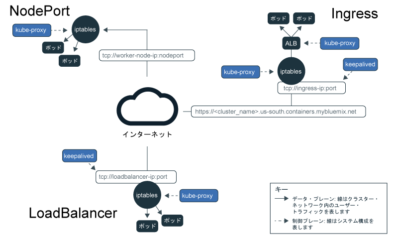

---

copyright:
  years: 2014, 2018
lastupdated: "2018-4-20"

---

{:new_window: target="_blank"}
{:shortdesc: .shortdesc}
{:screen: .screen}
{:pre: .pre}
{:table: .aria-labeledby="caption"}
{:codeblock: .codeblock}
{:tip: .tip}
{:download: .download}

# NodePort、LoadBalancer、または Ingress サービスを使用したネットワーキングの計画
{: #planning}

{{site.data.keyword.containerlong}} で Kubernetes クラスターを作成する場合は、すべてのクラスターをパブリック VLAN に接続する必要があります。 ワーカー・ノードに割り当てられるパブリック IP アドレスは、クラスター作成時にパブリック VLAN によって決定されます。
{:shortdesc}

フリー・クラスターと標準クラスターの両方とも、ワーカー・ノードのパブリック・ネットワーク・インターフェースは Calico ネットワーク・ポリシーによって保護されます。 デフォルトでは、これらのポリシーは大部分のインバウンド・トラフィックをブロックします。 ただし、Kubernetes が機能するために必要なインバウンド・トラフィックは、NodePort、LoadBalancer、Ingress の各サービスへの接続と同様に、許可されます。 ポリシーの変更方法を含め、これらのポリシーの詳細については、[ネットワーク・ポリシー](cs_network_policy.html#network_policies)を参照してください。

|クラスター・タイプ|クラスターのパブリック VLAN の管理者|
|------------|------------------------------------------|
|{{site.data.keyword.Bluemix_notm}} 内のフリー・クラスター|{{site.data.keyword.IBM_notm}}|
|{{site.data.keyword.Bluemix_notm}} 内の標準クラスター|IBM Cloud インフラストラクチャー (SoftLayer) アカウントを使用するお客様|

ワーカー・ノードとポッドの間のクラスター内ネットワーク通信について詳しくは、[クラスター内ネットワーキング](cs_secure.html#in_cluster_network)を参照してください。 Kubernetes クラスター内で実行するアプリをセキュアにオンプレミス・ネットワークに接続する、またはクラスター外のアプリに接続する方法について詳しくは、[VPN 接続のセットアップ](cs_vpn.html)を参照してください。

## アプリへのパブリック・アクセスを許可する方法
{: #public_access}

アプリをインターネットでだれでも利用できるようにするには、アプリをクラスターにデプロイする前に、構成ファイルを更新する必要があります。
{:shortdesc}

*{{site.data.keyword.containershort_notm}} での Kubernetes データ・プレーン*

この図は、{{site.data.keyword.containershort_notm}} で Kubernetes がユーザー・ネットワーク・トラフィックを伝送する方法を示しています。 フリー・クラスターを作成したか標準クラスターを作成したかに応じて、インターネットからアプリにアクセスできるようにする方法は複数あります。

<dl>
<dt><a href="cs_nodeport.html#planning" target="_blank">NodePort サービス</a> (フリー・クラスターと標準クラスター)</dt>
<dd>
 <ul>
  <li>すべてのワーカー・ノードのパブリック・ポートを公開し、ワーカー・ノードのパブリック IP アドレスを使用して、クラスター内のサービスにパブリック・アクセスを行います。</li>
  <li>Iptables は、アプリのポッド間で要求のロード・バランスを取る Linux カーネル・フィーチャーで、パフォーマンスの高いネットワーク・ルーティングを実現し、ネットワーク・アクセス制御を行います。</li>
  <li>ワーカー・ノードのパブリック IP アドレスは永続的なアドレスではありません。 ワーカー・ノードが削除されたり再作成されたりすると、新しいパブリック IP アドレスがワーカー・ノードに割り当てられます。</li>
  <li>NodePort サービスは、パブリック・アクセスのテスト用として優れています。 これはパブリック・アクセスを短時間だけ必要とする場合にも使用できます。</li>
 </ul>
</dd>
<dt><a href="cs_loadbalancer.html#planning" target="_blank">LoadBalancer サービス</a> (標準クラスターのみ)</dt>
<dd>
 <ul>
  <li>どの標準クラスターにも 4 つのポータブル・パブリック IP アドレスと 4 つのポータブル・プライベート IP アドレスがプロビジョンされます。そのアドレスを使用して、アプリ用の外部 TCP/UDP ロード・バランサーを作成できます。</li>
  <li>Iptables は、アプリのポッド間で要求のロード・バランスを取る Linux カーネル・フィーチャーで、パフォーマンスの高いネットワーク・ルーティングを実現し、ネットワーク・アクセス制御を行います。</li>
  <li>ロード・バランサーに割り当てられるポータブル・パブリック IP アドレスは永続的なアドレスであり、クラスター内のワーカー・ノードが再作成されても変更されません。</li>
  <li>アプリで必要なすべてのポートを公開することによってロード・バランサーをカスタマイズすることも可能です。</li></ul>
</dd>
<dt><a href="cs_ingress.html#planning" target="_blank">Ingress</a> (標準クラスターのみ)</dt>
<dd>
 <ul>
  <li>HTTP または HTTPS、TCP、UDP のいずれかで使用できる外部ロード・バランサーを 1 つ作成することによって、クラスターに複数のアプリを公開できます。このロード・バランサーを使用して、保護された固有のパブリック・エントリー・ポイントから着信要求を各アプリにルーティングします。</li>
  <li>1 つのパブリック・ルートを使用してクラスター内の複数のアプリをサービスとして公開できます。</li>
  <li>Ingress は、以下の 2 つのコンポーネントで構成されています。<ul>
    <li>Ingress リソースでは、アプリに対する着信要求のルーティングとロード・バランシングの方法に関するルールを定義します。</li>
    <li>アプリケーション・ロード・バランサー (ALB) は、着信する HTTP または HTTPS、TCP、または UDP のサービス要求を listen し、Ingress リソースに定義されたルールに基づいて、アプリのポッドに要求を転送します。</li>
   </ul>
  <li>カスタム・ルーティング・ルールを使用して独自の ALB を実装する場合、およびアプリに SSL 終端が必要な場合は、Ingress を使用してください。</li>
 </ul>
</dd></dl>

アプリケーションに最適なネットワーキング・オプションを選択するために、以下のデシジョン・ツリーに従うことができます。 計画情報および構成手順については、選択したネットワーク・サービス・オプションをクリックしてください。

<map name="networking_map" id="networking_map">
<area href="/docs/containers/cs_nodeport.html" alt="Nodeport サービス" shape="circle" coords="52, 283, 45"/>
<area href="/docs/containers/cs_loadbalancer.html" alt="LoadBalancer サービス" shape="circle" coords="247, 419, 44"/>
<area href="/docs/containers/cs_ingress.html" alt="Ingress サービス" shape="circle" coords="445, 420, 45"/>
</map>

