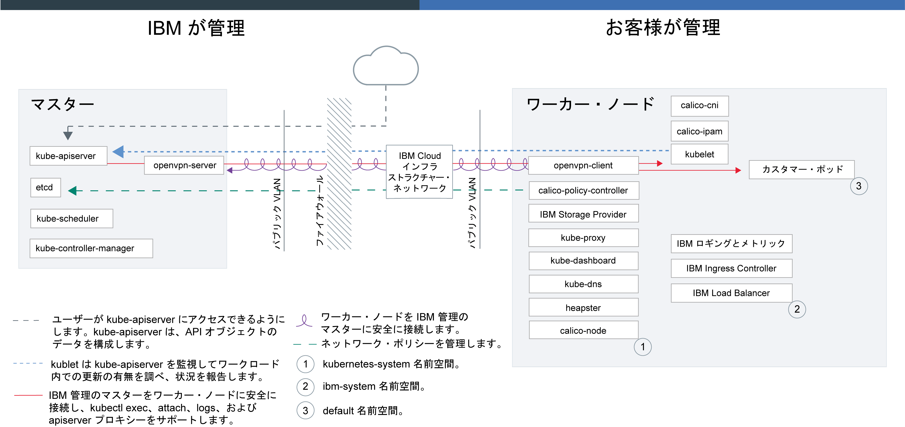

---

copyright:
  years: 2014, 2017
lastupdated: "2017-08-14"

---

{:new_window: target="_blank"}
{:shortdesc: .shortdesc}
{:screen: .screen}
{:pre: .pre}
{:table: .aria-labeledby="caption"}
{:codeblock: .codeblock}
{:tip: .tip} 
{:download: .download}

# {{site.data.keyword.containerlong_notm}} について
{: #cs_ov}

{{site.data.keyword.containershort}} は、Docker と Kubernetes を結合させて、強力なツール、直観的なユーザー・エクスペリエンス、標準装備のセキュリティーと分離機能を提供します。Kubernetes API を使用することによって、独立したコンピュート・ホストから成るクラスター上でのコンテナー化アプリのデプロイメント、操作、スケーリング、モニタリングを自動化することができます。
{:shortdesc}

## Kubernetes の基本
{: #kubernetes_basics}

Kubernetes は Google によって Borg プロジェクトの一部として開発され、2014 年にオープン・ソース・コミュニティーに引き渡されました。Kubernetes は、Google が 15 年以上にわたって続けてきた、コンテナー化されたインフラストラクチャーを実動ワークロード、オープン・ソース・コントリビューション、Docker コンテナー管理ツールと結合させて実行するための調査活動の結果として生まれました。これは機密保護機能のある分離したアプリ・プラットフォームであり、ポータブルで拡張可能性に優れ、フェイルオーバー時の自己修復機能を備えています。
{:shortdesc}

Kubernetes の基本的な仕組みを簡単な用語で説明します。 

<dl>
<dt>クラスター</dt>
<dd>Kubernetes クラスターは、ワーカー・ノードと呼ばれる 1 つ以上の仮想マシンから成ります。
各ワーカー・ノードは、コンテナー化アプリをデプロイ、実行、管理できる場所であるコンピュート・ホストを表します。
ワーカー・ノードは、クラスター内のすべての Kubernetes リソースを一元的に制御してモニターする Kubernetes マスターによって管理されます。
コンテナー化アプリをデプロイすると、Kubernetes マスターが、デプロイメント要件とクラスターで使用できるキャパシティーを考慮してアプリのデプロイ先を決定します。</dd>
<dt>ポッド</dt>
<dd>Kubernetes クラスターにデプロイされる各コンテナー化アプリは、ポッドによってデプロイ、実行、管理されます。
ポッドとは、Kubernetes クラスターにデプロイできる最小単位であり、単体として扱う必要がある複数のコンテナーをグループ化するために使用されます。ほとんどの場合、各コンテナーはそのコンテナー独自のポッドにデプロイされます。ただしアプリでは、コンテナーとその他のヘルパー・コンテナーを 1 つのポッドにデプロイすることによって、同じプライベート IP アドレスを使用してそれらのコンテナーをアドレス指定できるようにする必要がある場合もあります。</dd>
<dt>デプロイメント</dt>
<dd>デプロイメントは Kubernetes リソースであり、デプロイメントの中でコンテナーと、アプリの実行に必要な他の Kubernetes リソース (永続ストレージ、サービス、アノテーションなど) が指定されます。 デプロイメントは Kubernetes デプロイメント・スクリプトで文書化されます。デプロイメントを実行すると、Kubernetes マスターが、クラスターのワーカー・ノードで使用できるキャパシティーを考慮して、指定されたコンテナーをポッドにデプロイします。他の Kubernetes リソースは、デプロイメント・スクリプトの指定どおりに作成され、構成されます。
  
デプロイメントを使用して、ローリング更新中に追加するポッド数や、同時に使用不可にできるポッド数など、アプリの更新のための戦略を定義できます。ローリング更新の実行時には、デプロイメントによって、リビジョンが動作しているかどうかが確認され、障害が検出されるとロールアウトが停止されます。</dd>
<dt>サービス</dt>
<dd>Kubernetes サービスによってポッドのセットをグループ化し、クラスター内の他のサービスからそれらのポッドにアクセスするためのネットワーク接続を提供します。そうすれば、各ポッドの実際のプライベート IP アドレスを公開する必要はありません。
サービスを使用することにより、アプリをクラスター内または公開インターネットで使用可能にできます。
  
Kubernetes の用語について詳しく学びたい場合は、<a href="https://kubernetes.io/docs/tutorials/kubernetes-basics/" target="_blank">Kubernetes Basics のチュートリアル</a>を試してください。</dd>
</dl>

## クラスターを使用する利点
{: #cs_ov_benefits}

各クラスターは、ネイティブの Kubernetes と {{site.data.keyword.IBM_notm}} が追加した機能を提供するための、共有または専用の仮想マシンにデプロイされます。
{:shortdesc}

|利点|説明|
|-------|-----------|
|コンピュート、ネットワーク、およびストレージそれぞれのインフラストラクチャーを分離する、単一テナントの Kubernetes クラスター|<ul><li>ビジネスと開発環境の要件に適合する、カスタマイズされた独自のインフラストラクチャーを作成できる。
</li><li>{{site.data.keyword.BluSoftlayer_full}} によって提供されるリソースを使用して、機密保護機能のある専用の Kubernetes マスター、ワーカー・ノード、仮想ネットワーク、そしてストレージをプロビジョンできる。
</li><li>統合されたセキュアなボリューム・サービスによって、永続データを保管し、Kubernetes ポッド間でデータを共有し、必要に応じてデータを復元することができる。
</li><li>{{site.data.keyword.IBM_notm}} によって継続的にモニターされている、可用性が高く完全に管理された Kubernetes マスター。</li><li>すべてのネイティブ Kubernetes API をフルサポートすることによる利点。
</li></ul>|
|Vulnerability Advisor によるイメージ・セキュリティー・コンプライアンス|<ul><li>保護された独自の Docker プライベート・イメージ・レジストリーをセットアップできる。このレジストリーにイメージが格納され、組織内のすべてのユーザーによって共有される。
</li><li>プライベート {{site.data.keyword.Bluemix_notm}} レジストリー内のイメージを自動スキャンすることによる利点。
</li><li>イメージ内で使用されるオペレーティング・システムに固有の推奨を確認して、潜在的な脆弱性を修正できる。
</li></ul>|
|アプリの自動スケーリング|<ul><li>CPU とメモリーの使用量に基づいてアプリのスケールアップとスケールダウンを行うためのカスタム・ポリシーを定義できる。
</li></ul>|
|クラスターの正常性に関する継続的なモニター|<ul><li>クラスター・ダッシュボードを使用して、クラスター、ワーカー・ノード、およびコンテナー・デプロイメントの正常性を素早く参照して管理できる。</li><li>{{site.data.keyword.monitoringlong}}を使用して詳細な使用量メトリックを確認し、ワークロードに合わせてクラスターを素早く拡張することができる。</li><li>{{site.data.keyword.loganalysislong}}を使用してロギング情報を参照して、クラスター・アクティビティーの詳細を確認できる。</li></ul>|
|正常でないコンテナーの自動リカバリー|<ul><li>ワーカー・ノードにデプロイされたコンテナーの継続的なヘルス・チェック。</li><li>コンテナーに障害が発生した場合の自動再作成。
</li></ul>|
|サービス・ディスカバリーとサービス・マネジメント|<ul><li>アプリ・サービスを一元的に登録してクラスター内の他のアプリがそれらを使用できるようにしつつ、パブリックには公開しない。
</li><li>変化する IP アドレスやコンテナー ID を追跡しなくても登録されたサービスを検出して、使用可能なインスタンスに自動ルーティングできる利点がある。
</li></ul>|
|サービスにパブリック・アクセスできるよう安全に公開する|<ul><li>完全なロード・バランサーと Ingress サポートを備えたプライベート・オーバーレイ・ネットワークを使用することによって、だれでもアクセスできるようにアプリを公開することが可能になり、クラスター内の変化する IP アドレスを追跡しなくても複数のワーカー・ノードの間でワークロードのバランスを保つことができる。
</li><li>インターネットからクラスター内のサービスにアクセスする方法を、パブリック IP アドレス、{{site.data.keyword.IBM_notm}} 提供の経路、独自のカスタム・ドメインの中から選択できる。</li></ul>|
|{{site.data.keyword.Bluemix_notm}} サービスの統合|<ul><li>Watson API、ブロックチェーン、データ・サービス、モノのインターネットなどの {{site.data.keyword.Bluemix_notm}} サービスを統合してアプリに付加的な機能を追加し、クラスター・ユーザーがアプリ開発とコンテナー管理のプロセスを単純化できるようにする。
</li></ul>|
{: caption="表 1. {{site.data.keyword.containerlong_notm}} でクラスターを使用する利点" caption-side="top"}

## クラウド環境
{: #cs_ov_environments}

クラスターとコンテナーをデプロイする {{site.data.keyword.Bluemix_notm}} クラウド環境を選択できます。{:shortdesc}

###{{site.data.keyword.Bluemix_notm}} Public
{: #public_environment}

パブリック・クラウド環境 ([https://console.bluemix.net ](https://console.bluemix.net)) にクラスターをデプロイして、{{site.data.keyword.Bluemix_notm}} カタログ内の任意のサービスに接続できます。

{{site.data.keyword.Bluemix_notm}} Public のクラスターでは、クラスター内のワーカー・ノードのハードウェアの分離レベルを選択できます。使用可能な物理リソースをお客様のクラスター専用にする場合は専用ハードウェアを使用します。一方、{{site.data.keyword.IBM_notm}} の他のお客様のクラスターと物理リソースを共有できるようにする場合は共有ハードウェアを使用します。クラスターの分離が必要でも、使用する他の {{site.data.keyword.Bluemix_notm}} サービスにはそのような分離が必要でない場合は、{{site.data.keyword.Bluemix_notm}} Public 環境の専用クラスターを選択できます。

開始するには、次のオプションのいずれかをクリックします。

    <map name="public_options" id="public_options">
    <area href="container_index.html#clusters" alt="Bluemix の Kubernetes クラスターの概説" title="Bluemix の Kubernetes クラスターの概説" shape="rect" coords="-5, -6, 123, 154" />
    <area href="cs_classic.html#cs_classic" alt="IBM Bluemix Container Service での単一コンテナーとスケーラブル・コンテナーの実行" title="IBM Bluemix Container Service での単一コンテナーとスケーラブル・コンテナーの実行" shape="rect" coords="181, -5, 320, 161" />
    </map>

### {{site.data.keyword.Bluemix_notm}} Dedicated
{: #dedicated_environment}

クラスター (最終ベータ版) または単一コンテナーとスケーラブル・コンテナーを専用クラウド環境 (`https://<my-dedicated-cloud-instance>.bluemix.net`) にデプロイし、同じくそこで実行される事前選択された {{site.data.keyword.Bluemix_notm}} サービスと接続します。

{{site.data.keyword.Bluemix_notm}} Dedicated のクラスターは、{{site.data.keyword.Bluemix_notm}} Public で専用ハードウェアを使用して作成されるクラスターと同じです。使用可能な物理リソースはお客様のクラスター専用であり、{{site.data.keyword.IBM_notm}} の他のお客様のクラスターと共有されません。Public でも Dedicated でも、クラスターの作成にはパブリック API エンドポイントが使用されます。
ただし、最も重要な違いとして、{{site.data.keyword.Bluemix_notm}} Dedicated には以下の違いがあります。

*   ワーカー・ノード、VLAN、サブネットがデプロイされる {{site.data.keyword.BluSoftlayer_notm}} アカウントは、お客様が所有するアカウントではなく、{{site.data.keyword.IBM_notm}} が所有して管理するアカウントです。
*   それらの VLAN とサブネットの仕様は、クラスターの作成時ではなく、Dedicated 環境の作成時に決まります。

クラスターの分離が必要であり、使用する他の {{site.data.keyword.Bluemix_notm}} サービスにもそのような分離が必要な場合は、{{site.data.keyword.Bluemix_notm}} Dedicated 環境をセットアップすることができます。

開始するには、次のオプションのいずれかをクリックします。

    <map name="dedicated_options" id="dedicated_options">
    <area href="#setup_dedicated" alt="Bluemix Dedicated (最終ベータ版) での IBM Bluemix Container Service のセットアップ" title="Bluemix Dedicated (最終ベータ版) での IBM Bluemix Container Service のセットアップ" shape="rect" coords="-5, -15, 100, 153" />
    <area href="container_index.html#dedicated" alt="Bluemix Dedicated (最終ベータ版) の Kubernetes クラスターの概説" title="Bluemix Dedicated (最終ベータ版) の Kubernetes クラスターの概説" shape="rect" coords="153, -10, 276, 182" />
    <area href="cs_classic.html#cs_classic" alt="IBM Bluemix Container Service での単一コンテナーとスケーラブル・コンテナーの実行" title="IBM Bluemix Container Service での単一コンテナーとスケーラブル・コンテナーの実行" shape="rect" coords="317, -11, 436, 188" />
    <area href="container_ha.html#container_group_ui" alt="Bluemix GUI から長期サービスをコンテナー・グループとして実行する" title="Bluemix GUI から長期サービスをコンテナー・グループとして実行する" shape="rect" coords="485, -1, 600, 173" />
    </map>

### クラウド環境間のクラスター管理の違い
{: #env_differences}

|Area|{{site.data.keyword.Bluemix_notm}} Public|{{site.data.keyword.Bluemix_notm}} Dedicated (最終ベータ版)|
|--|--------------|--------------------------------|
|クラスター作成|ライト・クラスターを作成したり、標準クラスターに関する以下の詳細を指定したりします。<ul><li>クラスター・タイプ</li><li>名前</li><li>Kubernetes バージョン</li><li>ロケーション</li><li>マシン・タイプ</li><li>ワーカー・ノードの数</li><li>パブリック VLAN</li><li>プライベート VLAN</li><li>ハードウェア</li></ul>|標準クラスターに関する以下の詳細を指定します。<ul><li>名前</li><li>Kubernetes バージョン</li><li>マシン・タイプ</li><li>ワーカー・ノードの数</li></ul>
**注:** VLAN とハードウェアの設定は、{{site.data.keyword.Bluemix_notm}} 環境の作成時に事前定義されます。
|
|クラスターのハードウェアと所有権|標準クラスターでは、ハードウェアは {{site.data.keyword.IBM_notm}} の他のお客様と共有することも、お客様専用にすることもできます。パブリック VLAN とプライベート VLAN は、お客様の {{site.data.keyword.BluSoftlayer_notm}} アカウントでお客様が所有して管理します。|{{site.data.keyword.Bluemix_notm}} Dedicated のクラスターでは、ハードウェアは常に専用です。パブリック VLAN とプライベート VLAN は、お客様の代わりに IBM が所有して管理します。 {{site.data.keyword.Bluemix_notm}} 環境のロケーションは事前定義されます。|
|クラスターとのサービス・バインディング|[bx cs cluster-service-bind](cs_cluster.html#cs_cluster_service) コマンドを使用して Kubernetes シークレットをクラスターにバインドします。|サービス資格情報の [JSON 鍵ファイル](cs_cluster.html#binding_dedicated)を作成した後に、クラスターにバインドする Kubernetes シークレットをそのファイルから作成します。
|
|ロード・バランサーと Ingress ネットワーキング|標準クラスターのプロビジョニング時には、以下のアクションが自動的に行われます。<ul><li>パブリック・ポータブル・サブネットがクラスターに結合され、{{site.data.keyword.BluSoftlayer_notm}} アカウントに割り当てられます。</li><li>1 つのポータブル・パブリック IP アドレスが可用性の高い Ingress コントローラー用に使用され、固有のパブリック経路が &lt;cluster_name&gt;.containers.mybluemix.net の形式で割り当てられます。この経路を使用して、複数のアプリをパブリックに公開できます。</li><li>ロード・バランサー・サービスを介してアプリをパブリックに公開するために使用できる、4 つのポータブル・パブリック IP アドレスがクラスターに割り当てられます。{{site.data.keyword.BluSoftlayer_notm}} アカウントを介して追加のサブネットを要求できます。</li></ul>|Dedicated アカウントを作成するときには、以下を決定します。<ul><li>必要なサブネットの数</li><li>必要なサブネットのタイプ (ロード・バランサーまたは Ingress のどちらか)。お客様の代わりに {{site.data.keyword.IBM_notm}} がサブネットを作成し、ネットワーク管理タスクを行います。選択内容によっては、Ingress コントローラーが作成されたり、パブリック経路が割り当てられたりする場合があります。
サブネットを作成するための[サポート・チケットを開いて](/docs/support/index.html#contacting-support)追加のサブネットを要求できます。その後に、[`bx cs cluster-subnet-add`](cs_cli_reference.html#cs_cluster_subnet_add) コマンドを使用してクラスターにサブネットを追加します。|
|NodePort ネットワーキング|ワーカー・ノードのパブリック・ポートを公開し、ワーカー・ノードのパブリック IP アドレスを使用して、クラスター内のサービスにパブリック・アクセスを行います。
|ワーカー・ノードのすべてのパブリック IP アドレスがファイアウォールによってブロックされます。ただし、クラスターに追加された {{site.data.keyword.Bluemix_notm}} サービスでは、パブリック IP アドレスまたはプライベート IP アドレスを使用してノード・ポートにアクセスできます。|
|永続ストレージ|ボリュームの[動的プロビジョニング](cs_apps.html#cs_apps_volume_claim)または[静的プロビジョニング](cs_cluster.html#cs_cluster_volume_create)を使用します。|ボリュームの[動的プロビジョニング](cs_apps.html)を使用します。</li></ul>|
|{{site.data.keyword.registryshort_notm}} のイメージ・レジストリー URL|<ul><li>米国南部: <code>registry.ng bluemix.net</code></li><li>英国南部: <code>registry.eu-gb.bluemix.net</code></li><li>中欧 (フランクフルト): <code>registry.eu-de.bluemix.net</code></li><li>オーストラリア (シドニー): <code>registry.au-syd.bluemix.net</code></li></ul>||<ul><li>新しい名前空間には、{{site.data.keyword.Bluemix_notm}} Public に対して定義されたものと同じ地域をベースとするレジストリーを使用してください。</li><li>{{site.data.keyword.Bluemix_notm}} Dedicated で単一コンテナーとスケーラブル・コンテナー用にセットアップされた名前空間の場合は、<code>registry.&lt;dedicated_domain&gt;</code> を使用します。</li></ul>|
|レジストリーへのアクセス|[{{site.data.keyword.containershort_notm}} でのプライベートとパブリックのイメージ・レジストリーの使用](cs_cluster.html#cs_apps_images)にあるオプションを参照してください。|<ul><li>新しい名前空間の場合は、[{{site.data.keyword.containershort_notm}} でのプライベートとパブリックのイメージ・レジストリーの使用](cs_cluster.html#cs_apps_images)にあるオプションを参照してください。</li><li>単一グループとスケーラブル・グループ用にセットアップされた名前空間の場合は、[トークンを使用し、Kubernetes シークレットを作成](cs_dedicated_tokens.html#cs_dedicated_tokens)して認証を受けます。</li></ul>|
{: caption="表 2. {{site.data.keyword.Bluemix_notm}} Public と {{site.data.keyword.Bluemix_notm}} Dedicated の機能の相違点" caption-side="top"}

### {{site.data.keyword.Bluemix_notm}} Dedicated (最終ベータ版) での {{site.data.keyword.containershort_notm}} のセットアップ
{: #setup_dedicated}

管理者が、組織の IBM 管理者 ID とユーザーを Dedicated 環境に追加する必要があります。

始める前に、 [{{site.data.keyword.Bluemix_notm}} Dedicated 環境をセットアップします。](/docs/dedicated/index.html#setupdedicated)

クラスターを使用するように Dedicated 環境をセットアップするには、以下のようにします。

1.  提供された IBM 管理者 ID を環境に追加します。
    1.  {{site.data.keyword.Bluemix_notm}} Dedicated アカウントを選択します。

    2.  メニュー・バーから、**「管理」>「セキュリティー」>「ID およびアクセス」**をクリックします。「ユーザー」ウィンドウに、選択したアカウントのユーザー、E メール・アドレス、状況のリストが表示されます。
    3.  **「ユーザーの招待」**をクリックします。
    4.  **「E メール・アドレスまたは既存の IBMid」**に、E メール・アドレスとして `cfsdl@us.ibm.com` を入力します。
    5.  **「アクセス」**セクションで、**「ID およびアクセス対応サービス」**を展開します。
    6.  **「サービス」**ドロップダウン・リストで、**「{{site.data.keyword.containershort_notm}}」**を選択します。
    7.  **「役割」**ドロップダウン・リストから、**「管理者」**を選択します。
    8.  **「ユーザーの招待」**をクリックします。
2.  [{{site.data.keyword.Bluemix_notm}} アカウントのエンド・ユーザー用に IBMID を作成します。](https://www.ibm.com/account/us-en/signup/register.html)
3.  [前の手順で作成したユーザーを {{site.data.keyword.Bluemix_notm}} アカウントに追加します。](cs_cluster.html#add_users)
4.  Public コンソールから {{site.data.keyword.Bluemix_notm}} Dedicated アカウントにアクセスして、クラスターの作成を開始します。

    1.  IBMID を使用して {{site.data.keyword.Bluemix_notm}} Public コンソール ([https://console.bluemix.net ](https://console.bluemix.net)) にログインします。
    2.  アカウント・メニューから、{{site.data.keyword.Bluemix_notm}} Dedicated アカウントを選択します。コンソールが更新されて、ご使用の {{site.data.keyword.Bluemix_notm}} Dedicated インスタンスに関するサービスと情報が表示されます。
    3.  {{site.data.keyword.Bluemix_notm}} Dedicated インスタンスのカタログから**「コンテナー」**を選択して、**「Kubernetes クラスター」**をクリックします。

次に、クラスターの詳しい作成方法について、[{{site.data.keyword.Bluemix_notm}} Dedicated (最終ベータ版) における GUI からの Kubernetes クラスターの作成](cs_cluster.html#creating_ui_dedicated)を参照してください。

## Kubernetes クラスターが機能する仕組み 
{: #cs_ov_architecture}

Kubernetes クラスターは、1 つ以上の物理マシンまたは仮想マシンで構成されます。これらのマシン、つまりワーカー・ノードは疎結合されて拡張可能であり、Kubernetes マスターによって一元的にモニターされ、管理されます。
Kubernetes マスターは、カスタマー・アカウントごとに IBM によって管理され、高度な回復力と高度な可用性を備えています。
{:shortdesc}

各ワーカー・ノードのセットアップ時には、{{site.data.keyword.IBM_notm}} 管理の Docker エンジン、別個のコンピュート・リソース、ネットワーキング、ボリューム・サービスが用意されます。さらに、分離機能、リソース管理機能、そしてワーカー・ノードのセキュリティー・コンプライアンスを提供する標準装備のセキュリティー機能もあります。ワーカー・ノードは、機密保護機能のある TLS 証明書と openVPN 接続を使用してマスターと通信します。

*図 1. IBM Bluemix Container Service での Kubernetes アーキテクチャーとネットワーキング*

## Docker コンテナー
{: #cs_ov_docker}

Docker は 2013 年に dotCloud によってリリースされたオープン・ソース・プロジェクトです。既存の Linux コンテナー (LXC) 技術のフィーチャーに基づき構築された Docker は、アプリを素早く作成、テスト、デプロイ、拡張するために使用できるソフトウェア・プラットフォームとなっています。
Docker は、アプリの実行に必要なすべてのエレメントを含んだコンテナーと呼ばれる標準化されたユニットに、ソフトウェアをパッケージ化します。
{:shortdesc}

ここでは、次の概念について解説して、Docker の基本的な概念を紹介します。

<dl>
<dt>コンテナー</dt>
<dd>コンテナーとは、アプリとそのすべての従属物をパッケージ化して、アプリを変更せずに環境間で移動して実行できるようにするための標準的な手段です。仮想マシンとは異なり、コンテナーはデバイス、そのオペレーティング・システム、およびその基礎となるハードウェアを仮想化しません。アプリのコード、ランタイム、システム・ツール、ライブラリー、設定値のみがコンテナー内にパッケージ化されます。
コンテナーは、デプロイ先のコンピュート・ホスト上で分離したプロセスとして実行され、ホストのオペレーティング・システムとそのハードウェア・リソースを共用します。
このため、コンテナーは仮想マシンより軽量で移植しやすく、効率的です。
</dd>
<dt>イメージ </dt>
<dd>各コンテナーは Docker イメージに基づいており、イメージのインスタンスと見なされます。イメージは Dockerfile (イメージをビルドするための指示が入ったファイル) と、ビルド成果物 (アプリ、アプリの構成、およびその従属関係) から構築されます。
</dd>
<dt>レジストリー</dt>
<dd>イメージ・レジストリーは Docker イメージを格納、取得、共有する場所です。レジストリーに格納されたイメージは、だれでもアクセスできるものもありますし (パブリック・レジストリー)、小さなグループのユーザーだけにアクセスを限定したものもあります (プライベート・レジストリー)。
{{site.data.keyword.containershort_notm}} では、Docker や Kubernetes を使用する手始めに、最初のコンテナー化アプリをクラスター内に作成するのに使用できる
ibmliberty などのパブリック・イメージを提供しています。エンタープライズ・アプリケーションを作成する場合は、無許可ユーザーが勝手にイメージを使用したり変更したりすることがないように、{{site.data.keyword.Bluemix_notm}} で提供されているものなどのプライベート・レジストリーを使用してください。

  
イメージからコンテナーをデプロイする場合は、そのイメージがパブリックまたはプライベートのイメージ・レジストリーに格納されていることを確認する必要があります。
</dd>
</dl>

### コンテナーを使用する主な利点
{: #container_benefits}

<dl>
<dt>コンテナーは迅速</dt>
<dd>コンテナーは、開発チームおよび実動チームのための、標準化された環境を提供することにより、システム管理を簡素化します。エンジンの軽量ランタイムにより、需要の変化に応じて、素早いスケールアップおよびスケールダウンが可能です。コンテナーは、さまざまなオペレーティング・システム・プラットフォームおよび基礎となるインフラストラクチャーを管理する複雑さをなくすのに役立ちます。コンテナーは、どのインフラストラクチャーでもすべてのアプリを素早く確実にデプロイして実行するのに役立ちます。</dd>
<dt>コンテナーは小さい</dt>
<dd>1 つの仮想マシンで必要とされる量のスペースに、複数のコンテナーを入れることができます。
</dd>
<dt>コンテナーはポータブル</dt>
<dd>別のイメージをベースとして使用して、別のコンテナー用のイメージをビルドします。イメージの処理の大部分の作業は他の人にまかせ、そのイメージを自分の用途に合わせて微調整します。ステージング環境から実稼働環境に素早くアプリのコードをマイグレーションすることもできます。マイグレーション・プロセスは、Delivery Pipeline または UrbanCode Deploy などのツールで自動化できます。</dd>
</dl>

## コンテナーの不正使用
{: #cs_terms}

お客様は {{site.data.keyword.containershort_notm}} を不正使用してはいけません。{:shortdesc}

不正使用には、以下が含まれます。

*   不法行為
*   マルウェアの配布や実行
*   {{site.data.keyword.containershort_notm}} に損害を与えたり、他のお客様による {{site.data.keyword.containershort_notm}} の使用に干渉したりすること
*   他のサービスやシステムに損害を与えたり、他のお客様による使用に干渉したりすること
*   サービスまたはシステムに対する無許可アクセス
*   サービスまたはシステムに対する無許可の変更
*   他のお客様の権利を侵害すること

すべての使用条件については、[クラウド・サービスのご利用条件](/docs/navigation/notices.html#terms)を参照してください。
