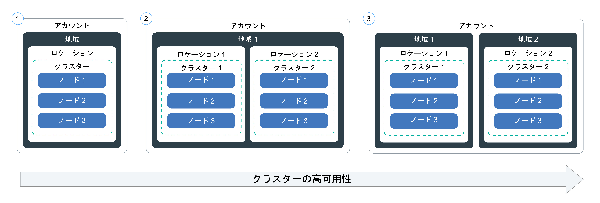
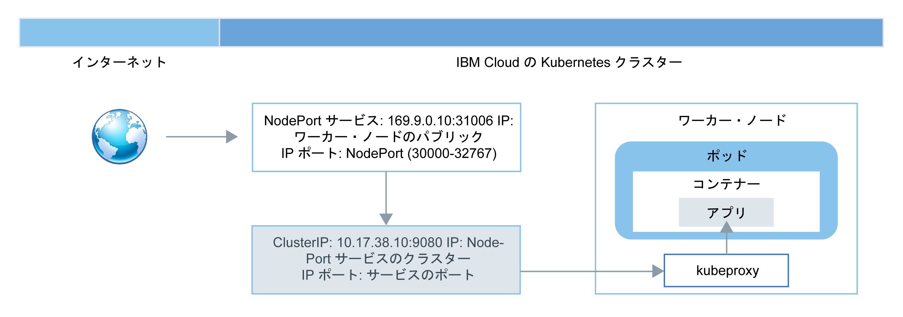
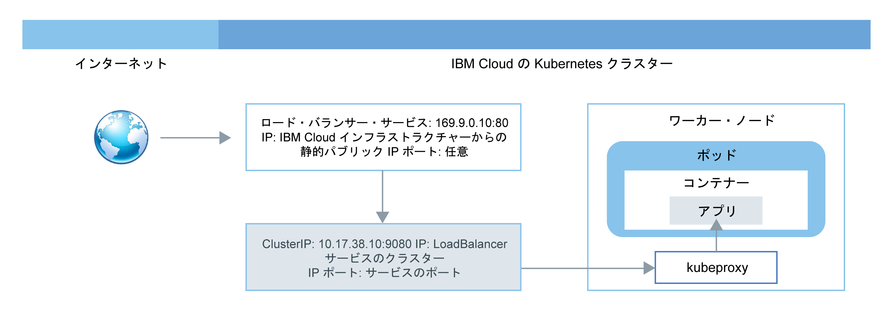

---

copyright:
  years: 2014, 2017
lastupdated: "2017-08-14"

---

{:new_window: target="_blank"}
{:shortdesc: .shortdesc}
{:screen: .screen}
{:pre: .pre}
{:table: .aria-labeledby="caption"}
{:codeblock: .codeblock}
{:tip: .tip} 
{:download: .download}


# クラスターとアプリの計画
{: #cs_planning}

{{site.data.keyword.containershort_notm}} には、組織の機能要件と非機能要件を満たす Kubernetes クラスターを構成してカスタマイズするために、いくつかのオプションが用意されています。
それらの構成の中には、クラスター作成後には変更できないものもあります。それらの構成を事前に理解しておくと、メモリー、ディスク・スペース、IP アドレスなどのすべてのリソースを開発チームのために確保する上で役立ちます。
{:shortdesc}

## ライト・クラスターと標準クラスターの比較
{: #cs_planning_cluster_type}

ライト・クラスターを作成して Kubernetes の機能を確認、テストすることができます。また、標準クラスターを作成して Kubernetes の全機能を利用したアプリの実装を開始することもできます。
{:shortdesc}

|特性|ライト・クラスター|標準クラスター|
|---------------|-------------|-----------------|
|[{{site.data.keyword.Bluemix_notm}} Public で使用可能](cs_ov.html#public_environment)|||
|[クラスター内のプライベート・ネットワーキング](#cs_planning_private_network)|||
|[NodePort サービスによるパブリック・アプリ・アクセス](#cs_nodeport)|||
|[ユーザー・アクセス管理](cs_cluster.html#cs_cluster_user)|||
|[クラスターとアプリからの {{site.data.keyword.Bluemix_notm}} サービス・アクセス](cs_cluster.html#cs_cluster_service)|||
|[ストレージ用のワーカー・ノードのディスク・スペース](#cs_planning_apps_storage)|||
|[NFS ファイル・ベースの永続ストレージのボリューム](#cs_planning_apps_storage)|||
|[ロード・バランサー・サービスによるパブリック・アプリ・アクセス](#cs_loadbalancer)|||
|[Ingress サービスによるパブリック・アプリ・アクセス](#cs_ingress)|||
|[ポータブル・パブリック IP アドレス](cs_apps.html#cs_cluster_ip_subnet)|||
|[{{site.data.keyword.Bluemix_notm}} Dedicated (最終ベータ版) で使用可能](cs_ov.html#dedicated_environment)|||
{: caption="表 1. ライト・クラスターと標準クラスターとの違い" caption-side="top"}

## クラスター構成
{: #cs_planning_cluster_config}

標準クラスターを使用してアプリの可用性を向上させることができます。
セットアップを複数のワーカー・ノードとクラスターに分散させると、ユーザーがダウン時間を経験する可能性が低くなります。
負荷分散や負荷分離などの組み込み機能により、ホスト、ネットワーク、アプリで想定される障害に対する回復力を強化できます。
{:shortdesc}

クラスターのセットアップ方法を以下にまとめます。下に行くほど可用性が高くなります。


[](https://console.bluemix.net/docs/api/content/containers/images/cs_cluster_ha_roadmap.png)

1.  複数のワーカー・ノードを配置した 1 つのクラスター

2.  同じ地域内の別々のロケーションで実行される 2 つのクラスター (ロケーションごとに複数のワーカー・ノードを配置)
3.  別々の地域で実行される 2 つのクラスター (地域ごとに複数のワーカー・ノードを配置)

これらの技法を利用してクラスターの可用性を高める方法について、このあと説明します。

<dl>
<dt>アプリ・インスタンスを分散させるために十分な数のワーカー・ノードを含める</dt>
<dd>クラスターごとに複数のワーカー・ノードにコンテナーを分散して配置できるようにしておけば、アプリ開発者は高可用性の実現に向けて作業することができます。
3 つのワーカー・ノードがあれば、1 つのワーカー・ノードの故障時にも、アプリの使用が中断されることはありません。
[{{site.data.keyword.Bluemix_notm}} GUI](cs_cluster.html#cs_cluster_ui) または [CLI](cs_cluster.html#cs_cluster_cli) からクラスターを作成するときに、含めるワーカー・ノードの数を指定できます。
Kubernetes では、1 つのクラスター内に作成できるワーカー・ノードの最大数に制限があります。詳しくは、[ワーカー・ノードとポッドの割り当て量 ](https://kubernetes.io/docs/admin/cluster-large/) を参照してください。
<pre class="codeblock">
<code>bx cs cluster-create --location &lt;dal10&gt; --workers 3 --public-vlan &lt;my_public_vlan_id&gt; --private-vlan &lt;my_private_vlan_id&gt; --machine-type &lt;u1c.2x4&gt; --name &lt;my_cluster&gt;</code>
</pre>
</dd>
<dt>複数のクラスターにアプリを分散させる</dt>
<dd>それぞれに複数のワーカー・ノードを配置した複数のクラスターを作成します。
1 つのクラスターで障害が発生した場合でも、各ユーザーは別のクラスターにデプロイされているアプリにアクセスできます。
<p>クラスター 1:</p>
<pre class="codeblock">
<code>bx cs cluster-create --location &lt;dal10&gt; --workers 3 --public-vlan &lt;my_public_vlan_id&gt; --private-vlan &lt;my_private_vlan_id&gt; --machine-type &lt;u1c.2x4&gt; --name &lt;my_cluster1&gt;</code>
</pre>
<p>クラスター 2:</p>
<pre class="codeblock">
<code>bx cs cluster-create --location &lt;dal12&gt; --workers 3 --public-vlan &lt;my_public_vlan_id&gt; --private-vlan &lt;my_private_vlan_id&gt; --machine-type &lt;u1c.2x4&gt;  --name &lt;my_cluster2&gt;</code>
</pre>
</dd>
<dt>異なる地域にある複数のクラスターにアプリを分散させる</dt>
<dd>アプリケーションをそれぞれ異なる地域にある複数のクラスターに分散させた場合は、ユーザーのいる地域に基づいてロード・バランシングを行うことができます。
ある地域でクラスター、ハードウェア、またはロケーション全体がダウンした場合は、別のロケーションにデプロイされているコンテナーにトラフィックが転送されます。
<p><strong>重要:</strong> カスタム・ドメインを構成した後、以下のコマンドを使用してクラスターを作成することもできます。</p>
<p>ロケーション 1:</p>
<pre class="codeblock">
<code>bx cs cluster-create --location &lt;dal10&gt; --workers 3 --public-vlan &lt;my_public_vlan_id&gt; --private-vlan &lt;my_private_vlan_id&gt; --machine-type &lt;u1c.2x4&gt; --name &lt;my_cluster1&gt;</code>
</pre>
<p>ロケーション 2:</p>
<pre class="codeblock">
<code>bx cs cluster-create --location &lt;ams03&gt; --workers 3 --public-vlan &lt;my_public_vlan_id&gt; --private-vlan &lt;my_private_vlan_id&gt; --machine-type &lt;u1c.2x4&gt; --name &lt;my_cluster2&gt;</code>
</pre>
</dd>
</dl>


## ワーカー・ノードの構成
{: #cs_planning_worker_nodes}

Kubernetes クラスターは、仮想マシンのワーカー・ノードで構成され、Kubernetes マスターによって一元的にモニターされて管理されます。
クラスター管理者は、ワーカー・ノードのクラスターをどのようにセットアップするかを決定して、
クラスター内のアプリをデプロイして実行するためのすべてのリソースをクラスター・ユーザーのために用意する必要があります。
{:shortdesc}

標準クラスターを作成する時、ワーカー・ノードは {{site.data.keyword.BluSoftlayer_full}} 内で自動的に順番に配置されて {{site.data.keyword.Bluemix_notm}} にセットアップされます。すべてのワーカー・ノードには、
固有のワーカー・ノード ID とドメイン名が割り当てられます。
それらをクラスターの作成後に変更してはいけません。
選択するハードウェア分離のレベルに応じて、ワーカー・ノードを共有ノードまたは専用ノードとしてセットアップできます。それぞれのワーカー・ノードは特定のマシン・タイプでプロビジョンされ、ワーカー・ノードにデプロイされるコンテナーが使用できる vCPU の数、メモリー、ディスク・スペースがそのタイプによって決まります。
Kubernetes では、1 つのクラスター内に作成できるワーカー・ノードの最大数に制限があります。詳しくは、[ワーカー・ノードとポッドの割り当て量 ](https://kubernetes.io/docs/admin/cluster-large/) を参照してください。


### ワーカー・ノード用のハードウェア
{: #shared_dedicated_node}

どのワーカー・ノードも、物理ハードウェア上の仮想マシンとしてセットアップされます。
{{site.data.keyword.Bluemix_notm}} Public で標準クラスターを作成する場合は、基礎ハードウェアを {{site.data.keyword.IBM_notm}} の複数のお客様で共有する (マルチテナンシー) か、自分専用にする (単一テナンシー) かを選択する必要があります。
{:shortdesc}

マルチテナント・セットアップの場合、CPU やメモリーなどの物理リソースは、同じ物理ハードウェアにデプロイされたすべての仮想マシン間で共有されます。
各仮想マシンが独立して実行できるようにするため、仮想マシン・モニター (ハイパーバイザーとも呼ばれる) が物理リソースを個別のエンティティーにセグメント化し、それらを専用リソースとして仮想マシンに割り振ります (ハイパーバイザー分離)。


単一テナント・セットアップの場合は、すべての物理リソースがユーザー専用になります。
同じ物理ホスト上に複数のワーカー・ノードを仮想マシンとしてデプロイできます。
マルチテナント・セットアップと同様、各ワーカー・ノードには、使用可能な物理リソースがハイパーバイザーによって割り振られます。


共有ノードは通常、専用ノードよりも安価です。基盤となるハードウェアのコストを複数のお客様が共同で分担するからです。
ただし、共有ノードにするか専用ノードにするかを決定する際は、社内の法務部門に相談して、アプリ環境で必要になるインフラストラクチャーの分離とコンプライアンスのレベルを検討することをお勧めします。


ライト・クラスターを作成する場合、ワーカー・ノードは {{site.data.keyword.IBM_notm}} {{site.data.keyword.BluSoftlayer_notm}} アカウントに共有ノードとして自動的にプロビジョンされます。

{{site.data.keyword.Bluemix_notm}} Dedicated でクラスターを作成する場合は、単一テナント・セットアップのみが使用されるので、すべての物理リソースはお客様専用になります。
同じ物理ホスト上に複数のワーカー・ノードを仮想マシンとしてデプロイします。


## デプロイメント
{: #highly_available_apps}

セットアップ時に複数のワーカー・ノードとクラスターを分散させる範囲を広くすればするほど、各ユーザーがアプリのダウン時間を経験する可能性は低くなります。
{:shortdesc}

アプリのセットアップ方法を以下にまとめます。下に行くほど可用性が高くなります。


[](../api/content/containers/images/cs_app_ha_roadmap.png)

1.  n+2 個のポッドをレプリカ・セットで管理するデプロイメント。
2.  n+2 個のポッドをレプリカ・セットで管理し、同じ場所の複数のノードに分散させる
(アンチアフィニティー) デプロイメント。
3.  n+2 個のポッドをレプリカ・セットで管理し、別々の場所に存在する複数のノードに分散させる (アンチアフィニティー) デプロイメント。

4.  n+2 個のポッドをレプリカ・セットで管理し、別々の地域に存在する複数のノードに分散させる (アンチアフィニティー) デプロイメント。


アプリの可用性を高めるための技法について詳しく説明します。

<dl>
<dt>デプロイメントとレプリカ・セットを使用してアプリとその依存項目をデプロイする</dt>
<dd>デプロイメントとは、アプリのすべてのコンポーネントや依存項目を宣言するために使用できる Kubernetes リソースです。
必要なすべての手順やコンポーネントの作成順序ではなくそれぞれの単一コンポーネントを記述することにより、
稼働中のアプリの動作に集中できます。
</br>
複数のポッドをデプロイすると、デプロイメントのレプリカ・セットが自動的に作成されます。そのレプリカ・セットによってポッドがモニターされ、いつでも望ましい数のポッドが稼働状態になります。
ポッドがダウンすると、応答しなくなったポッドがレプリカ・セットによって新しいポッドに置き換えられます。
</br></br>
デプロイメントを使用して、ローリング更新中に追加するポッドの数や、1 度に使用不可にできるポッドの数など、アプリの更新戦略を定義できます。
ローリング更新の実行時には、デプロイメントによって、リビジョンが動作しているかどうかが確認され、障害が検出されるとロールアウトが停止されます。
</br>
デプロイメントを使用すれば、異なるフラグを設定した複数のリビジョンを同時にデプロイすることもできるので、まずデプロイメントをテストしてから実稼働環境にプッシュするかどうかを決める、といったことが可能になります。
</br></br>
すべてのデプロイメントで、デプロイされたリビジョンが追跡されます。
こうしたリビジョンの履歴を使用して、更新が予期したとおりに機能しない場合に、以前のバージョンにロールバックできます。
</dd>
<dt>アプリのワークロードに十分なレプリカ数、プラス 2 を組み込む</dt>
<dd>アプリの可用性と耐障害性を高めるために、予想されるワークロードを処理する最低限の数のレプリカに加えて予備のレプリカを組み込むことを検討してください。
ポッドがクラッシュし、そのポッドがレプリカ・セットによってまだリカバリーされていない状況でも、予備のレプリカでワークロードを処理できます。

2 つが同時に障害を発生した場合に対応できるようにするには、2 つ余分にレプリカを組み込みます。このセットアップは N+2 パターンです。N は着信ワークロードを処理するレプリカの数、+2 は追加の 2 つのインスタンスです。</dd>
<dt>複数のノードにポッドを分散させる (アンチアフィニティー)</dt>
<dd>デプロイメントを作成する時に、各ポッドを同じワーカー・ノードにデプロイすることもできます。
複数のポッドが同じワーカー・ノード上に存在するセットアップは、アフィニティーまたはコロケーションといいます。
ワーカー・ノードの障害からアプリを保護するために、デプロイメントによって複数のワーカー・ノードにポッドを分散させることもできます。そのためには、<strong>podAntiAffinity</strong> オプションを使用します。
このオプションを使用できるのは標準クラスターの場合に限られます。
</br></br>
<strong>注:</strong> 以下の YAML ファイルでは、それぞれのポッドを異なるワーカー・ノードにデプロイします。定義したレプリカの数がクラスター内の使用できるワーカー・ノードの数より多い場合は、アンチアフィニティーの要件を満たせる数のレプリカだけがデプロイされます。
それ以外のレプリカは、ワーカー・ノードがさらにクラスターに追加されるまで保留状態になります。
<pre class="codeblock">
<code>apiVersion: v1
kind: Service
metadata:
name: wasliberty
labels:
app: wasliberty
spec:
ports:
    # the port that this service should serve on
  - port: 9080
  selector:
    app: wasliberty
  type: NodePort 
---
apiVersion: extensions/v1beta1
kind: Deployment
metadata:
  name: wasliberty
spec:
  replicas: 3
  template:
    metadata:
      labels:
        app: wasliberty
      annotations:
        scheduler.alpha.kubernetes.io/affinity: >
            {
              "podAntiAffinity": {
"requiredDuringSchedulingIgnoredDuringExecution": [
                  {
                    "labelSelector": {
"matchExpressions": [
                        {
                          "key": "app",
                          "operator": "In",
                          "values": ["wasliberty"]
                        }
                      ]
                    },
                    "topologyKey": "kubernetes.io/hostname"
                 }
                ]
               }
             }
    spec:
      containers:
      - name: wasliberty
        image: registry.&lt;region&gt;.bluemix.net/ibmliberty
        ports:
          - containerPort: 9080</code></pre>

</dd>
<dt>複数の場所にポッドを分散させる</dt>
<dd>ある場所や領域の障害からアプリを保護するために、別の場所の 2 つ目のクラスターを作成し、デプロイメントの YAML を使用してアプリの重複レプリカ・セットをデプロイできます。クラスターの前に共有ルートとロード・バランサーを追加して、複数の場所や領域にワークロードを分散させることもできます。
クラスター間でルートを共有する方法について詳しくは、<a href="https://console.bluemix.net/docs/containers/cs_cluster.html#cs_cluster" target="_blank">クラスターの高可用性</a>を参照してください。
詳しくは、<a href="https://console.bluemix.net/docs/containers/cs_planning.html#cs_planning_cluster_config" target="_blank">可用性の高いデプロイメント</a>のオプションを参照してください。</dd>
</dl>

### 最小限のアプリのデプロイメント
{: #minimal_app_deployment}

ライト・クラスターまたは標準クラスターへの基本的なアプリのデプロイメントには、一般には以下の構成要素が含まれます。
{:shortdesc}

<a href="../api/content/containers/images/cs_app_tutorial_components1.png"></a>

最小アプリのための構成スクリプトの例
```
apiVersion: extensions/v1beta1
kind: Deployment
metadata:
  name: ibmliberty
spec:
  replicas: 1
  template:
    metadata:
      labels:
        app: ibmliberty
    spec:
      containers:
      - name: ibmliberty
        image: registry.<region>.bluemix.net/ibmliberty:latest
---
apiVersion: v1
kind: Service
metadata:
  name: ibmliberty-service
  labels:
    app: ibmliberty
spec:
  selector:
    run: ibmliberty
  type: NodePort
  ports:
   - protocol: TCP
     port: 9080
```
{: codeblock}

## プライベート・ネットワーキング
{: #cs_planning_private_network}

ワーカー・ノードとポッド間のセキュア・プライベート・ネットワーク通信は、プライベート仮想ローカル・エリア・ネットワーク (プライベート VLAN とも呼ばれる) で実現されます。
VLAN では、ワーカー・ノードとポッドをまとめたグループが同じ物理ワイヤーに接続されているかのように構成されます。
{:shortdesc}

クラスターを作成すると、すべてのクラスターはプライベート VLAN に自動的に接続されます。ワーカー・ノードに割り当てられるプライベート IP アドレスは、クラスター作成時にプライベート VLAN によって決定されます。


|クラスター・タイプ|クラスターのプライベート VLAN の管理者|
|------------|-------------------------------------------|
|{{site.data.keyword.Bluemix_notm}} Public 内のライト・クラスター|{{site.data.keyword.IBM_notm}}|
|{{site.data.keyword.Bluemix_notm}} Public 内の標準クラスター|{{site.data.keyword.BluSoftlayer_notm}} アカウント内のユーザー<p>**ヒント:** アカウント内のすべての VLAN にアクセスできるようにするには、[VLAN スパンニング ](https://knowledgelayer.softlayer.com/procedure/enable-or-disable-vlan-spanning) をオンにします。</p>|
|{{site.data.keyword.Bluemix_notm}} Dedicated 内の標準クラスター|{{site.data.keyword.IBM_notm}}|
{: caption="表 2. プライベート VLAN 管理の責任" caption-side="top"}

ワーカー・ノードにデプロイされるすべてのポッドにも、プライベート IP アドレスが割り当てられます。ポッドには 172.30.0.0/16 のプライベート・アドレス範囲で IP が割り当てられ、ワーカー・ノード間でのみルーティングされます。
競合を避けるために、ご使用のワーカー・ノードと通信するノードにはこの IP 範囲を使用しないでください。
ワーカー・ノードとポッドは、プライベート IP アドレスを使用してプライベート・ネットワーク上で安全に通信できます。
しかし、ポッドが異常終了した場合やワーカー・ノードを再作成する必要がある場合は、新しいプライベート IP アドレスが割り当てられます。


高可用性が必要とされるアプリの変化するプライベート IP アドレスを追跡することは難しいため、組み込みの Kubernetes サービス・ディスカバリー機能を使用してクラスター内のプライベート・ネットワーク上のクラスター IP サービスとしてアプリを公開することができます。Kubernetes サービスによってポッドのセットをグループ化し、クラスター内の他のサービスからそれらのポッドにアクセスするためのネットワーク接続を提供します。そうすれば、各ポッドの実際のプライベート IP アドレスを公開する必要はありません。
クラスター IP サービスを作成すると、10.10.10.0/24 のプライベート・アドレス範囲からそのサービスにプライベート IP アドレスが割り当てられます。ポッドのプライベート・アドレス範囲と同様に、この IP 範囲はワーカー・ノードと通信するノードには使用しないでください。
この IP アドレスはクラスター内でのみアクセス可能です。
インターネットからこの IP アドレスにアクセスすることはできません。
同時に、サービスの DNS 参照エントリーが作成され、クラスターの kube-dns コンポーネントに保管されます。
DNS エントリーには、サービスの名前、サービスが作成された名前空間、割り当てられたプライベート・クラスター IP アドレスへのリンクが設定されます。


クラスター IP サービスの背後に属するポッドにクラスター内のアプリがアクセスする必要がある場合は、サービスに割り当てられたプライベート・クラスター IP アドレスを使用するか、サービスの名前を使用して要求を送信します。サービスの名前を使用した場合、名前は kube-dns コンポーネント内で検索され、サービスのプライベート・クラスター IP アドレスにルーティングされます。
要求がサービスに到達すると、ポッドのプライベート IP アドレスやデプロイ先のワーカー・ノードに関係なく、すべての要求がサービスによってポッドに等しく転送されます。


クラスター IP タイプのサービスを作成する方法について詳しくは、[Kubernetes サービス ](https://kubernetes.io/docs/concepts/services-networking/service/#publishing-services---service-types) を参照してください。


## パブリック・ネットワーキング
{: #cs_planning_public_network}

クラスターを作成するときには、すべてのクラスターをパブリック VLAN に接続する必要があります。ワーカー・ノードに割り当てられるパブリック IP アドレスは、クラスター作成時にパブリック VLAN によって決定されます。
{:shortdesc}

パブリック VLAN は {{site.data.keyword.BluSoftlayer_notm}} ファイアウォールによって保護されます。このファイアウォールは、デフォルトでは、インターネットとの間のインバウンド接続もアウトバウンド接続も許可しません。
Kubernetes マスターとワーカー・ノードは、それぞれに割り当てられたパブリック IP アドレスを使用してパブリック VLAN で通信しますが、インターネットからはアクセスできません。


|クラスター・タイプ|クラスターのパブリック VLAN の管理者|
|------------|------------------------------------------|
|{{site.data.keyword.Bluemix_notm}} Public 内のライト・クラスター|{{site.data.keyword.IBM_notm}}|
|{{site.data.keyword.Bluemix_notm}} Public 内の標準クラスター|{{site.data.keyword.BluSoftlayer_notm}} アカウント内のユーザー|
|{{site.data.keyword.Bluemix_notm}} Dedicated 内の標準クラスター|{{site.data.keyword.IBM_notm}}|
{: caption="表 3. VLAN 管理の責任" caption-side="top"}

ライト・クラスターを作成したか、または標準クラスターを作成したかに応じて、アプリを公開するためのオプションを次の中から選択できます。

-   [NodePort タイプのサービス](#cs_nodeport) (ライト・クラスターと標準クラスター)
-   [LoadBalancer タイプのサービス](#cs_loadbalancer) (標準クラスターのみ)
-   [Ingress](#cs_ingress) (標準クラスターのみ)


### NodePort タイプのサービスを使用してアプリをインターネットに公開する
{: #cs_nodeport}

ワーカー・ノードのパブリック・ポートを公開し、ワーカー・ノードのパブリック IP アドレスを使用して、クラスター内のサービスにパブリック・アクセスを行います。
{:shortdesc}

[](https://console.bluemix.net/docs/api/content/containers/images/cs_nodeport.png)

NodePort タイプの Kubernetes サービスを作成してアプリを公開する場合は、30000 から 32767 の範囲の NodePort と内部クラスター IP アドレスがサービスに割り当てられます。NodePort サービスは、アプリに対する着信要求のための外部エントリー・ポイントとして機能します。
割り当てられた NodePort は、クラスター内の各ワーカー・ノードの kubeproxy 設定でパブリックに公開されます。
どのワーカー・ノードも、割り当てられた NodePort で、サービスに対する着信要求の listen を開始します。
インターネットからサービスにアクセスするには、クラスター作成時に割り当てられたワーカー・ノードのパブリック IP アドレスと NodePort を使用します。その形式は、`<ip_address>:<nodeport>` です。

パブリック要求は、NodePort サービスに到達すると、サービスの内部クラスター IP に自動的に転送され、さらに kubeproxy コンポーネントから、アプリがデプロイされたポッドのプライベート IP アドレスに転送されます。クラスター IP はクラスター内でのみアクセス可能です。
複数の異なるポッドでアプリの複数のレプリカが実行されている場合、kubeproxy コンポーネントはすべてのレプリカ間で着信要求のロード・バランシングを行います。


**注:** ワーカー・ノードのパブリック IP アドレスは永続的なアドレスでないということに留意してください。ワーカー・ノードが削除されたり再作成されたりすると、新しいパブリック IP アドレスがワーカー・ノードに割り当てられます。
NodePort タイプのサービスは、アプリのパブリック・アクセスをテストする場合や、パブリック・アクセスが短期間だけ必要な場合に使用できます。
安定的なパブリック IP アドレスとサービスのさらなる可用性が必要な場合は、[LoadBalancer タイプのサービス](#cs_loadbalancer)か [Ingress タイプのサービス](#cs_ingress)を使用してアプリを公開してください。

{{site.data.keyword.containershort_notm}} NodePort タイプのサービスを作成する方法について詳しくは、[NodePort タイプのサービスを使用してアプリへのパブリック・アクセスを構成する方法](cs_apps.html#cs_apps_public_nodeport)を参照してください。


### LoadBalancer タイプのサービスを使用してアプリをインターネットに公開する
{: #cs_loadbalancer}

ポートを公開し、ロード・バランサーのパブリック IP アドレスを使用してアプリにアクセスします。


[](https://console.bluemix.net/docs/api/content/containers/images/cs_loadbalancer.png)

標準クラスターを作成する時、{{site.data.keyword.containershort_notm}} は自動的に 5 つのポータブル・パブリック IP アドレスを要求し、クラスター作成時にそれらをお客様の {{site.data.keyword.BluSoftlayer_notm}} アカウントにプロビジョンします。ポータブル IP アドレスの 1 つは [Ingress コントローラー](#cs_ingress)用として使用されます。
4 つのポータブル・パブリック IP アドレスを使用して LoadBalancer タイプのサービスを作成することにより、アプリをパブリックに公開できます。

LoadBalancer タイプの Kubernetes サービスを作成する時、外部ロード・バランサーが 1 つ作成され、使用可能な 4 つのパブリック IP アドレスのうちの 1 つがそれに割り当てられます。使用可能なポータブル・パブリック IP アドレスがなければ、LoadBalancer サービスの作成は失敗します。LoadBalancer サービスは、アプリに対する着信要求のための外部エントリー・ポイントとして機能します。NodePort タイプのサービスとは異なり、任意のポートをロード・バランサーに割り当て可能で、特定のポート範囲に縛られません。LoadBalancer サービスに割り当てられるポータブル・パブリック IP アドレスは永続的なアドレスであり、ワーカー・ノードが削除されたり再作成されたりしても変更されないので、LoadBalancer サービスの可用性は NodePort サービスより高くなります。インターネットから LoadBalancer サービスにアクセスするには、ロード・バランサーのパブリック IP アドレスと割り当てられたポートを、`<ip_address>:<port>` という形式で使用します。

パブリック要求は、LoadBalancer サービスに到達すると、サービス作成時に LoadBalancer サービスに割り当てられた内部クラスター IP アドレスに自動的に転送されます。クラスター IP アドレスはクラスター内でのみアクセス可能です。
着信要求はクラスター IP アドレスからさらにワーカー・ノードの kubeproxy コンポーネントに転送された後、アプリがデプロイされたポッドのプライベート IP アドレスに転送されます。
複数の異なるポッドでアプリの複数のレプリカが実行されている場合、kubeproxy コンポーネントはすべてのレプリカ間で着信要求のロード・バランシングを行います。


{{site.data.keyword.containershort_notm}} で LoadBalancer タイプのサービスを作成する方法について詳しくは、[ロード・バランサー・タイプのサービスを使用してアプリへのパブリック・アクセスを構成する方法](cs_apps.html#cs_apps_public_load_balancer)を参照してください。


### Ingress を使用してインターネットにアプリを公開する
{: #cs_ingress}

Ingress ではクラスターの複数のサービスを公開し、単一のパブリック・エントリー・ポイントを使用してそれらのサービスを使用可能にできます。


[](https://console.bluemix.net/docs/api/content/containers/images/cs_ingress.png)

公開するアプリごとにロード・バランサー・サービスを作成する方法とは異なり、Ingress では固有のパブリック経路が提供されるので、クラスター内外のアプリに対するパブリック要求を、それらのアプリの固有のパスに基づいて転送できます。Ingress には主なコンポーネントが 2 つあります。
Ingress リソースは、アプリの着信要求のルーティング方法に関するルールを定義します。Ingress リソースはすべて Ingress コントローラーに登録する必要があります。Ingress コントローラーは、着信する HTTP または HTTPS のいずれかのサービス要求を listen し、Ingress リソースごとに定義されたルールに基づいて要求を転送します。

標準クラスターを作成すると、{{site.data.keyword.containershort_notm}} がそのクラスター用に可用性の高い Ingress コントローラーを自動で作成し、固有のパブリック経路を `<cluster_name>.<region>.containers.mybluemix.net` という形式で割り当てます。
パブリック経路は、クラスター作成時にお客様の {{site.data.keyword.BluSoftlayer_notm}} アカウントにプロビジョンされたポータブル・パブリック IP アドレスにリンクされます。

Ingress 経由でアプリを公開するには、アプリ用に Kubernetes サービスを作成し、Ingress リソースを定義することによってこのサービスを Ingress リソースに登録する必要があります。Ingress リソースは、公開されるアプリの固有の URL を形成するためにパブリック経路に付加するパスを指定します。例えば、`mycluster.us-south.containers.mybluemix.net/myapp`のようになります。 この経路を Web ブラウザーに入力すると、要求が Ingress コントローラーのリンク先ポータブル・パブリック IP アドレスに送信されます。Ingress コントローラーは、`mycluster` クラスター内の `myapp` パスのルーティング・ルールが存在するかどうかを検査します。
一致するルールが見つかれば、アプリがデプロイされているポッドに、個々のパスを含んだ要求が転送されます。このとき、元の Ingress リソース・オブジェクトで定義されたルールが考慮されます。
アプリが着信要求を処理するためには、Ingress リソースで定義した個々のパスでアプリが listen するようにしておく必要があります。


次のようなシナリオで、アプリの着信ネットワーク・トラフィックを管理するよう Ingress コントローラーを構成できます。


-   IBM 提供ドメインを使用 (TLS 終端なし)
-   IBM 提供ドメインと TLS 証明書を使用 (TLS 終端あり)
-   カスタム・ドメインと TLS 証明書を使用して TLS 終端を実行
-   IBM 提供ドメインまたはカスタム・ドメインと TLS 証明書を使用して、クラスター外のアプリにアクセス

-   アノテーションを使用して Ingress コントローラーに機能を追加する

{{site.data.keyword.containershort_notm}} での Ingress の使用方法について詳しくは、[Ingress コントローラーを使用してアプリへのパブリック・アクセスを構成する方法](cs_apps.html#cs_apps_public_ingress)を参照してください。


## ユーザー・アクセス管理
{: #cs_planning_cluster_user}

クラスターへのアクセス権限を組織内の他のユーザーに付与することができます。そのようにすると、許可ユーザーだけがクラスターの作業を行い、アプリをクラスターにデプロイすることができます。
{:shortdesc}

詳しくは、[{{site.data.keyword.containershort_notm}} でのユーザーとクラスターへのアクセス権限の管理](cs_cluster.html#cs_cluster_user)を参照してください。


## イメージ・レジストリー
{: #cs_planning_images}

Docker イメージは、作成するすべてのコンテナーの基礎となるものです。イメージは、Dockerfile (イメージをビルドするための指示が入ったファイル) から作成されます。Dockerfile の別個に保管されている指示の中で、ビルド成果物 (アプリ、アプリの構成、その従属関係) が参照されることもあります。{:shortdesc}

イメージは通常、レジストリーに保管されます。だれでもアクセスできるレジストリー (パブリック・レジストリー) を使用することも、小さなグループのユーザーだけにアクセスを限定したレジストリー (プライベート・レジストリー) をセットアップすることもできます。
Docker Hub などのパブリック・レジストリーは、Docker および Kubernetes の入門として最初のコンテナー化アプリをクラスター内に作成する時に使用できます。
しかしエンタープライズ・アプリケーションを作成する場合は、許可されていないユーザーが勝手にイメージを使用したり変更したりすることがないように、 {{site.data.keyword.registryshort_notm}} で提供されているようなプライベート・レジストリーを使用してください。
プライベート・レジストリーはクラスター管理者がセットアップする必要があります。プライベート・レジストリーにアクセスするための資格情報をクラスター・ユーザーに提供する必要があるためです。


{{site.data.keyword.containershort_notm}} では、複数のレジストリーを使用してアプリをクラスターにデプロイできます。


|レジストリー|説明|利点|
|--------|-----------|-------|
|[{{site.data.keyword.registryshort_notm}}](/docs/services/Registry/index.html)|このオプションを使用すると、保護された独自の Docker イメージ・リポジトリーを {{site.data.keyword.registryshort_notm}} 内にセットアップできます。そこでイメージを安全に保管してクラスター・ユーザー間で共有することができます。
|<ul><li>アカウント内でイメージへのアクセス権限を管理できる。</li><li>{{site.data.keyword.IBM_notm}} 提供のイメージとサンプル・アプリ ({{site.data.keyword.IBM_notm}} Liberty など) を親イメージとして使用し、それに独自のアプリ・コードを追加できる。</li><li>Vulnerability Advisor によるイメージの潜在的脆弱性の自動スキャン (それらの脆弱性を修正するための OS 固有の推奨事項を含む)。
</li></ul>|
|他のプライベート・レジストリー|[imagePullSecret ](https://kubernetes.io/docs/concepts/containers/images/) を作成して、既存のプライベート・レジストリーをクラスターに接続します。このシークレットは、レジストリーの URL と資格情報を Kubernetes シークレットに安全に保存するために使用されます。
|<ul><li>ソース (Docker Hub、組織が所有するレジストリー、または他のプライベート・クラウド・レジストリー) と無関係に既存のプライベート・レジストリーを使用できる。
</li></ul>|
|パブリック Docker Hub|このオプションは、Dockerfile に変更を加える必要がなく、Docker Hub にある既存のパブリック・イメージを直接使用する場合に使用します。
<p>**注:** このオプションは組織のセキュリティー要件 (アクセス管理、脆弱性スキャン、アプリ・プライバシーなど) を満たさない可能性があるということに留意してください。</p>|<ul><li>クラスターの追加セットアップが不要。</li><li>さまざまなオープン・ソース・アプリケーションを含めることができる。
</li></ul>|
{: caption="表 4. パブリック・イメージ・レジストリーおよびプライベート・イメージ・レジストリーのオプション" caption-side="top"}

イメージ・レジストリーをセットアップすると、クラスター・ユーザーがイメージを使用してクラスターにアプリをデプロイできるようになります。


パブリック・レジストリーまたはプライベート・レジストリーにアクセスする方法、イメージを使用してコンテナーを作成する方法について詳しくは、[{{site.data.keyword.containershort_notm}} でのプライベートとパブリックのイメージ・レジストリーの使用](cs_cluster.html#cs_apps_images)を参照してください。


## 永続データ・ストレージ
{: #cs_planning_apps_storage}

コンテナーは、設計上、存続時間が短期です。しかし、コンテナーにフェイルオーバーが発生した場合でもデータが永続するように、そしてコンテナー間でデータを共有するために、複数のオプションから選択することができます。
{:shortdesc}

[](https://console.bluemix.net/docs/api/content/containers/images/cs_planning_apps_storage.png)

|オプション|説明|
|------|-----------|
|オプション 1: `/emptyDir` を使用して、ワーカー・ノード上の使用可能なディスク・スペースを使用してデータを永続させる<p>この機能は、ライト・クラスターと標準クラスターで使用可能です。</p>|このオプションでは、ポッドに割り当てられたワーカー・ノードのディスク・スペースに空のボリュームを作成できます。
そのポッド内のコンテナーは、そのボリュームに対する読み取りと書き込みを行うことができます。
ボリュームが特定の 1 つのポッドに割り当てられているので、レプリカ・セット内の他のポッドとデータを共有することはできません。
<p>`/emptyDir` ボリュームとそのデータは、割り当てられたポッドがワーカー・ノードから永久に削除されるときに削除されます。
</p><p>**注:** ポッド内のコンテナーがクラッシュした場合でも、ボリューム内のデータはワーカー・ノードで引き続き使用できます。</p><p>詳しくは、[Kubernetes ボリューム ](https://kubernetes.io/docs/concepts/storage/volumes/) を参照してください。</p>|
|オプション 2: 使用するデプロイメント用に NFS ベースの永続ストレージをプロビジョンするための永続ボリューム請求を行う
<p>このフィーチャーを使用できるのは、標準クラスターの場合に限られます。</p>|このオプションにより、無制限の数の NFS ファイル共有と永続ボリュームで構成される、アプリとコンテナー・データのための永続ストレージを持つことができます。
NFS ベースのファイル・ストレージの要求を出すには、[永続ボリューム請求](cs_apps.html)を作成します。{{site.data.keyword.containershort_notm}} には、ストレージのサイズ、IOPS、ボリュームに対する読み取りと書き込みの許可を定義する、事前定義されたストレージ・クラスが用意されています。
永続ボリューム請求を行う際に、これらのストレージ・クラスの中から選択できます。
永続ボリューム請求をサブミットすると、{{site.data.keyword.containershort_notm}} が NFS ベースのファイル・ストレージでホストされる永続ボリュームを動的にプロビジョニングします。[ 永続ボリューム請求をボリュームとしてポッドにマウントし](cs_apps.html#cs_apps_volume_claim)、ポッド内のコンテナーがボリュームに対する読み取りと書き込みを行えるようにすることができます。
永続ボリュームは、同じレプリカ・セット内のポッドの間で、または同じクラスター内の他のポッドと共有することができます。
<p>コンテナーがクラッシュしたとき、またはポッドがワーカー・ノードから削除されたときでも、データは削除されないので、ボリュームをマウントした他のポッドから引き続きアクセスできます。
永続ボリューム請求は永続ストレージでホストされますが、バックアップはありません。データのバックアップが必要な場合は、手動バックアップを作成してください。</p><p>**注:** 永続 NFS ファイル共有ストレージは、月単位で課金されます。クラスター用に永続ストレージをプロビジョンして即時にそれを削除したときは、短時間しか使用しない場合でも、永続ストレージの月額課金を支払う必要があります。
</p>|
|オプション 3: {{site.data.keyword.Bluemix_notm}} データベース・サービスをポッドにバインドする<p>この機能は、ライト・クラスターと標準クラスターで使用可能です。</p>|このオプションの場合、{{site.data.keyword.Bluemix_notm}} データベース・クラウド・サービスを使用して、データを永続させ、アクセスすることができます。
{{site.data.keyword.Bluemix_notm}} サービスをクラスター内の名前空間にバインドすると、Kubernetes シークレットが作成されます。
Kubernetes シークレットは、サービスへの URL、ユーザー名、パスワードなど、サービスに関する機密情報を保持します。
シークレットをシークレット・ボリュームとしてポッドにマウントして、シークレット内の資格情報を使用することによりサービスにアクセスできます。
シークレット・ボリュームを他のポッドにマウントすることにより、ポッド間でデータを共有することもできます。
<p>コンテナーがクラッシュしたとき、またはポッドがワーカー・ノードから削除されたときでも、データは削除されないので、シークレット・ボリュームをマウントした他のポッドから引き続きアクセスできます。
</p><p>{{site.data.keyword.Bluemix_notm}} のデータベース・サービスのほとんどは、少量のデータ用のディスク・スペースを無料で提供しているため、機能をテストすることができます。
</p><p>{{site.data.keyword.Bluemix_notm}} サービスをポッドにバインドする方法について詳しくは、[{{site.data.keyword.containershort_notm}} でのアプリ用 {{site.data.keyword.Bluemix_notm}} サービスの追加](cs_apps.html#cs_apps_service)を参照してください。</p>|
{: caption="表 5. Kubernetes クラスターでのデプロイメントのための永続データ・ストレージのオプション" caption-side="top"}


## ヘルス・モニター
{: #cs_planning_health}

Kubernetes と Docker の標準機能を使用して、クラスターとそのクラスターにデプロイされたアプリの正常性をモニターできます。
{:shortdesc}
<dl>
<dt>{{site.data.keyword.Bluemix_notm}} のクラスター詳細ページ</dt>
<dd>{{site.data.keyword.containershort_notm}} には、クラスターの正常性と能力、そしてクラスター・リソースの使用方法に関する情報が表示されます。
この GUI を使用して、クラスターのスケールアウト、永続ストレージの作業、{{site.data.keyword.Bluemix_notm}} サービス・バインディングによるクラスターへの付加機能の追加を行うことができます。
クラスターの詳細ページを表示するには、**{{site.data.keyword.Bluemix_notm}} の「ダッシュボード」**に移動して、クラスターを選択します。</dd>
<dt>Kubernetes ダッシュボード</dt>
<dd>Kubernetes ダッシュボードは、ワーカー・ノードの正常性の検討、Kubernetes リソースの検索、コンテナー化アプリのデプロイ、ロギングとモニタリング情報に基づくアプリのトラブルシューティングを行うために使用できる、管理 Web インターフェースです。Kubernetes ダッシュボードにアクセスする方法について詳しくは、[{{site.data.keyword.containershort_notm}} での Kubernetes ダッシュボードの起動](cs_apps.html#cs_cli_dashboard)を参照してください。</dd>
<dt>Docker ログ</dt>
<dd>組み込みの Docker ロギング機能を活用して、標準の STDOUT と STDERR 出力ストリームのアクティビティーを検討することができます。
詳しくは、[Kubernetes クラスターで実行されるコンテナーのコンテナー・ログの表示](/docs/services/CloudLogAnalysis/containers/logging_containers_other_logs.html#logging_containers_collect_data)を参照してください。</dd>
<dt>ロギングとモニタリング</dt>
<dd>{{site.data.keyword.containershort_notm}} は、標準クラスター用の付加的なモニター機能とロギング機能をサポートします。ログとメトリックは、Kubernetes クラスターを作成したときにログインした {{site.data.keyword.Bluemix_notm}} スペースにあります。<ul><li>コンテナーのメトリックはクラスターにデプロイされたすべてのコンテナーについて自動的に収集されます。
これらのメトリックが送信され、 Grafana で使用できるようになります。メトリックについて詳しくは、[{{site.data.keyword.containershort_notm}} のモニター](/docs/services/cloud-monitoring/containers/analyzing_metrics_bmx_ui.html#analyzing_metrics_bmx_ui)を参照してください。<p>Grafana ダッシュボードにアクセスするには、`https://metrics.<region>.bluemix.net` に移動します。クラスターを作成した{{site.data.keyword.Bluemix_notm}} 組織とスペースを選択します。
</p></li><li>コンテナーのログは、コンテナー外部からモニターされて転送されます。コンテナーのログには Kibana ダッシュボードを使用してアクセスできます。ロギングについて詳しくは、[{{site.data.keyword.containershort_notm}} のロギング](/docs/services/CloudLogAnalysis/index.html#getting-started-with-cla)を参照してください。<p>Kibana ダッシュボードにアクセスするには、`https://logging.<region>.bluemix.net` に移動します。クラスターを作成した{{site.data.keyword.Bluemix_notm}} 組織とスペースを選択します。
</p></li></ul></dd>
</dl>

### その他のヘルス・モニター・ツール
{: #concept_xrh_dhj_wz}

他のツールを構成してロギング機能とモニター機能を追加することができます。

<dl>
<dt>Prometheus</dt>
<dd>Prometheus は、特に Kubernetes のために設計されたモニタリング、ロギング、およびアラートのためのオープン・ソースのツールで、Kubernetes のロギング情報に基づいてクラスター、ワーカー・ノード、およびデプロイメントの正常性に関する詳細情報を取得するために使用されます。
セットアップ方法について詳しくは、[{{site.data.keyword.containershort_notm}} とのサービスの統合](#cs_planning_integrations)を参照してください。</dd>
</dl>


## 統合
{: #cs_planning_integrations}

さまざまな外部サービスと {{site.data.keyword.Bluemix_notm}} カタログにあるサービスを {{site.data.keyword.containershort_notm}} の標準クラスターで使用できます。{:shortdesc}

<table summary="アクセシビリティーについての要約">
<caption>表 6. Kubernetes でのクラスターとアプリの統合オプション</caption>
<thead>
<tr>
<th>サービス</th>
<th>説明</th>
</tr>
</thead>
<tbody>
<tr>
<td>IBM Blockchain</td>
<td>{{site.data.keyword.containerlong_notm}} の Kubernetes クラスターに、だれでも利用できる IBM Blockchain 開発環境をデプロイします。この環境を使用して、独自のブロックチェーン・ネットワークを開発してカスタマイズし、トランザクションの履歴を記録するために変更不可能な台帳を共有するアプリをデプロイできます。詳しくは、<a href="https://ibm-blockchain.github.io" target="_blank">Develop in a cloud sandbox
IBM Blockchain Platform </a> を参照してください。</td>
</tr>
<tr>
<td>Istio</td>
<td>Istio は Kubernetes などのクラウド・オーケストレーション・プラットフォームでマイクロサービス・ネットワーク (サービス・メッシュともいう) の接続、保護、管理、モニターを行うための方法を開発者に提供するオープン・ソース・サービスです。
Istio はネットワーク・トラフィックの管理、マイクロサービス間のロード・バランシング、アクセス・ポリシーの実施、サービス・メッシュでのサービス ID の検証といった機能を提供します。
{{site.data.keyword.containershort_notm}} の Kubernetes クラスターに Istio をインストールするには、Istio 資料の<a href="https://istio.io/docs/tasks/installing-istio.html" target="_blank">インストール・トピック </a> を参照してください。Istio を Kubernetes で使用する方法を示す開発者用のサンプル・ジャーニーについては、<a href="https://developer.ibm.com/code/journey/manage-microservices-traffic-using-istio/" target="_blank">Manage microservices traffic using Istio </a> を参照してください。</td>
</tr>
<tr>
<td>Prometheus</td>
<td>Prometheus は、特に Kubernetes のために設計されたモニタリング、ロギング、およびアラートのためのオープン・ソースのツールで、Kubernetes のロギング情報に基づいてクラスター、ワーカー・ノード、およびデプロイメントの正常性に関する詳細情報を取得するために使用されます。
クラスター内で実行中のすべてのコンテナーの CPU、メモリー、I/O、およびネットワークのアクティビティーが収集されて、クラスターのパフォーマンスとワークロードをモニターするためにカスタム・クエリーやアラートで使用できます。
<p>Prometheus を使用するには次の手順を実行します。</p>
<ol>
<li><a href="https://github.com/coreos/prometheus-operator/tree/master/contrib/kube-prometheus" target="_blank">CoreOS の説明 </a> に従って Prometheus をインストールします。<ol>
<li>export コマンドを実行するときには、kube-system 名前空間を使用します。
<p><code>export NAMESPACE=kube-system hack/cluster-monitoring/deploy</code></p></li>
</ol>
</li>
<li>Prometheus がクラスターにデプロイされた後に、<code>prometheus.kube-system:30900</code> を参照するように Grafana の Prometheus データ・ソースを編集します。</li>
</ol>
</td>
</tr>
<tr>
<td>Weave Scope</td>
<td>Weave Scope は、Kubernetes クラスター内のリソース (サービス、ポッド、コンテナー、プロセス、ノードなど) のビジュアル図を表示します。Weave Scope は CPU とメモリーのインタラクティブ・メトリックを示し、コンテナーの中で追尾したり実行したりするツールも備えています。
<p>詳しくは、[Weave Scope と {{site.data.keyword.containershort_notm}} での Kubernetes クラスター・リソースの視覚化](cs_cluster.html#cs_weavescope)を参照してください。</p></li></ol>
</td>
</tr>
</tbody>
</table>


## {{site.data.keyword.BluSoftlayer_notm}} ポートフォリオへのアクセス
{: #cs_planning_unify_accounts}

標準の Kubernetes クラスターを作成するには、{{site.data.keyword.BluSoftlayer_notm}} ポートフォリオにアクセスする必要があります。
クラスターのワーカー・ノード、ポータブル・パブリック IP アドレス、永続ストレージなど、有料のインフラストラクチャー・リソースを要求するには、このアクセスが必要です。
{:shortdesc}

自動アカウント・リンクが使用できるようになった後に作成した {{site.data.keyword.Bluemix_notm}} 従量制課金アカウントには、
{{site.data.keyword.BluSoftlayer_notm}} ポートフォリオへのアクセスが既にセットアップされているので、
追加の構成なしでクラスター用のインフラストラクチャー・リソースを購入できます。

他の {{site.data.keyword.Bluemix_notm}} アカウント・タイプを持つユーザー、または {{site.data.keyword.Bluemix_notm}} アカウントにリンクされていない既存の {{site.data.keyword.BluSoftlayer_notm}} アカウントを持つユーザーは、
標準クラスターを作成できるようにアカウントを構成する必要があります。


以下の表を確認して、各アカウント・タイプの選択肢を見つけてください。

|アカウント・タイプ|説明|標準クラスターを作成するための選択肢|
|------------|-----------|----------------------------------------------|
|無料試用版のアカウント|無料試用版のアカウントは、{{site.data.keyword.BluSoftlayer_notm}} ポートフォリオにアクセスできません。
<p>既存の {{site.data.keyword.BluSoftlayer_notm}} アカウントがある場合は、それを無料試用版のアカウントにリンクできます。</p>|<ul><li>選択肢 1: [無料試用版のアカウントを {{site.data.keyword.Bluemix_notm}} 従量制課金アカウントにアップグレードします](/docs/pricing/billable.html#upgradetopayg)。従量制課金アカウントには、{{site.data.keyword.BluSoftlayer_notm}} ポートフォリオへのアクセスがセットアップされています。</li><li>選択肢 2: [無料試用版のアカウントを既存の {{site.data.keyword.BluSoftlayer_notm}} アカウントにリンクします](/docs/pricing/linking_accounts.html#unifyingaccounts)。<p>両方のアカウントをリンクすると、無料試用版のアカウントが従量制課金アカウントに自動的にアップグレードされます。
アカウントをリンクすると、{{site.data.keyword.Bluemix_notm}} と {{site.data.keyword.BluSoftlayer_notm}} の両方のリソースについて {{site.data.keyword.Bluemix_notm}} から請求されるようになります。
</p><p>**注:** リンクする {{site.data.keyword.BluSoftlayer_notm}} アカウントには、スーパーユーザー権限がセットアップされている必要があります。</p></li></ul>|
|以前の従量制課金アカウント|自動アカウント・リンクが使用できるようになる前に作成された従量制課金アカウントには、{{site.data.keyword.BluSoftlayer_notm}} ポートフォリオにアクセスする機能がありません。
<p>既存の {{site.data.keyword.BluSoftlayer_notm}} アカウントがあっても、そのアカウントを以前の従量制課金アカウントにリンクすることはできません。</p>|<ul><li>選択肢 1: [新しい従量制課金アカウントを作成します](/docs/pricing/billable.html#billable)。このアカウントには、{{site.data.keyword.BluSoftlayer_notm}} ポートフォリオへのアクセスがセットアップされます。
この選択肢を取る場合は、2 つの異なる {{site.data.keyword.Bluemix_notm}} アカウントを所有し、2 つの異なる課金が行われることになります。
<p>以前の従量制課金アカウントを使用して標準クラスターを作成するために、新しい従量制課金アカウントを使用して、
{{site.data.keyword.BluSoftlayer_notm}} ポートフォリオにアクセスするための API キーを生成します。
そして、その API キーを以前の従量制課金アカウントに設定する必要があります。
詳しくは、[以前の従量制課金アカウントとサブスクリプション・アカウント用の API キーの生成](#old_account)を参照してください。
{{site.data.keyword.BluSoftlayer_notm}} リソースは新しい従量制課金アカウントを介して課金されることに注意してください。</p></li><li>選択肢 2: 既存の {{site.data.keyword.BluSoftlayer_notm}} アカウントを使用したい場合は、{{site.data.keyword.Bluemix_notm}} アカウントに[資格情報を設定](cs_cli_reference.html#cs_credentials_set)します。
<p>**注:** {{site.data.keyword.Bluemix_notm}} アカウントで使用する {{site.data.keyword.BluSoftlayer_notm}} アカウントには、スーパーユーザー権限がセットアップされている必要があります。</p></li></ul>|
|サブスクリプション・アカウント|サブスクリプション・アカウントには、{{site.data.keyword.BluSoftlayer_notm}} ポートフォリオへのアクセスがセットアップされていません。|<ul><li>選択肢 1: [新しい従量制課金アカウントを作成します](/docs/pricing/billable.html#billable)。このアカウントには、{{site.data.keyword.BluSoftlayer_notm}} ポートフォリオへのアクセスがセットアップされます。
この選択肢を取る場合は、2 つの異なる {{site.data.keyword.Bluemix_notm}} アカウントを所有し、2 つの異なる課金が行われることになります。
<p>サブスクリプション・アカウントを使用して標準クラスターを作成するために、新しい従量制課金アカウントを使用して、
{{site.data.keyword.BluSoftlayer_notm}} ポートフォリオにアクセスするための API キーを生成します。
そして、その API キーをサブスクリプション・アカウントに設定する必要があります。
詳しくは、[以前の従量制課金アカウントとサブスクリプション・アカウント用の API キーの生成](#old_account)を参照してください。
{{site.data.keyword.BluSoftlayer_notm}} リソースは新しい従量制課金アカウントを介して課金されることに注意してください。</p></li><li>選択肢 2: 既存の {{site.data.keyword.BluSoftlayer_notm}} アカウントを使用したい場合は、{{site.data.keyword.Bluemix_notm}} アカウントに[資格情報を設定](cs_cli_reference.html#cs_credentials_set)します。
<p>**注:** {{site.data.keyword.Bluemix_notm}} アカウントで使用する {{site.data.keyword.BluSoftlayer_notm}} アカウントには、スーパーユーザー権限がセットアップされている必要があります。</p></li></ul>|
|{{site.data.keyword.BluSoftlayer_notm}} アカウントがあり、{{site.data.keyword.Bluemix_notm}} アカウントはない|標準クラスターを作成するには、{{site.data.keyword.Bluemix_notm}} アカウントが必要です。|<ul><li>選択肢 1: [新しい従量制課金アカウントを作成します](/docs/pricing/billable.html#billable)。このアカウントには、{{site.data.keyword.BluSoftlayer_notm}} ポートフォリオへのアクセスがセットアップされます。
この選択肢を取る場は、自動で新しい {{site.data.keyword.BluSoftlayer_notm}} が作成されます。
2 つの異なる {{site.data.keyword.BluSoftlayer_notm}} アカウントを所有し、2 つの異なる課金が行われることになります。
</li><li>選択肢 2: [無料試用版のアカウントを作成して](/docs/pricing/free.html#pricing)、[それを既存の {{site.data.keyword.BluSoftlayer_notm}} アカウントにリンクします](/docs/pricing/linking_accounts.html#unifyingaccounts)。
両方のアカウントをリンクすると、無料試用版のアカウントが従量制課金アカウントに自動的にアップグレードされます。
アカウントをリンクすると、{{site.data.keyword.Bluemix_notm}} と {{site.data.keyword.BluSoftlayer_notm}} の両方のリソースについて {{site.data.keyword.Bluemix_notm}} から請求されるようになります。
<p>**注:** リンクする {{site.data.keyword.BluSoftlayer_notm}} アカウントには、スーパーユーザー権限がセットアップされている必要があります。</p></li></ul>|
{: caption="表 7. {{site.data.keyword.BluSoftlayer_notm}} アカウントにリンクされていないアカウントを使用して標準クラスターを作成するための選択肢" caption-side="top"}


### {{site.data.keyword.Bluemix_notm}} アカウントで使用するための {{site.data.keyword.BluSoftlayer_notm}} API キーの生成
{: #old_account}

以前の従量制課金アカウントまたはサブスクリプション・アカウントを使用して標準クラスターを作成する場合は、
新しい従量制課金アカウントを使用して API キーを生成し、その API キーを以前のアカウントに設定する必要があります。
{:shortdesc}

開始する前に、{{site.data.keyword.BluSoftlayer_notm}} ポートフォリオへのアクセスが自動的にセットアップされる {{site.data.keyword.Bluemix_notm}} 従量制課金アカウントを作成します。

1.  新しい従量制課金アカウント用に作成した {{site.data.keyword.ibmid}} とパスワードを使用して、[{{site.data.keyword.BluSoftlayer_notm}} ポータル ](https://control.softlayer.com/) にログインします。
2.  **「アカウント」**を選択し、次に**「ユーザー」**を選択します。
3.  **「生成 (Generate)」**をクリックして、新しい従量制課金アカウント用の {{site.data.keyword.BluSoftlayer_notm}} API キーを生成します。
4.  その API キーをコピーします。
5.  CLI から、以前の従量制課金アカウントまたはサブスクリプション・アカウントの {{site.data.keyword.ibmid}} とパスワードを使用して {{site.data.keyword.Bluemix_notm}} にログインします。

  ```
bx login```
  {: pre}

6.  {{site.data.keyword.BluSoftlayer_notm}} ポートフォリオにアクセスするために、先ほど生成した API キーを設定します。
`<API_KEY>` を API キーに置き換え、`<USERNAME>` を新しい従量制課金アカウントの {{site.data.keyword.ibmid}} に置き換えます。

  ```
  bx cs credentials-set --infrastructure-api-key <API_KEY> --infrastructure-username <USERNAME>
  ```
  {: pre}

7.  [標準クラスターの作成](cs_cluster.html#cs_cluster_cli)を開始します。

**注:** 生成した後に API キーを確認するには、手順 1 と 2 の後に、**「API キー」**セクションで**「表示 (View)」**をクリックして、ユーザー ID の API キーを参照します。
