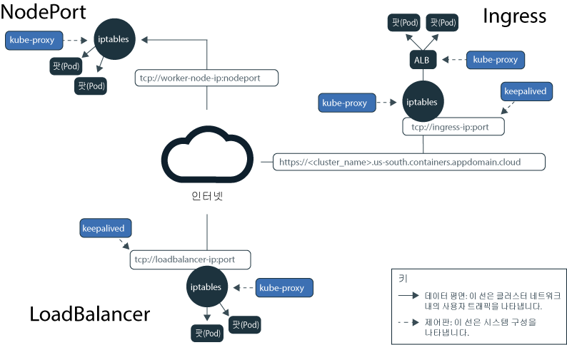

---

copyright:
  years: 2014, 2018
lastupdated: "2018-03-16"

---

{:new_window: target="_blank"}
{:shortdesc: .shortdesc}
{:screen: .screen}
{:pre: .pre}
{:table: .aria-labeledby="caption"}
{:codeblock: .codeblock}
{:tip: .tip}
{:download: .download}

# 외부 네트워킹 계획
{: #planning}

{{site.data.keyword.containerlong}}에서 Kubernetes 클러스터를 작성할 때 모든 클러스터가 퍼블릭 VLAN에 연결되어야 합니다. 퍼블릭 VLAN은 클러스터 작성 중에 작업자 노드에 지정된 공인 IP 주소를 판별합니다.
{:shortdesc}

무료 및 표준 클러스터 모두의 작업자 노드에 대한 공용 네트워크 인터페이스는 Calico 네트워크 정책으로 보호됩니다. 이러한 정책은 기본적으로 대부분의 인바운드 트래픽을 차단합니다. 그러나 NodePort, LoadBalancer 및 Ingress 서비스에 대한 연결과 마찬가지로 Kubernetes가 작동하는 데 필요한 인바운드 트래픽은 허용됩니다. 수정 방법을 포함하여 이러한 정책에 대한 자세한 정보는 [네트워크 정책](cs_network_policy.html#network_policies)을 참조하십시오.

|클러스터 유형|클러스터의 퍼블릭 VLAN 관리자|
|------------|------------------------------------------|
|{{site.data.keyword.Bluemix_notm}}의 무료 클러스터|{{site.data.keyword.IBM_notm}}|
|{{site.data.keyword.Bluemix_notm}}의 표준 클러스터|IBM Cloud 인프라(SoftLayer) 계정의 사용자|
{: caption="VLAN 관리 책임" caption-side="top"}

작업자 노드와 포드 간의 클러스터 내 네트워크 통신에 대한 정보는 [클러스터 내부 네트워킹](cs_secure.html#in_cluster_network)을 참조하십시오. Kubernetes 클러스터에서 실행되는 앱을 온프레미스 네트워크 또는 클러스터 외부의 앱에 안전하게 연결하는 데 대한 정보는 [VPN 연결 설정](cs_vpn.html)을 참조하십시오.

## 앱에 대한 공용 액세스 허용
{: #public_access}

인터넷에서 공용으로 앱을 사용할 수 있으려면 클러스터에 앱을 배치하기 전에 구성 파일을 업데이트해야 합니다.
{:shortdesc}

*{{site.data.keyword.containershort_notm}}의 Kubernetes 데이터 평면*

이 다이어그램은 Kubernetes가 {{site.data.keyword.containershort_notm}}에서 사용자 네트워크 트래픽을 운반하는 방법을 보여줍니다. 무료 또는 표준 클러스터를 작성했는지에 따라 인터넷에서 앱에 다양한 방법으로 액세스할 수 있습니다.

<dl>
<dt><a href="cs_nodeport.html#planning" target="_blank">NodePort 서비스</a>(무료 및 표준 클러스터)</dt>
<dd>
 <ul>
  <li>모든 작업자 노드에서 공용 포트를 노출시키고, 임의의 작업자 노드의 공인 IP 주소를 사용하여 클러스터의 서비스에 공용으로 액세스합니다.</li>
  <li>Iptables는 로드 밸런스가 앱의 포드 전체에서 요청하는 기능이며, 고성능 네트워크 라우팅과 네트워크 액세스 제어를 제공합니다.</li>
  <li>작업자 노드의 공인 IP 주소는 영구적이지 않습니다. 작업자 노드가 제거되거나 다시 작성되면 새 공인 IP 주소가 작업자 노드에 지정됩니다.</li>
  <li>NodePort 서비스는 공용 액세스를 테스트하기에 좋습니다. 짧은 시간 동안만 공용 액세스가 필요한 경우에도 사용할 수 있습니다.</li>
 </ul>
</dd>
<dt><a href="cs_loadbalancer.html#planning" target="_blank">LoadBalancer 서비스</a>(표준 클러스터 전용)</dt>
<dd>
 <ul>
  <li>모든 표준 클러스터는 앱에 대한 외부 TCP/UDP 로드 밸런서를 작성하는 데 사용할 수 있는 네 개의 포터블 공인 IP 주소 및 네 개의 사설 IP 주소로 프로비저닝됩니다.</li>
  <li>Iptables는 로드 밸런스가 앱의 포드 전체에서 요청하는 기능이며, 고성능 네트워크 라우팅과 네트워크 액세스 제어를 제공합니다.</li>
  <li>로드 밸런서에 지정된 포터블 공인 IP 주소는 영구적이며 클러스터에서 작업자 노드가 다시 작성될 때 변경되지 않습니다.</li>
  <li>앱이 요구하는 포트를 노출함으로써 로드 밸런서를 사용자 정의할 수 있습니다.</li></ul>
</dd>
<dt><a href="cs_ingress.html#planning" target="_blank">Ingress</a>(표준 클러스터 전용)</dt>
<dd>
 <ul>
  <li>안전하고 고유한 공용 시작점을 사용하여 수신 요청을 앱으로 라우팅하는 한 개의 외부 HTTP 또는 HTTPS, TCP 또는 UDP 로드 밸런서를 작성하여 클러스터의 다중 앱을 노출시킵니다.</li>
  <li>하나의 공용 라우트를 사용하여 서비스로 클러스터의 다중 앱을 노출할 수 있습니다.</li>
  <li>Ingress는 두 개의 기본 컴포넌트(Ingress 리소스와 애플리케이션 로드 밸런서)로 구성되어 있습니다.
   <ul>
    <li>Ingress 리소스는 앱에 대한 수신 요청을 라우팅하고 로드 밸런싱하는 방법에 대한 규칙을 정의합니다.</li>
    <li>애플리케이션 로드 밸런서(ALB)는 수신 HTTP 또는 HTTPS, TCP 또는 UDP 서비스 요청을 청취하고 각 Ingress 리소스에 정의한 규칙을 기반으로 앱의 포드에서 요청을 전달합니다. </li>
   </ul>
  <li>사용자 정의 라우팅 규칙으로 사용자 고유의 ALB를 구현하려는 경우와 앱에 대한 SSL 종료가 필요한 경우 Ingress를 사용하십시오.</li>
 </ul>
</dd></dl>

다음 의사결정 트리에 따라 애플리케이션을 위한 최고의 네트워킹 옵션을 선택할 수 있습니다. 계획 정보 및 구성 지시사항은 선택한 네트워킹 서비스 옵션을 클릭하십시오.

<map name="networking_map" id="networking_map">
<area href="/docs/containers/cs_nodeport.html#planning" alt="Nodeport 서비스" shape="circle" coords="52, 283, 45"/>
<area href="/docs/containers/cs_loadbalancer.html#planning" alt="LoadBalancer 서비스" shape="circle" coords="247, 419, 44"/>
<area href="/docs/containers/cs_ingress.html#planning" alt="Ingress 서비스" shape="circle" coords="445, 420, 45"/>
</map>
