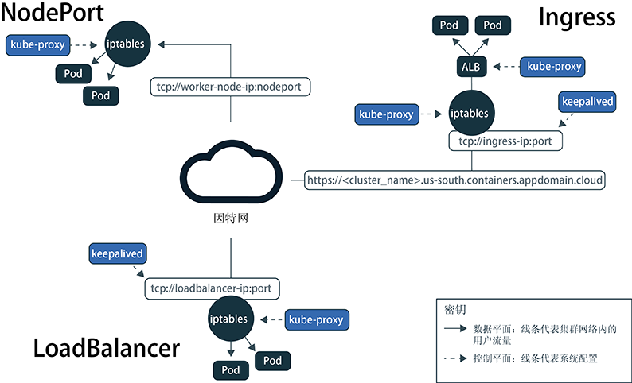

---

copyright:
  years: 2014, 2018
lastupdated: "2018-02-06"

---

{:new_window: target="_blank"}
{:shortdesc: .shortdesc}
{:screen: .screen}
{:pre: .pre}
{:table: .aria-labeledby="caption"}
{:codeblock: .codeblock}
{:tip: .tip}
{:download: .download}

# 规划外部联网
{: #planning}

创建集群时，每个集群都必须连接到一个公共 VLAN。公共 VLAN 用于确定在集群创建期间分配给工作程序节点的公共 IP 地址。
{:shortdesc}

免费集群和标准集群中的工作程序节点的公用网络接口受 Calico 网络策略保护。缺省情况下，这些策略将阻止大多数入站流量。但是，在与 NodePort、Loadbalancer 和 Ingress 服务连接时，允许 Kubernetes 运作所需的入站流量。有关这些策略的更多信息，包括如何修改这些策略，请参阅[网络策略](cs_network_policy.html#network_policies)。

|集群类型|集群的公共 VLAN 的管理方|
|------------|------------------------------------------|
|{{site.data.keyword.Bluemix_notm}} 中的免费集群|{{site.data.keyword.IBM_notm}}|
|{{site.data.keyword.Bluemix_notm}} 中的标准集群|您通过您的 IBM Cloud infrastructure (SoftLayer) 帐户|
{: caption="VLAN 管理责任" caption-side="top"}

有关工作程序节点与 pod 之间的集群内网络通信的信息，请参阅[集群内联网](cs_secure.html#in_cluster_network)。有关将 Kubernetes 集群中运行的应用程序安全连接到内部部署网络或连接到集群外部的应用程序的信息，请参阅[设置 VPN 连接](cs_vpn.html)。

## 允许对应用程序进行公共访问
{: #public_access}

要使应用程序在因特网上公开可用，必须先更新配置文件，然后再将应用程序部署到集群中。
{:shortdesc}

*{{site.data.keyword.containershort_notm}} 中的 Kubernetes 数据平面*

此图显示了 {{site.data.keyword.containershort_notm}} 中 Kubernetes 如何携带用户网络流量。根据创建的是免费集群还是标准集群，有不同的方式使应用程序可从因特网进行访问。

<dl>
<dt><a href="#nodeport" target="_blank">NodePort 服务</a>（免费和标准集群）</dt>
<dd>
 <ul>
  <li>在每个工作程序节点上公开一个公共端口，并使用任一工作程序节点的公共 IP 地址来公共访问集群中的服务。</li>
  <li>Iptables 是一个 Linux 内核功能，它在应用程序的 pod 之间对请求进行负载均衡，提供高性能的网络路由，并提供网络访问控制。</li>
  <li>工作程序节点的公共 IP 地址不是永久固定的。除去或重新创建工作程序节点时，将为该工作程序节点分配新的公共 IP 地址。</li>
  <li>NodePort 服务适合于测试公共访问。如果您只需要短时间的公用访问，那么也可以使用它。</li>
 </ul>
</dd>
<dt><a href="#loadbalancer" target="_blank">LoadBalancer 服务</a>（仅限标准集群）</dt>
<dd>
 <ul>
  <li>每个标准集群供应有 4 个可移植的公共 IP 地址和 4 个可移植的专用 IP 地址，这些 IP 地址可以用于为应用程序创建外部 TCP/UDP 负载均衡器。</li>
  <li>Iptables 是一个 Linux 内核功能，它在应用程序的 pod 之间对请求进行负载均衡，提供高性能的网络路由，并提供网络访问控制。</li>
  <li>分配给负载均衡器的可移植公共 IP 地址是永久固定的，在集群中重新创建工作程序节点时不会更改。</li>
  <li>您可以通过公开应用程序需要的任何端口来定制负载均衡器。</li></ul>
</dd>
<dt><a href="#ingress" target="_blank">Ingress</a>（仅限标准集群）</dt>
<dd>
 <ul>
  <li>通过创建一个外部 HTTP 或 HTTPS 负载均衡器来使用安全的唯一公共入口点将入局请求路由到集群中的多个应用程序，从而公开这些应用程序。</li>
  <li>您可以使用一个公用路径，将集群中的多个应用程序显示为服务。</li>
  <li>Ingress 由两个主要组件组成：Ingress 资源和应用程序负载均衡器。
   <ul>
    <li>Ingress 资源用于定义如何对应用程序的入局请求进行路由和负载均衡的规则。</li>
    <li>应用程序负载均衡器侦听入局 HTTP 或 HTTPS 服务请求，并根据为每个 Ingress 资源定义的规则在各个应用程序 pod 中转发请求。</li>
   </ul>
  <li>如果要使用定制路由规则实施自己的应用程序负载均衡器，并且需要对应用程序进行 SSL 终止，请使用 Ingress。</li>
 </ul>
</dd></dl>

要为应用程序选择最佳联网选项，可以遵循以下决策树：

<map name="networking_map" id="networking_map">
<area href="/docs/containers/cs_nodeport.html#config" alt="Nodeport 服务" shape="circle" coords="52, 283, 45"/>
<area href="/docs/containers/cs_loadbalancer.html#config" alt="Loadbalancer 服务" shape="circle" coords="247, 419, 44"/>
<area href="/docs/containers/cs_ingress.html#config" alt="Ingress 服务" shape="circle" coords="445, 420, 45"/>
</map>

 

## 使用 NodePort 服务将应用程序公开到因特网
{: #nodeport}

在工作程序节点上公开一个公共端口，并使用该工作程序节点的公共 IP 地址通过因特网来公共访问集群中的服务。
{:shortdesc}

通过创建类型为 NodePort 的 Kubernetes 服务来公开应用程序时，将为该服务分配 30000-32767 范围内的 NodePort 以及内部集群 IP 地址。NodePort 服务充当应用程序入局请求的外部入口点。分配的 NodePort 在集群中每个工作程序节点的 kubeproxy 设置中公共公开。每个工作程序节点都会在分配的 NodePort 上开始侦听该服务的入局请求。要从因特网访问该服务，可以使用在集群创建期间分配的任何工作程序节点的公共 IP 地址以及 NodePort，格式为 `<ip_address>:<nodeport>`. 除了公共 IP 地址外，NodePort 服务还可用于工作程序节点的专用 IP 地址。

下图显示配置 NodePort 服务后，如何将通信从因特网定向到应用程序。

如图所示，请求到达 NodePort 服务时，会自动转发到该服务的内部集群 IP，然后进一步从 `kube-proxy` 组件转发到部署了应用程序的 pod 的专用 IP 地址。该集群 IP 只能在集群内部访问。如果应用程序有多个副本在不同 pod 中运行，那么 `kube-proxy` 组件会在所有副本之间对入局请求进行负载均衡。

**注**：工作程序节点的公共 IP 地址不是永久固定的。除去或重新创建工作程序节点时，将为该工作程序节点分配新的公共 IP 地址。在测试应用程序的公共访问权时，或者仅在短时间内需要公共访问权时，可以使用 NodePort 服务。如果需要服务具有稳定的公共 IP 地址和更高可用性，请使用 [LoadBalancer 服务](#loadbalancer)或 [Ingress](#ingress) 来公开应用程序。

有关如何使用 {{site.data.keyword.containershort_notm}} 创建类型为 NodePort 的服务的指示信息，请参阅[使用 NodePort 服务类型来配置对应用程序的公共访问权](cs_nodeport.html#config)。

 

## 使用 LoadBalancer 服务将应用程序公开到因特网
{: #loadbalancer}

公开一个端口，并使用负载均衡器的公共或专用 IP 地址来访问应用程序。
{:shortdesc}

创建标准集群时，{{site.data.keyword.containershort_notm}} 会自动请求 5 个可移植公共 IP 地址和 5 个可移植专用 IP 地址，并在集群创建期间将其供应给 IBM Cloud infrastructure (SoftLayer) 帐户。两个可移植 IP 地址（一个公共一个专用）用于 [Ingress 应用程序负载均衡器](#ingress)。通过创建 LoadBalancer 服务，可以使用 4 个可移植公共 IP 地址和 4 个可移植专用 IP 地址来公开应用程序。

在公用 VLAN 上于集群中创建 Kubernetes LoadBalancer 服务时，会创建一个外部负载均衡器。四个可用的公共 IP 地址之一会分配给负载均衡器。如果没有可移植公共 IP 地址可用，那么创建 LoadBalancer 服务会失败。LoadBalancer 服务充当应用程序入局请求的外部入口点。与 NodePort 服务不同，您可以为负载均衡器分配任何端口，而不限于特定端口范围。分配给 LoadBalancer 服务的可移植公共 IP 地址是永久固定的，在除去或重新创建工作程序节点时不会更改。因此，LoadBalancer 服务的可用性比 NodePort 服务更高。要从因特网访问 LoadBalancer 服务，请使用负载均衡器的公共 IP 地址以及分配的端口，格式为 `<ip_address>:<port>`.

下图显示 LoadBalancer 如何将通信从因特网定向到应用程序：

如图所示，请求到达 LoadBalancer 服务时，该请求会自动转发到在 LoadBalancer 服务创建期间分配给该服务的内部集群 IP 地址。该集群 IP 地址只能在集群内部访问。入局请求会从该集群 IP 地址进一步转发到工作程序节点的 `kube-proxy` 组件。然后，这些请求再转发到部署了应用程序的 pod 的专用IP 地址。如果您的应用程序有多个副本在不同 pod 中运行，那么 `kube-proxy` 组件会在所有副本之间对入局请求进行负载均衡。

如果使用 LoadBalancer 服务，那么任何工作程序节点的每个 IP 地址上也提供一个节点端口。要在使用 LoadBalancer 服务时阻止访问节点端口，请参阅[阻止入局流量](cs_network_policy.html#block_ingress)。

在创建 LoadBalancer 服务时，IP 地址的选项如下所示：

- 如果集群位于公用 VLAN 上，那么将使用可移植的公共 IP 地址。
- 如果集群仅在专用 VLAN 上可用，那么将使用可移植的专用 IP 地址。
- 通过向配置文件添加注释，可请求用于 LoadBalancer 服务的可移植公共或专用 IP 地址：`service.kubernetes.io/ibm-load-balancer-cloud-provider-ip-type
<public_or_private>`.

有关如何使用 {{site.data.keyword.containershort_notm}} 创建 LoadBalancer 的服务的指示信息，请参阅[使用 LoadBalancer 服务类型来配置对应用程序的公共访问权](cs_loadbalancer.html#config)。

 

## 使用 Ingress 向因特网公开应用程序
{: #ingress}

通过 Ingress，可以使用单个公共入口点来公开集群中的多个服务并使其公共可用。
{:shortdesc}

Ingress 不会为您要向公众公开的每个应用程序创建一个 LoadBalancer 服务，而是提供唯一公共路径，用于根据公共请求的各个路径，将这些请求转发到集群内部和外部的应用程序。Ingress 由两个主要组件组成。Ingress 资源定义了有关如何对应用程序的入局请求进行路由的规则。所有 Ingress 资源都必须向 Ingress 应用程序负载均衡器进行注册；此负载均衡器侦听入局 HTTP 或 HTTPS 服务请求，并根据为每个 Ingress 资源定义的规则转发请求。

创建标准集群时，{{site.data.keyword.containershort_notm}} 会自动为集群创建高可用性应用程序负载均衡器，并为其分配唯一公共路径，格式为 `<cluster_name>.<region>.containers.mybluemix.net`。该公共路径链接到在集群创建期间供应到 IBM Cloud infrastructure (SoftLayer) 帐户中的可移植公共 IP 地址。另外，还会自动创建专用应用程序负载均衡器，但不会自动启用该负载均衡器。

下图显示 Ingress 如何将通信从因特网定向到应用程序：

要通过 Ingress 公开应用程序，必须为应用程序创建 Kubernetes 服务，并通过定义 Ingress 资源向应用程序负载均衡器注册此服务。Ingress 资源指定要附加到公共路径的路径，以构成所公开应用程序的唯一 URL，例如：`mycluster.us-south.containers.mybluemix.net/myapp`。如图所示，在 Web 浏览器中输入此路径时，请求会发送到应用程序负载均衡器的已链接可移植公共 IP 地址。应用程序负载均衡器会检查 `mycluster` 集群中 `myapp` 路径的路由规则是否存在。如果找到匹配的规则，那么包含单个路径的请求会转发到部署了应用程序的 pod，同时考虑在原始 Ingress 资源对象中定义的规则。为了使应用程序能够处理入局请求，请确保应用程序侦听在 Ingress 资源中定义的单个路径。

可以针对以下场景配置应用程序负载均衡器，以管理应用程序的入局网络流量：

-   使用 IBM 提供的域（不带 TLS 终止）
-   使用 IBM 提供的域（带 TLS 终止）
-   使用定制域（带 TLS 终止）
-   使用 IBM 提供的域或定制域（带 TLS 终止）访问集群外部的应用程序
-   使用专用应用程序负载均衡器和定制域（不带 TLS 终止）
-   使用专用应用程序负载均衡器和定制域（带 TLS 终止）
-   使用注释向应用程序负载均衡器添加功能

有关如何将 Ingress 用于 {{site.data.keyword.containershort_notm}} 的指示信息，请参阅[使用 Ingress 来配置对应用程序的公共访问权](cs_ingress.html#ingress)。

 

