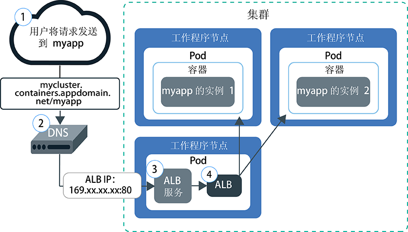
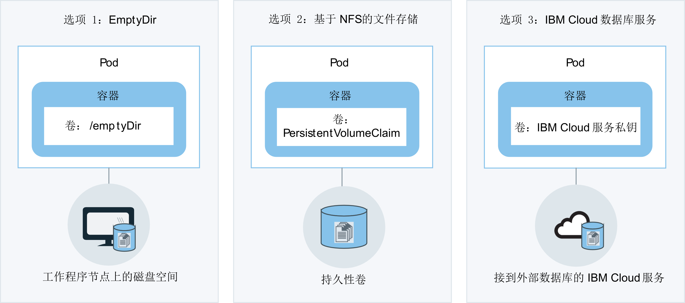

---

copyright:
  years: 2014, 2017
lastupdated: "2017-10-24"

---

{:new_window: target="_blank"}
{:shortdesc: .shortdesc}
{:screen: .screen}
{:pre: .pre}
{:table: .aria-labeledby="caption"}
{:codeblock: .codeblock}
{:tip: .tip}
{:download: .download}


# 计划集群和应用程序
{: #cs_planning}

{{site.data.keyword.containershort_notm}} 提供多个选项，用于配置和定制 Kubernetes 集群，以符合您组织的功能和非功能需求。其中有些配置在创建集群后即不可更改。事先了解这些配置可帮助确保所有资源（如内存、磁盘空间和 IP 地址）均可供开发团队使用。
{:shortdesc}

<br />


## 比较 Lite 和标准集群
{: #cs_planning_cluster_type}

您可以创建 Lite 集群来熟悉并测试 Kubernetes 功能，也可以创建标准集群以开始实施具有完整 Kubernetes 功能的应用程序。
{:shortdesc}

|特征|Lite 集群|标准集群|
|---------------|-------------|-----------------|
|[在 {{site.data.keyword.Bluemix_notm}} Public 中可用](cs_ov.html#public_environment)|||
|[在集群内进行专用联网](#cs_planning_private_network)|||
|[NodePort 服务对应用程序的公共访问权](#cs_nodeport)|||
|[用户访问管理](cs_cluster.html#cs_cluster_user)|||
|[从集群和应用程序访问 {{site.data.keyword.Bluemix_notm}} 服务](cs_cluster.html#cs_cluster_service)|||
|[工作程序节点上用于存储的磁盘空间](#cs_planning_apps_storage)|||
|[基于 NFS 文件的持久存储器（带有卷）](#cs_planning_apps_storage)| ||
|[LoadBalancer 服务对应用程序的公共或专用访问权](#cs_loadbalancer)| ||
|[Ingress 服务对应用程序的公共访问权](#cs_ingress)| ||
|[可移植公共 IP 地址](cs_apps.html#cs_cluster_ip_subnet)| ||
|[在 {{site.data.keyword.Bluemix_notm}} Dedicated 中可用（封闭 Beta 版）](cs_ov.html#dedicated_environment)| ||
{: caption="表 1. Lite 集群与标准集群之间的差异" caption-side="top"}

<br />


## 集群配置
{: #cs_planning_cluster_config}

使用标准集群来提高应用程序可用性。在多个工作程序节点和集群之间分发设置时，用户不太可能会遇到停机时间。内置功能（例如负载均衡和隔离）可在主机、网络或应用程序发生潜在故障时更快恢复。
{:shortdesc}

查看以下潜在的集群设置（按可用性程度从低到高排序）：

[](https://console.bluemix.net/docs/api/content/containers/images/cs_cluster_ha_roadmap.png)

1.  一个集群具有多个工作程序节点
2.  在同一区域的不同位置运行的两个集群，每个集群具有多个工作程序节点
3.  在不同区域运行的两个集群，每个集群具有多个工作程序节点

了解有关可以如何使用这些方法来提高集群可用性的更多信息：

<dl>
<dt>包含足够的工作程序节点用于散布到应用程序实例</dt>
<dd>为了实现高可用性，允许应用程序开发者跨每个集群的多个工作程序节点散布其容器。如果有三个工作程序节点，就允许有一个工作程序节点发生停机，而不会中断应用程序使用。在通过 [{{site.data.keyword.Bluemix_notm}} GUI](cs_cluster.html#cs_cluster_ui) 或 [CLI](cs_cluster.html#cs_cluster_cli) 创建集群时，可以指定要包含的工作程序节点数。Kubernetes 限制了在一个集群中可以拥有的最大工作程序节点数。有关更多信息，请查看[工作程序节点和 pod 配额 ](https://kubernetes.io/docs/admin/cluster-large/)。<pre class="codeblock">
<code>bx cs cluster-create --location &lt;dal10&gt; --workers 3 --public-vlan &lt;my_public_vlan_id&gt; --private-vlan &lt;my_private_vlan_id&gt; --machine-type &lt;u1c.2x4&gt; --name &lt;my_cluster&gt;</code>
</pre>
</dd>
<dt>跨集群散布应用程序</dt>
<dd>创建多个集群，每个集群具有多个工作程序节点。如果一个集群发生停机，用户仍可以访问还部署在其他集群中的应用程序。<p>集群 1：</p>
<pre class="codeblock">
<code>bx cs cluster-create --location &lt;dal10&gt; --workers 3 --public-vlan &lt;my_public_vlan_id&gt; --private-vlan &lt;my_private_vlan_id&gt; --machine-type &lt;u1c.2x4&gt; --name &lt;my_cluster1&gt;</code>
</pre>
<p>集群 2：</p>
<pre class="codeblock">
<code>bx cs cluster-create --location &lt;dal12&gt; --workers 3 --public-vlan &lt;my_public_vlan_id&gt; --private-vlan &lt;my_private_vlan_id&gt; --machine-type &lt;u1c.2x4&gt;  --name &lt;my_cluster2&gt;</code>
</pre>
</dd>
<dt>跨不同区域的集群散布应用程序</dt>
<dd>跨不同区域的集群散布应用程序时，可以允许基于用户所在的区域进行负载均衡。如果一个区域中的集群、硬件甚至整个位置当机，那么流量会路由到另一个位置内所部署的容器。<p><strong>重要信息</strong>：配置定制域后，可使用以下命令来创建集群。</p>
<p>位置 1：</p>
<pre class="codeblock">
<code>bx cs cluster-create --location &lt;dal10&gt; --workers 3 --public-vlan &lt;my_public_vlan_id&gt; --private-vlan &lt;my_private_vlan_id&gt; --machine-type &lt;u1c.2x4&gt; --name &lt;my_cluster1&gt;</code>
</pre>
<p>位置 2：</p>
<pre class="codeblock">
<code>bx cs cluster-create --location &lt;ams03&gt; --workers 3 --public-vlan &lt;my_public_vlan_id&gt; --private-vlan &lt;my_private_vlan_id&gt; --machine-type &lt;u1c.2x4&gt; --name &lt;my_cluster2&gt;</code>
</pre>
</dd>
</dl>

<br />


## 工作程序节点配置
{: #cs_planning_worker_nodes}

Kubernetes 集群由虚拟机工作程序节点组成，并由 Kubernetes 主节点机进行集中监视和管理。集群管理员必须决定如何设置工作程序节点的集群，以确保集群用户具备在集群中部署和运行应用程序所需的所有资源。
{:shortdesc}

创建标准集群时，会在 IBM Bluemix Infrastructure (SoftLayer) 中代表您对工作程序节点进行排序，并在 {{site.data.keyword.Bluemix_notm}} 中对其进行设置。为每个工作程序节点分配唯一的工作程序节点标识和域名，在创建集群后，不得更改该标识和域名。根据选择的硬件隔离级别，可以将工作程序节点设置为共享或专用节点。每个工作程序节点都供应有特定机器类型，用于确定部署到该工作程序节点的容器可用的 vCPU 数、内存量和磁盘空间量。
Kubernetes 限制了在一个集群中可以拥有的最大工作程序节点数。有关更多信息，请查看[工作程序节点和 pod 配额 ](https://kubernetes.io/docs/admin/cluster-large/)。


### 工作程序节点的硬件
{: #shared_dedicated_node}

每个工作程序节点都会设置为物理硬件上的虚拟机。在 {{site.data.keyword.Bluemix_notm}} Public 中创建标准集群时，必须选择是希望底层硬件由多个 {{site.data.keyword.IBM_notm}} 客户共享（多租户）还是仅供您专用（单租户）。
{:shortdesc}

在多租户设置中，物理资源（如 CPU 和内存）在部署到同一物理硬件的所有虚拟机之间共享。要确保每个虚拟机都能独立运行，虚拟机监视器（也称为系统管理程序）会将物理资源分段成隔离的实体，并将其作为专用资源分配给虚拟机（系统管理程序隔离）。

在单租户设置中，所有物理资源都仅供您专用。您可以将多个工作程序节点作为虚拟机部署在同一物理主机上。与多租户设置类似，系统管理程序也会确保每个工作程序节点在可用物理资源中获得应有的份额。

共享节点通常比专用节点更便宜，因为底层硬件的开销由多个客户分担。但是，在决定是使用共享还是专用节点时，可能需要咨询您的法律部门，以讨论应用程序环境所需的基础架构隔离和合规性级别。

创建 Lite 集群时，工作程序节点会自动作为 {{site.data.keyword.IBM_notm}} IBM Bluemix Infrastructure (SoftLayer) 帐户中的共享节点进行供应。

在 {{site.data.keyword.Bluemix_notm}} Dedicated 中创建集群时，只会使用单租户集，并且所有物理资源仅供您专用。您可以将多个工作程序节点作为虚拟机部署在同一物理主机上。

<br />


## 集群管理责任
{: #responsibilities}

查看您与 IBM 共享的用于管理集群的责任。要查看在 {{site.data.keyword.Bluemix_notm}} Dedicated 环境中管理的集群的责任，请改为参阅[云环境之间集群管理的差异](cs_ov.html#env_differences)。
{:shortdesc}

**IBM 负责：**

- 在集群中部署主节点、工作程序节点和管理组件，例如，在集群创建时部署 Ingress 控制器
- 管理集群的 Kubernetes 主节点的更新、监视和恢复
- 监视工作程序节点的运行状况并为这些工作程序节点的更新和恢复提供自动化
- 对基础架构帐户执行自动化任务，包括添加工作程序节点、除去工作程序节点以及创建缺省子网
- 管理、更新和恢复集群内的操作组件，例如，Ingress 控制器和存储插件
- 在持久卷声明请求时供应存储卷
- 在所有工作程序节点上提供安全性设置

<br />
**您负责：**

- [在集群中部署和管理 Kubernetes 资源，例如，Pod、服务和部署](cs_apps.html#cs_apps_cli)
- [利用服务和 Kubernetes 的功能以确保应用程序的高可用性](cs_planning.html#highly_available_apps)
- [通过使用 CLI 添加或除去工作程序节点来添加或除去容量](cs_cli_reference.html#cs_worker_add)
- [在 IBM Bluemix Infrastructure (SoftLayer) 中创建公用和专用 VLAN 以针对集群进行网络隔离 ](https://knowledgelayer.softlayer.com/topic/vlans)
- [确保所有工作程序节点都具有到 Kibernetes 主节点 URL 的网络连接](cs_security.html#opening_ports)<p>**注**：如果工作程序节点同时具有公用和专用 VLAN，那么已配置网络连接。如果工作程序节点仅设置了专用 VLAN，那么需要 vyatta 来提供网络连接。</p>
- [确定当 Kubernetes 主要或次要版本更新可用时，何时更新 kube-apiserver 和工作程序节点](cs_cluster.html#cs_cluster_update)
- [通过运行 `kubectl` 命令（如 `cordon` 或 `drain`）以及运行 `bx cs` 命令（如 `reboot`、`reload` 或 `delete`](cs_cli_reference.html#cs_worker_reboot)）采取操作来恢复故障工作程序节点。
- [根据需要在 IBM Bluemix Infrastructure (SoftLayer) 中添加或除去其他子网](cs_cluster.html#cs_cluster_subnet)
- [在 IBM Bluemix Infrastructure (SoftLayer) 中备份和复原持久存储器中的数据 ](../services/RegistryImages/ibm-backup-restore/index.html#ibmbackup_restore_starter)

<br />


## 部署 (Deployment)
{: #highly_available_apps}

设置在多个工作程序节点和集群上分发得越广泛，用户使用应用程序时遭遇停机时间的可能性就越低。
{:shortdesc}

查看以下潜在的应用程序设置（按可用性程度从低到高排序）：

[](../api/content/containers/images/cs_app_ha_roadmap.png)

1.  部署具有 n+2 个 pod，这些 pod 由副本集管理。
2.  部署具有 n+2 个 pod，这些 pod 由副本集管理并跨同一位置的多个节点分布（反亲缘关系）。
3.  部署具有 n+2 个 pod，这些 pod 由副本集管理并跨不同位置的多个节点分布（反亲缘关系）。
4.  部署具有 n+2 个 pod，这些 pod 由副本集管理并跨不同区域的多个节点分布（反亲缘关系）。

了解有关用于提高应用程序可用性的方法的更多信息：

<dl>
<dt>使用部署和副本集来部署应用程序及其依赖项</dt>
<dd>部署是一种 Kubernetes 资源，可用于声明应用程序的所有组件以及应用程序的依赖项。通过描述单个组件，而不是写下所有必要的步骤和创建这些步骤的顺序，您可以专注于应用程序在运行时的外观。</br></br>
部署多个 pod 时，会自动为部署创建副本集；副本集用于监视这些 pod，并确保始终有所需数量的 pod 正常运行。pod 发生故障时，副本集会将无响应的 pod 替换为新的 pod。</br></br>
您可以使用部署来定义应用程序的更新策略，包括在滚动更新期间要添加的 pod 数，以及允许同时不可用的 pod 数。执行滚动更新时，部署将检查修订版是否有效，并在检测到故障时停止应用。</br></br>
部署还提供了同时部署具有不同标志的多个修订版的可能性，因此，例如您可以先测试部署，然后再决定是否将其推送到生产环境。</br></br>
每个部署都会跟踪已部署的修订版。遇到更新无法按预期运行时，可以使用此修订版历史记录回滚到上一个版本。</dd>
<dt>包含足够多的副本用于应用程序的工作负载，在此基础上再额外增加两个副本</dt>
<dd>要使应用程序具有更高可用性且在出现故障时能够更快恢复，请考虑在处理预期工作负载所需最低要求的副本数基础上，再包含额外的副本。在某个 pod 崩溃且副本集尚未恢复已崩溃 pod 的情况下，额外的副本可处理工作负载。要针对同时发生两个故障的情况进行防护，请包含两个额外的副本。此设置是 N+2 模式，其中 N 是处理入局工作负载的副本数，+2 是额外两个副本。只要集群有足够的空间用于 pod，就可以在集群中拥有尽可能多的 pod。</dd>
<dt>跨多个节点分布 pod（反亲缘关系）</dt>
<dd>创建部署时，各个 pod 可能会部署到同一工作程序节点。这种 pod 存在于相同工作程序节点上的设置称为亲缘关系或共存。为了保护应用程序不受工作程序节点故障的影响，可以使用 <strong>podAntiAffinity</strong> 选项来强制您的部署跨多个工作程序节点分布 pod。此选项仅可用于标准集群。</br></br>
<strong>注</strong>：以下 YAML 文件强制将每个 pod 部署到不同的工作程序节点。如果定义的副本数超过集群中可用的工作程序节点数，仅会部署可以满足反亲缘关系需求的副本数。任何其他副本都将保持暂挂状态，直到向集群添加了更多工作程序节点为止。<pre class="codeblock">
<code>apiVersion: extensions/v1beta1
kind: Deployment
metadata:
name: wasliberty
spec:
        replicas: 3
        template:
metadata:
labels:
app: wasliberty
spec:
      affinity:
        podAntiAffinity:
          preferredDuringSchedulingIgnoredDuringExecution:
          - weight: 100
            podAffinityTerm:
              labelSelector:
                matchExpressions:
                - key: app
                  operator: In
                  values:
                  - wasliberty
              topologyKey: kubernetes.io/hostname
      containers:
      - name: wasliberty
        image: registry.&lt;region&gt;.bluemix.net/ibmliberty
        ports:
        - containerPort: 9080
---
apiVersion: v1
kind: Service
metadata:
  name: wasliberty
  labels:
    app: wasliberty
spec:
  ports:
    # the port that this service should serve on
  - port: 9080
  selector:
    app: wasliberty
  type: NodePort</code></pre>

</dd>
<dt>跨多个位置或区域分布 pod</dt>
<dd>为了保护应用程序不受位置或区域故障的影响，可以在另一个位置或区域中创建第二个集群，并使用部署 YAML 来部署应用程序的重复副本集。通过在集群前端添加共享路径和负载均衡器，可以跨位置和区域分布工作负载。有关在集群之间共享路径的更多信息，请参阅<a href="https://console.bluemix.net/docs/containers/cs_cluster.html#cs_cluster" target="_blank">集群高可用性</a>。有关更多详细信息，请查看<a href="https://console.bluemix.net/docs/containers/cs_planning.html#cs_planning_cluster_config" target="_blank">高可用性部署</a>的选项。</dd>
</dl>


### 最低应用程序部署
{: #minimal_app_deployment}

Lite 或标准集群中的基本应用程序部署可能包含以下组件。
{:shortdesc}

<a href="../api/content/containers/images/cs_app_tutorial_components1.png"></a>

用于最简应用程序的配置文件示例。
```
apiVersion: extensions/v1beta1
kind: Deployment
metadata:
  name: ibmliberty
spec:
  replicas: 1
  template:
    metadata:
      labels:
        app: ibmliberty
    spec:
      containers:
      - name: ibmliberty
        image: registry.<region>.bluemix.net/ibmliberty:latest
---
apiVersion: v1
kind: Service
metadata:
  name: ibmliberty-service
  labels:
    app: ibmliberty
spec:
  selector:
    run: ibmliberty
  type: NodePort
  ports:
   - protocol: TCP
     port: 9080
```
{: codeblock}

<br />


## 专用联网
{: #cs_planning_private_network}

工作程序节点与 pod 之间安全的专用网络通信可通过专用虚拟局域网（也称为专用 VLAN）来实现。VLAN 会将一组工作程序节点和 pod 视为连接到同一物理连线那样进行配置。
{:shortdesc}

创建集群时，每个集群会自动连接到一个专用 VLAN。专用 VLAN 用于确定在集群创建期间分配给工作程序节点的专用 IP 地址。

|集群类型|集群的专用 VLAN 的管理方|
|------------|-------------------------------------------|
|{{site.data.keyword.Bluemix_notm}} Public 中的 Lite 集群|{{site.data.keyword.IBM_notm}}|
|{{site.data.keyword.Bluemix_notm}} Public 中的标准集群|您在 IBM Bluemix Infrastructure (SoftLayer) 帐户中<p>**提示**：要有权访问帐户中的所有 VLAN，请打开 [VLAN 生成 ](https://knowledgelayer.softlayer.com/procedure/enable-or-disable-vlan-spanning)。</p>|
|{{site.data.keyword.Bluemix_notm}} Dedicated 中的标准集群|{{site.data.keyword.IBM_notm}}|
{: caption="表 2. 专用 VLAN 管理责任" caption-side="top"}

此外，部署到一个工作程序节点的所有 pod 都会分配有一个专用 IP 地址。分配给 pod 的 IP 位于 172.30.0.0/16 专用地址范围内，并且这些 pod 仅在工作程序节点之间进行路由。为了避免冲突，请勿在将与工作程序节点通信的任何节点上使用此 IP 范围。工作程序节点和 pod 可以使用专用 IP 地址在专用网络上安全地通信。但是，当 pod 崩溃或需要重新创建工作程序节点时，会分配新的专用 IP 地址。

由于对于必须具备高可用性的应用程序，很难跟踪其不断变化的专用 IP 地址，因此可以使用内置 Kubernetes 服务发现功能，并将应用程序公开为集群中专用网络上的集群 IP 服务。Kubernetes 服务会将一些 pod 分组在一起，并提供与这些 pod 的网络连接，以供集群中的其他服务使用，而无需公开每个 pod 的实际专用 IP 地址。创建集群 IP 服务后，会从 10.10.10.0/24 专用地址范围中为该服务分配专用 IP 地址。与 pod 专用地址范围一样，请勿在将与工作程序节点通信的任何节点上使用此 IP 范围。此 IP 地址只能在集群内部访问。不能从因特网访问此 IP 地址。同时，会为该服务创建 DNS 查找条目，并将该条目存储在集群的 kube-dns 组件中。DNS 条目包含服务名称、在其中创建服务的名称空间以及指向分配的专用集群 IP 地址的链接。

如果集群中的应用程序需要访问位于集群 IP 服务后端的 pod，那么可以使用分配给该服务的专用集群 IP 地址，也可以使用该服务的名称发送请求。使用服务名称时，会在 kube-dns 组件中查找该名称，并将其路由到服务的专用集群 IP 地址。请求到达服务时，服务会确保所有请求都同等转发到 pod，而不考虑其专用 IP 地址和部署到的工作程序节点。

有关如何创建类型为集群 IP 的服务的更多信息，请参阅 [Kubernetes 服务 ](https://kubernetes.io/docs/concepts/services-networking/service/#publishing-services---service-types)。

<br />


## 公共联网
{: #cs_planning_public_network}

创建集群时，每个集群都必须连接到一个公共 VLAN。公共 VLAN 用于确定在集群创建期间分配给工作程序节点的公共 IP 地址。
{:shortdesc}

Lite 集群和标准集群中的工作程序节点的公用网络接口受 Calico 网络策略的保护。缺省情况下，这些策略将阻止大多数入站流量，包括 SSH。但是，在与 NodePort、Loadbalancer 和 Ingress 服务连接时，允许 Kubernetes 运作所需的入站流量。有关这些策略的更多信息，包括如何修改这些策略，请参阅[网络策略](cs_security.html#cs_security_network_policies)。

|集群类型|集群的公共 VLAN 的管理方|
|------------|------------------------------------------|
|{{site.data.keyword.Bluemix_notm}} Public 中的 Lite 集群|{{site.data.keyword.IBM_notm}}|
|{{site.data.keyword.Bluemix_notm}} Public 中的标准集群|您在 IBM Bluemix Infrastructure (SoftLayer) 帐户中|
|{{site.data.keyword.Bluemix_notm}} Dedicated 中的标准集群|{{site.data.keyword.IBM_notm}}|
{: caption="表 3. VLAN 管理责任" caption-side="top"}

根据创建的是 Lite 集群还是标准集群，可以在以下选项中进行选择以向公众公开应用程序。

-   [NodePort 服务](#cs_nodeport)（Lite 和标准集群）
-   [LoadBalancer 服务](#cs_loadbalancer)（仅限标准集群）
-   [Ingress](#cs_ingress)（仅限标准集群）


### 使用 NodePort 服务将应用程序公开到因特网
{: #cs_nodeport}

在您的工作程序节点上公开一个公共端口，并使用该工作程序节点的公共 IP 地址来公共访问集群中的服务。
{:shortdesc}

[](https://console.bluemix.net/docs/api/content/containers/images/cs_nodeport.png)

通过创建类型为 NodePort 的 Kubernetes 服务来公开应用程序时，将为该服务分配 30000-32767 范围内的 NodePort 以及内部集群 IP 地址。NodePort 服务充当应用程序入局请求的外部入口点。分配的 NodePort 在集群中每个工作程序节点的 kubeproxy 设置中公共公开。每个工作程序节点都会在分配的 NodePort 上开始侦听该服务的入局请求。要从因特网访问该服务，可以使用在集群创建期间分配的任何工作程序节点的公共 IP 地址以及 NodePort，格式为 `<ip_address>:<nodeport>`. 除了公共 IP 地址外，NodePort 服务还可用于工作程序节点的专用 IP 地址。

请求到达 NodePort 服务时，会自动转发到该服务的内部集群 IP，然后进一步从 kubeproxy 组件转发到部署了应用程序的 pod 的专用 IP 地址。该集群 IP 只能在集群内部访问。如果您的应用程序有多个副本在不同 pod 中运行，那么 kubeproxy 组件会在所有副本之间对入局请求进行负载均衡。

**注**：工作程序节点的公共 IP 地址不是永久固定的。除去或重新创建工作程序节点时，将为该工作程序节点分配新的公共 IP 地址。在测试应用程序的公共访问权时，或者仅在短时间内需要公共访问权时，可以使用 NodePort 服务。如果需要服务具有稳定的公共 IP 地址和更高可用性，请使用 [LoadBalancer 服务](#cs_loadbalancer)或 [Ingress](#cs_ingress) 来公开应用程序。

有关如何使用 {{site.data.keyword.containershort_notm}} 创建类型为 NodePort 的服务的更多信息，请参阅[使用 NodePort 服务类型来配置对应用程序的公共访问权](cs_apps.html#cs_apps_public_nodeport)。


### 使用 LoadBalancer 服务将应用程序公开到因特网
{: #cs_loadbalancer}

公开一个端口，并使用负载均衡器的公共或专用 IP 地址来访问应用程序。

[](https://console.bluemix.net/docs/api/content/containers/images/cs_loadbalancer.png)

创建标准集群时，{{site.data.keyword.containershort_notm}} 会自动请求 5 个可移植公共 IP 地址和 5 个专用 IP 地址，并在集群创建期间将其供应给 IBM Bluemix Infrastructure (SoftLayer) 帐户。两个可移植 IP 地址，一个公共一个专用，用于 [Ingress 控制器](#cs_ingress)。通过创建 LoadBalancer 服务，可以使用 4 个可移植公共 IP 地址和 4 个专用 IP 地址来公开应用程序。

在公用 VLAN 上于集群中创建 Kubernetes LoadBalancer 服务时，会创建一个外部负载均衡器。四个可用的公共 IP 地址之一会分配给负载均衡器。如果没有可移植公共 IP 地址可用，那么创建 LoadBalancer 服务会失败。LoadBalancer 服务充当应用程序入局请求的外部入口点。与 NodePort 服务不同，您可以为负载均衡器分配任何端口，而不限于特定端口范围。分配给 LoadBalancer 服务的可移植公共 IP 地址是永久固定的，在除去或重新创建工作程序节点时不会更改。因此，LoadBalancer 服务的可用性比 NodePort 服务更高。要从因特网访问 LoadBalancer 服务，请使用负载均衡器的公共 IP 地址以及分配的端口，格式为 `<ip_address>:<port>`.

请求到达 LoadBalancer 服务时，该请求会自动转发到在服务创建期间分配给 LoadBalancer 服务的内部集群 IP 地址。该集群 IP 地址只能在集群内部访问。入局请求会从该集群 IP 地址进一步转发到工作程序节点的 `kube-proxy` 组件。然后，这些请求再转发到部署了应用程序的 pod 的专用IP 地址。如果您的应用程序有多个副本在不同 pod 中运行，那么 `kube-proxy` 组件会在所有副本之间对入局请求进行负载均衡。

如果使用 LoadBalancer 服务，那么任何工作程序节点的每个 IP 地址上也提供一个节点端口。要在使用 LoadBalancer 服务时阻止访问节点端口，请参阅[阻止入局流量](cs_security.html#cs_block_ingress)。

在创建 LoadBalancer 服务时，IP 地址的选项如下所示：

- 如果集群位于公用 VLAN 上，那么将使用可移植的公共 IP 地址。
- 如果集群仅在专用 VLAN 上可用，那么将使用可移植的专用 IP 地址。
- 通过向配置文件添加注释，可请求用于 LoadBalancer 服务的可移植公共或专用 IP 地址：`service.kubernetes.io/ibm-load-balancer-cloud-provider-ip-type
<public_or_private>`.

有关如何使用 {{site.data.keyword.containershort_notm}} 创建 LoadBalancer 的服务的更多信息，请参阅[使用 LoadBalancer 服务类型来配置对应用程序的公共访问权](cs_apps.html#cs_apps_public_load_balancer)。

### 使用 Ingress 向因特网公开应用程序
{: #cs_ingress}

通过 Ingress，可以使用单个公共入口点来公开集群中的多个服务并使其公共可用。

[](https://console.bluemix.net/docs/api/content/containers/images/cs_ingress.png)

Ingress 不会为您要向公众公开的每个应用程序创建一个 LoadBalancer 服务，而是提供唯一公共路径，用于根据公共请求的各个路径，将这些请求转发到集群内部和外部的应用程序。Ingress 由两个主要组件组成。Ingress 资源定义了有关如何对应用程序的入局请求进行路由的规则。所有 Ingress 资源都必须向 Ingress 控制器进行注册；Ingress 控制器基于为每个 Ingress 资源定义的规则来侦听入局 HTTP 或 HTTPS 服务请求并转发请求。

创建标准集群时，{{site.data.keyword.containershort_notm}} 会自动为集群创建高可用性 Ingress 控制器，并为该控制器分配唯一公共路径，格式为 `<cluster_name>.<region>.containers.mybluemix.net`。该公共路径链接到在集群创建期间供应到 IBM Bluemix Infrastructure (SoftLayer) 帐户中的可移植公共 IP 地址。

要通过 Ingress 公开应用程序，必须为应用程序创建 Kubernetes 服务，并通过定义 Ingress 资源向 Ingress 控制器注册此服务。Ingress 资源指定要附加到公共路径的路径，以构成所公开应用程序的唯一 URL，例如：`mycluster.us-south.containers.mybluemix.net/myapp`。在 Web 浏览器中输入此路径时，请求会发送到 Ingress 控制器的已链接可移植公共 IP 地址。Ingress 控制器会检查 `mycluster` 集群中 `myapp` 路径的路由规则是否存在。如果找到匹配的规则，那么包含单个路径的请求会转发到部署了应用程序的 pod，同时考虑在原始 Ingress 资源对象中定义的规则。为了使应用程序能够处理入局请求，请确保应用程序侦听在 Ingress 资源中定义的单个路径。

可以针对以下场景配置 Ingress 控制器，以管理应用程序的入局网络流量：

-   使用 IBM 提供的域（不带 TLS 终止）
-   使用 IBM 提供的域和 TLS 证书（带 TLS 终止）
-   使用定制域和 TLS 证书执行 TLS 终止
-   使用 IBM 提供的域或定制域和 TLS 证书访问集群外部的应用程序
-   使用注释向 Ingress 控制器添加功能

有关如何将 Ingress 用于 {{site.data.keyword.containershort_notm}} 的更多信息，请参阅[使用 Ingress 控制器来配置对应用程序的公共访问权](cs_apps.html#cs_apps_public_ingress)。

<br />


## 用户访问管理
{: #cs_planning_cluster_user}

您可以授予组织中其他用户对集群的访问权，以确保只有授权用户才能使用集群以及将应用程序部署到集群。
{:shortdesc}

有关更多信息，请参阅[在 {{site.data.keyword.containershort_notm}} 中管理用户和对集群的访问权](cs_cluster.html#cs_cluster_user)。

<br />


## 映像注册表
{: #cs_planning_images}

Docker 映像是所创建的每一个容器的基础。映像通过 Dockerfile 进行创建，此文件包含用于构建映像的指令。Dockerfile 可能会在其单独存储的指令中引用构建工件，例如应用程序、应用程序配置及其依赖项。
{:shortdesc}

映像通常会存储在可以公共访问的注册表（公共注册表）中，或者存储在设置为仅供一小组用户访问的注册表（专用注册表）中。开始使用 Docker 和 Kubernetes 在集群中创建第一个容器化应用程序时，可以使用公共注册表（如 Docker Hub）。但是对于企业应用程序，请使用专用注册表（如在 {{site.data.keyword.registryshort_notm}} 中提供的注册表），以保护映像不被未经授权的用户使用和更改。专用注册表必须由集群管理员设置，以确保用于访问专用注册表的凭证可供集群用户使用。

可以通过 {{site.data.keyword.containershort_notm}} 使用多个注册表将应用程序部署到集群。

|注册表|描述|优点|
|--------|-----------|-------|
|[{{site.data.keyword.registryshort_notm}}](/docs/services/Registry/index.html)|使用此选项，可以在 {{site.data.keyword.registryshort_notm}} 中设置自己的安全 Docker 映像存储库，在其中可以安全地存储映像并在集群用户之间共享这些映像。|<ul><li>管理对您帐户中映像的访问权。</li><li>将 {{site.data.keyword.IBM_notm}} 提供的映像和样本应用程序（如 {{site.data.keyword.IBM_notm}} Liberty）用作父映像，并向其添加自己的应用程序代码。</li><li>漏洞顾问程序会自动扫描映像以确定是否有潜在漏洞，包括特定于操作系统的漏洞修复建议。</li></ul>|
|其他任何专用注册表|通过创建 [imagePullSecret ](https://kubernetes.io/docs/concepts/containers/images/)，将任何现有专用注册表连接到集群。私钥用于将注册表 URL 和凭证安全地保存在 Kubernetes 私钥中。|<ul><li>独立于源（Docker Hub、组织拥有的注册表或其他云专用注册表）使用现有专用注册表。</li></ul>|
|公共 Docker Hub|使用此选项可在不需要 Dockerfile 更改时，通过 Docker Hub 直接使用现有公共映像。<p>**注**：请记住，此选项可能不满足您组织的安全需求，如访问管理、漏洞扫描或应用程序隐私。</p>|<ul><li>无需为集群进行其他设置。</li><li>包含各种开放式源代码应用程序。</li></ul>|
{: caption="表 4. 公共和专用映像注册表选项" caption-side="top"}

设置映像注册表后，集群用户可以使用映像将其应用程序部署到集群。

有关如何访问公共或专用注册表以及使用映像创建容器的更多信息，请参阅[将专用和公共映像注册表用于 {{site.data.keyword.containershort_notm}}](cs_cluster.html#cs_apps_images)。

<br />


## 持久数据存储
{: #cs_planning_apps_storage}

根据设计，容器的生命周期很短。但是，可以在多个选项中进行选择，以在容器故障转移时持久存储数据以及在容器之间共享数据。
{:shortdesc}

[](https://console.bluemix.net/docs/api/content/containers/images/cs_planning_apps_storage.png)

|选项|描述|
|------|-----------|
|选项 1：使用 `/emptyDir` 通过工作程序节点上的可用磁盘空间来持久存储数据。<p>此功能可用于 Lite 和标准集群。</p>|使用此选项，可以在分配给 pod 的工作程序节点的磁盘空间上创建空卷。该 pod 中的容器可以对该卷执行读写操作。由于卷会分配给一个特定 pod，因此数据无法与副本集内的其他 pod 共享。
<p>从工作程序节点中永久删除分配的 pod 时，会除去 `/emptyDir` 卷及其数据。</p><p>**注**：如果 pod 内的容器崩溃，该卷中的数据在工作程序节点上仍可用。</p><p>有关更多信息，请参阅 [Kubernetes 卷 ](https://kubernetes.io/docs/concepts/storage/volumes/)。</p>|
|选项 2：创建持久性卷申领以便为部署供应基于 NFS 的持久性存储器<p>此功能仅可用于标准集群。</p>|使用此选项时，可以通过无限数量的 NFS 文件共享和持久性卷来持久存储应用程序和容器数据。可以创建[持久性卷申领](cs_apps.html)，以发起对基于 NFS 的文件存储器的请求。{{site.data.keyword.containershort_notm}} 会提供预定义存储类，用于定义存储器的大小范围、IOPS 以及卷的读写许可权。创建持久性卷申领时，可以在这些存储类中进行选择。提交持久性卷申领后，{{site.data.keyword.containershort_notm}} 会以动态方式供应在基于 NFS 的文件存储器上托管的持久性卷。可以[将持久性卷申领作为卷安装到 pod](cs_apps.html#cs_apps_volume_claim)，以允许 pod 中的容器对该卷执行读写操作。持久性卷可以在同一副本集内的 pod 之间共享，也可以与同一集群中的其他 pod 共享。<p>容器崩溃或从工作程序节点中除去 pod 时，数据不会除去，而是仍可由安装该卷的其他 pod 访问。持久性卷申领在持久性存储器上进行托管，但没有备份。如果需要备份数据，请创建手动备份。</p><p>**注**：持久性 NFS 文件共享存储器按月收费。如果为集群供应了持续存储器，但随后立即将其除去，那么即使只用了很短的时间，您也仍然必须支付该持久性存储器一个月的费用。</p>|
|选项 3：将 {{site.data.keyword.Bluemix_notm}} 数据库服务绑定到 pod<p>此功能可用于 Lite 和标准集群。</p>|使用此选项，可以利用 {{site.data.keyword.Bluemix_notm}} 数据库云服务，持久存储和访问数据。将 {{site.data.keyword.Bluemix_notm}} 服务绑定到集群中的名称空间时，将创建 Kubernetes 私钥。Kubernetes 私钥会保存有关该服务的保密信息，例如服务的 URL、用户名和密码。可以将私钥作为私钥卷安装到 pod，并使用该私钥中的凭证来访问该服务。通过将私钥卷安装到其他 pod，还可以在 pod 之间共享数据。<p>容器崩溃或从工作程序节点中除去 pod 时，数据不会除去，而是仍可由安装该私钥卷的其他 pod 访问。</p><p>大多数 {{site.data.keyword.Bluemix_notm}} 数据库服务都免费对较小的数据量提供磁盘空间，因此您可以测试其功能。
</p><p>有关如何将 {{site.data.keyword.Bluemix_notm}} 服务绑定到 pod 的更多信息，请参阅[在 {{site.data.keyword.containershort_notm}} 中为应用程序添加 {{site.data.keyword.Bluemix_notm}} 服务](cs_apps.html#cs_apps_service)。</p>|
{: caption="表 5. 用于在 Kubernetes 集群中进行部署的持久数据存储选项" caption-side="top"}

<br />


## 监视工具
{: #cs_planning_health}

您可以使用标准 Kubernetes 和 Docker 功能来监视集群和应用程序的运行状况。
要查找用于对集群和应用程序问题进行故障诊断的日志，请参阅[配置集群记录](cs_cluster.html#cs_logging)。
{:shortdesc}

<dl>
<dt>{{site.data.keyword.Bluemix_notm}} 中的集群详细信息页面</dt>
<dd>{{site.data.keyword.containershort_notm}} 提供了有关集群的运行状况和容量以及集群资源使用情况的信息。可以使用此 GUI 通过 {{site.data.keyword.Bluemix_notm}} 服务绑定来向外扩展集群、使用持久性存储器以及向集群添加其他功能。要查看集群详细信息页面，请转至 **{{site.data.keyword.Bluemix_notm}} 仪表板**，然后选择集群。</dd>
<dt>Kubernetes 仪表板</dt>
<dd>Kubernetes 仪表板是一个管理 Web 界面，可用于查看工作程序节点的运行状况，查找 Kubernetes 资源，部署容器化应用程序，以及基于日志记录和监视信息对应用程序进行故障诊断。有关如何访问 Kubernetes 仪表板的更多信息，请参阅[启动 {{site.data.keyword.containershort_notm}} 的 Kubernetes 仪表板](cs_apps.html#cs_cli_dashboard)。</dd>
<dt>{{site.data.keyword.monitoringlong_notm}}</dt>
<dd>对于标准集群，度量值位于创建 Kubernetes 集群时登录到的 {{site.data.keyword.Bluemix_notm}} 空间中。将为集群中部署的所有容器自动收集容器度量值。这些度量值会通过 Grafana 发送并使其可用。有关度量值的更多信息，请参阅[监视 {{site.data.keyword.containershort_notm}}](/docs/services/cloud-monitoring/containers/analyzing_metrics_bmx_ui.html#analyzing_metrics_bmx_ui)。<p>要访问 Grafana 仪表板，请转至以下某个 URL，然后选择您在其中创建集群的 {{site.data.keyword.Bluemix_notm}} 组织和空间。<ul><li>美国南部和美国东部：https://metrics.ng.bluemix.net
</li><li>英国南部：https://metrics.eu-gb.bluemix.net</li><li>欧洲中部：https://metrics.eu-de.bluemix.net</li></ul></p></dd></dl>

### 其他运行状况监视工具
{: #cs_planning_health_tools}

可以配置其他工具来执行其他日志记录和监视功能。
<dl>
<dt>Prometheus</dt>
<dd>Prometheus 是一个开放式源代码监视、日志记录和警报工具，专为 Kubernetes 而设计，可基于 Kubernetes 日志记录信息检索有关集群、工作程序节点和部署运行状况的详细信息。有关设置信息，请参阅[将服务与 {{site.data.keyword.containershort_notm}} 集成](#cs_planning_integrations)。</dd>
</dl>

<br />


## 集成
{: #cs_planning_integrations}

您可以将各种外部服务和 {{site.data.keyword.Bluemix_notm}}“目录”中的服务用于 {{site.data.keyword.containershort_notm}} 中的标准集群。
{:shortdesc}

<table summary="可访问性摘要">
<caption>表 6. Kubernetes 中集群和应用程序的集成选项</caption>
<thead>
<tr>
<th>服务</th>
<th>描述</th>
</tr>
</thead>
<tbody>
<tr>
<td>Blockchain</td>
<td>将 IBM Blockchain 的公共可用的开发环境部署到 {{site.data.keyword.containerlong_notm}} 中的 Kubernetes 集群。使用此环境来开发和定制自己的区块链网络，以部署应用程序来共享用于记录交易历史记录的不可改变的分类帐。有关更多信息，请参阅<a href="https://ibm-blockchain.github.io" target="_blank">在云沙箱 IBM Blockchain Platform 中进行开发 </a>。</td>
</tr>
<tr>
<td>Continuous Delivery</td>
<td>使用工具链自动构建应用程序并将容器部署到 Kubernetes 集群。有关设置信息，请参阅博客<a href="https://developer.ibm.com/recipes/tutorials/deploy-kubernetes-pods-to-the-bluemix-container-service-using-devops-pipelines/" target="_blank">使用 DevOps 管道将 Kubernetes pod 部署到 {{site.data.keyword.containerlong_notm}} </a>。</td>
</tr>
<tr>
<td>Helm</td>
<td> <a href="https://helm.sh/" target="_blank">Helm </a> 是 Kubernetes 软件包管理器。创建 Helm Chart，以定义、安装和升级在 {{site.data.keyword.containerlong_notm}} 集群中运行的复杂 Kubernetes 应用程序。了解有关如何<a href="https://developer.ibm.com/recipes/tutorials/increase-deployment-velocity-with-kubernetes-helm-charts/" target="_blank">利用 Kubernetes Helm Chart 提高部署速度 </a> 的更多信息。</td>
</tr>
<tr>
<td>Istio</td>
<td>Istio 是一种开放式源代码服务，开发者可用于连接、保护、管理和监视云编排平台（如 Kubernetes）上的微服务网络（也称为服务网）。通过 Istio，可以在服务网上管理网络流量，在微服务之间进行负载均衡，强制实施访问策略并验证服务身份。要在 {{site.data.keyword.containershort_notm}} 中的 Kubernetes 集群上安装 Istio，请参阅 Istio 文档中的<a href="https://istio.io/docs/tasks/installing-istio.html" target="_blank">安装主题 </a>。要查看有关如何将 Istio 与 Kubernetes 配合使用的样本开发者过程，请参阅<a href="https://developer.ibm.com/code/journey/manage-microservices-traffic-using-istio/" target="_blank">使用 Istio 管理微服务流量 </a>。</td>
</tr>
<tr>
<td>Prometheus</td>
<td>Prometheus 是一个开放式源代码监视、日志记录和警报工具，专为 Kubernetes 而设计，可基于 Kubernetes 日志记录信息检索有关集群、工作程序节点和部署运行状况的详细信息。集群中所有运行中容器的 CPU、内存、I/O 和网络活动都会进行收集，并可用于定制查询或警报以监视集群中的性能和工作负载。<p>要使用 Prometheus，请执行以下操作：</p>
<ol>
<li>通过遵循 <a href="https://github.com/coreos/prometheus-operator/tree/master/contrib/kube-prometheus" target="_blank">CoreOS 指示信息 </a> 来安装 Prometheus。<ol>
<li>运行 export 命令时，请使用 kube-system 名称空间。
<p><code>export NAMESPACE=kube-system hack/cluster-monitoring/deploy</code></p></li>
</ol>
</li>
<li>在集群中部署 Prometheus 后，请在 Grafana 中将 Prometheus 数据源编辑为引用 <code>prometheus.kube-system:30900</code>。</li>
</ol>
</td>
</tr>
<tr>
<td>Weave Scope</td>
<td>Weave Scope 提供了 Kubernetes 集群内资源（包括服务、pod、容器、进程、节点等等）的可视图。此外，Weave Scope 还提供了 CPU 和内存的交互式度量值，以及用于跟踪和执行到容器中的多种工具。<p>有关更多信息，请参阅[使用 Weave Scope 和 {{site.data.keyword.containershort_notm}} 可视化 Kubernetes 集群资源](cs_cluster.html#cs_weavescope)。</p></li></ol>
</td>
</tr>
</tbody>
</table>

<br />


## 访问 IBM Bluemix Infrastructure (SoftLayer) 产品服务组合
{: #cs_planning_unify_accounts}

要创建标准 Kubernetes 集群，必须具有对 IBM Bluemix Infrastructure (SoftLayer) 产品服务组合的访问权。需要此访问权才能为集群请求付费基础架构资源，如工作程序节点、可移植公共 IP 地址或持久存储器。
{:shortdesc}

在启用自动帐户链接后创建的 {{site.data.keyword.Bluemix_notm}}“现买现付”帐户已设置为具有对 IBM Bluemix Infrastructure (SoftLayer) 产品服务组合的访问权，因此无需额外配置即可为集群购买基础架构资源。

具有其他 {{site.data.keyword.Bluemix_notm}} 帐户类型的用户或具有未链接到其 {{site.data.keyword.Bluemix_notm}} 帐户的现有 IBM Bluemix Infrastructure (SoftLayer) 帐户的用户必须对其帐户进行配置才能创建标准集群。

请查看下表以查找每种帐户类型的可用选项。

|帐户类型|描述|用于创建标准集群的可用选项|
|------------|-----------|----------------------------------------------|
|免费试用帐户|免费试用帐户无法访问 IBM Bluemix Infrastructure (SoftLayer) 产品服务组合。<p>如果您具有现有的 IBM Bluemix Infrastructure (SoftLayer) 帐户，那么可以将其链接到您的免费试用帐户。</p>|<ul><li>选项 1：[将免费试用版帐户升级到 {{site.data.keyword.Bluemix_notm}} 现买现付帐户](/docs/pricing/billable.html#upgradetopayg)，该帐户设置为具有对 IBM Bluemix Infrastructure (SoftLayer) 产品服务组合的访问权。</li><li>选项 2：[将免费试用帐户链接到现有 IBM Bluemix Infrastructure (SoftLayer) 帐户](/docs/pricing/linking_accounts.html#unifyingaccounts)。<p>链接这两个帐户后，您的免费试用帐户将自动升级到“现买现付”帐户。链接帐户时，将通过 {{site.data.keyword.Bluemix_notm}}，为 {{site.data.keyword.Bluemix_notm}} 和 IBM Bluemix Infrastructure (SoftLayer) 资源对您进行计费。</p><p>**注**：必须使用“超级用户”许可权设置您链接的 IBM Bluemix Infrastructure (SoftLayer) 帐户。</p></li></ul>|
|较旧的现买现付帐户|在自动帐户链接可用之前创建的“现买现付”帐户没有对 IBM Bluemix Infrastructure (SoftLayer) 产品服务组合的访问权。<p>如果您具有现有的 IBM Bluemix Infrastructure (SoftLayer) 帐户，那么无法将此帐户链接到较旧的“现买现付”帐户。</p>|<ul><li>选项 1：[创建新的现买现付帐户](/docs/pricing/billable.html#billable)，该帐户设置为具有对 IBM Bluemix Infrastructure (SoftLayer) 产品服务组合的访问权。选择此选项时，您有两个单独的 {{site.data.keyword.Bluemix_notm}} 帐户和帐单。<p>如果您想要继续使用旧的“现买现付”帐户来创建标准集群，那么您可以使用新的“现买现付”帐户生成 API 密钥，以访问 IBM Bluemix Infrastructure (SoftLayer) 产品服务组合。然后，必须为旧的“现买现付”帐户设置 API 密钥。有关更多信息，请参阅[为旧的现买现付和预订帐户生成 API 密钥](#old_account)。请记住，IBM Bluemix Infrastructure (SoftLayer) 资源将通过新的“现买现付”帐户进行计费。</p></li><li>选项 2：如果您已经具有要使用的现有 IBM Bluemix Infrastructure (SoftLayer) 帐户，那么可以为 {{site.data.keyword.Bluemix_notm}} 帐户[设置凭证](cs_cli_reference.html#cs_credentials_set)。<p>**注**：必须使用“超级用户”许可权设置您与 {{site.data.keyword.Bluemix_notm}} 帐户一起使用的 IBM Bluemix Infrastructure (SoftLayer) 帐户。</p></li></ul>|
|预订帐户|预订帐户未设置为具有对 IBM Bluemix Infrastructure (SoftLayer) 产品服务组合的访问权。|<ul><li>选项 1：[创建新的现买现付帐户](/docs/pricing/billable.html#billable)，该帐户设置为具有对 IBM Bluemix Infrastructure (SoftLayer) 产品服务组合的访问权。选择此选项时，您有两个单独的 {{site.data.keyword.Bluemix_notm}} 帐户和帐单。<p>如果您想要继续使用“预订”帐户来创建标准集群，那么您可以使用新的“现买现付”帐户生成 API 密钥，以访问 IBM Bluemix Infrastructure (SoftLayer) 产品服务组合。然后，必须为“预订”帐户设置 API 密钥。有关更多信息，请参阅[为旧的现买现付和预订帐户生成 API 密钥](#old_account)。请记住，IBM Bluemix Infrastructure (SoftLayer) 资源将通过新的“现买现付”帐户进行计费。</p></li><li>选项 2：如果您已经具有要使用的现有 IBM Bluemix Infrastructure (SoftLayer) 帐户，那么可以为 {{site.data.keyword.Bluemix_notm}} 帐户[设置凭证](cs_cli_reference.html#cs_credentials_set)。<p>**注**：必须使用“超级用户”许可权设置您与 {{site.data.keyword.Bluemix_notm}} 帐户一起使用的 IBM Bluemix Infrastructure (SoftLayer) 帐户。</p></li></ul>|
|IBM Bluemix Infrastructure (SoftLayer) 帐户，无 {{site.data.keyword.Bluemix_notm}} 帐户|要创建标准集群，必须具有 {{site.data.keyword.Bluemix_notm}} 帐户。|<ul><li>选项 1：[创建新的现买现付帐户](/docs/pricing/billable.html#billable)，该帐户设置为具有对 IBM Bluemix Infrastructure (SoftLayer) 产品服务组合的访问权。选择此选项时，将为您创建新的 IBM Bluemix Infrastructure (SoftLayer)。您有两个独立的 IBM Bluemix Infrastructure (SoftLayer) 帐户和记帐。</li><li>选项 2：[创建免费试用帐户](/docs/pricing/free.html#pricing)，并[将其链接到现有 IBM Bluemix Infrastructure (SoftLayer) 帐户](/docs/pricing/linking_accounts.html#unifyingaccounts)。链接这两个帐户后，您的免费试用帐户将自动升级到“现买现付”帐户。链接帐户时，将通过 {{site.data.keyword.Bluemix_notm}}，为 {{site.data.keyword.Bluemix_notm}} 和 IBM Bluemix Infrastructure (SoftLayer) 资源对您进行计费。<p>**注**：必须使用“超级用户”许可权设置您链接的 IBM Bluemix Infrastructure (SoftLayer) 帐户。</p></li></ul>|
{: caption="表 7. 用于通过未链接到 IBM Bluemix Infrastructure (SoftLayer) 帐户的帐户来创建标准集群的可用选项" caption-side="top"}


### 生成要与 {{site.data.keyword.Bluemix_notm}} 帐户配合使用的 IBM Bluemix Infrastructure (SoftLayer) API 密钥
{: #old_account}

如果要继续使用旧的“现买现付”或“预订”帐户来创建标准集群，那么必须使用新的“现买现付”帐户生成 API 密钥，并为旧帐户设置 API 密钥。
{:shortdesc}

开始之前，请先创建一个自动设置为具有 IBM Bluemix Infrastructure (SoftLayer) 产品服务组合访问权的 {{site.data.keyword.Bluemix_notm}}“现买现付”帐户。

1.  使用为新的“现买现付”帐户创建的 {{site.data.keyword.ibmid}} 和密码登录到 [IBM Bluemix Infrastructure (SoftLayer) 门户网站 ](https://control.softlayer.com/)。
2.  选择**帐户**，然后选择**用户**。
3.  单击**生成**，为新的“现买现付”帐户生成 IBM Bluemix Infrastructure (SoftLayer) API 密钥。
4.  复制 API 密钥。
5.  在 CLI 中，使用旧的“现买现付”或“预订”帐户的 {{site.data.keyword.ibmid}}和密码登录到 {{site.data.keyword.Bluemix_notm}}。

  ```
  bx login
  ```
  {: pre}

6.  设置先前生成的 API 密钥，以访问 IBM Bluemix Infrastructure (SoftLayer) 产品服务组合。将 `<API_KEY>` 替换为 API 密钥，将 `<USERNAME>` 替换为新的“现买现付”帐户的 {{site.data.keyword.ibmid}}。

  ```
  bx cs credentials-set --infrastructure-api-key <API_KEY> --infrastructure-username <USERNAME>
  ```
  {: pre}

7.  开始[创建标准集群](cs_cluster.html#cs_cluster_cli)。

**注**：要在生成 API 密钥后对其进行复查，请执行步骤 1 和 2，然后在 **API 密钥**部分中，单击**查看**以查看适用于您用户标识的 API 密钥。
