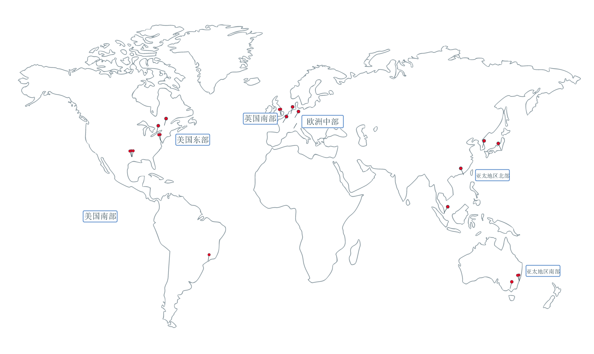

---

copyright:
  years: 2014, 2018
lastupdated: "2018-01-24"

---

{:new_window: target="_blank"}
{:shortdesc: .shortdesc}
{:screen: .screen}
{:pre: .pre}
{:table: .aria-labeledby="caption"}
{:codeblock: .codeblock}
{:tip: .tip}
{:download: .download}

# 区域和位置
{{site.data.keyword.Bluemix}} 在全球托管。区域是由端点访问的地理区域。位置是该区域内的数据中心。{{site.data.keyword.Bluemix_notm}} 内的服务可以在全球可用或在特定区域内可用。
{:shortdesc}

[{{site.data.keyword.Bluemix_notm}} 区域](#bluemix_regions)与 [{{site.data.keyword.containershort_notm}} 区域](#container_regions)不同。



图 1. {{site.data.keyword.containershort_notm}} 区域和数据中心

支持的 {{site.data.keyword.containershort_notm}} 区域：
  * 亚太地区北部
  * 亚太地区南部
  * 欧洲中部
  * 英国南部
  * 美国东部
  * 美国南部


## {{site.data.keyword.Bluemix_notm}} 区域 API 端点
{: #bluemix_regions}

您可以使用 {{site.data.keyword.Bluemix_notm}} 区域在 {{site.data.keyword.Bluemix_notm}} 服务之间组织资源。例如，您可以通过使用存储在同一区域的 {{site.data.keyword.registryshort_notm}} 中的专用 Docker 映像来创建 Kubernetes 集群。
{:shortdesc}

要检查您当前所在的 {{site.data.keyword.Bluemix_notm}} 区域，请运行 `bx info` 并查看**区域**字段。

可以通过在登录时指定 API 端点来访问 {{site.data.keyword.Bluemix_notm}} 区域。如果未指定区域，那么您会自动登录到离您最近的区域。

使用示例 login 命令登录到 {{site.data.keyword.Bluemix_notm}} 区域 API 端点：

  * 美国南部和美国东部
      ```
          bx login -a api.ng.bluemix.net
          ```
      {: pre}

  * 悉尼和亚太地区北部
      ```
        bx login -a api.au-syd.bluemix.net
        ```
      {: pre}

  * 德国
      ```
           bx login -a api.eu-de.bluemix.net
           ```
      {: pre}

  * 英国
      ```
           bx login -a api.eu-gb.bluemix.net
           ```
      {: pre}


<br />


## {{site.data.keyword.containershort_notm}} 区域 API 端点和位置
{: #container_regions}

通过使用 {{site.data.keyword.containershort_notm}} 区域，您可以在除您登录的 {{site.data.keyword.Bluemix_notm}} 区域以外的区域中创建或访问 Kibernetes 集群。
{{site.data.keyword.containershort_notm}} 区域端点具体参考 {{site.data.keyword.containershort_notm}}，而不是作为一个整体参考 {{site.data.keyword.Bluemix_notm}}。
{:shortdesc}

您可以通过一个全局端点来访问 {{site.data.keyword.containershort_notm}}：`https://containers.bluemix.net/`。
* 要检查您当前所在的 {{site.data.keyword.containershort_notm}} 区域，请运行 `bx cs region`。
* 要检索可用区域及其端点的列表，请运行 `bx cs regions`。

要将 API 用于全局端点，请在所有请求的 `X-Region` 头中传递区域名称。
{: tip}

### 登录到其他容器服务区域
{: #container_login_endpoints}

出于以下原因，您可能希望登录到其他 {{site.data.keyword.containershort_notm}} 区域：
  * 您在一个区域中创建了 {{site.data.keyword.Bluemix_notm}} 服务或专用 Docker 映像，并希望将其用于另一个区域中的 {{site.data.keyword.containershort_notm}}。
  * 您希望访问与登录到的缺省 {{site.data.keyword.Bluemix_notm}} 区域不同的区域中的集群。

</br>

要快速切换区域，请运行 `bx cs region-set`。

### 可供容器服务使用的位置
{: #locations}

位置是区域内可用的数据中心。

  | 区域| 位置| 城市|
  |--------|----------|------|
  | 亚太地区北部| hkg02、seo01、sng01、tok02 | 香港、首尔、新加坡和东京|
  | 亚太地区南部| mel01、syd01、syd04        | 墨尔本、悉尼|
  | 欧洲中部| ams03、fra02、mil01、par01| 阿姆斯特丹、法兰克福、米兰、巴黎|
  | 英国南部| lon02、lon04         | 伦敦|
  | 美国东部| mon01、tor01、wdc06、wdc07        | 蒙特利尔、多伦多、华盛顿|
  | 美国南部| dal10、dal12、dal13、sao01        | 达拉斯、圣保罗|

**注**：米兰 (mil01) 仅可用于免费集群。

### 使用容器服务 API 命令
{: #container_api}

要与 {{site.data.keyword.containershort_notm}} API 交互，请输入命令类型并将 `/v1/command` 附加到全局端点。

`GET /clusters` API 的示例：
  ```
  GET https://containers.bluemix.net/v1/clusters
  ```
  {: codeblock}

</br>

要将 API 用于全局端点，请在所有请求的 `X-Region` 头中传递区域名称。要列出可用区域，请运行 `bx cs regions`。
{: tip}

要查看有关 API 命令的文档，请查看 [https://containers.bluemix.net/swagger-api/](https://containers.bluemix.net/swagger-api/)。
