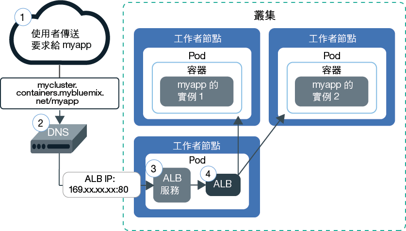
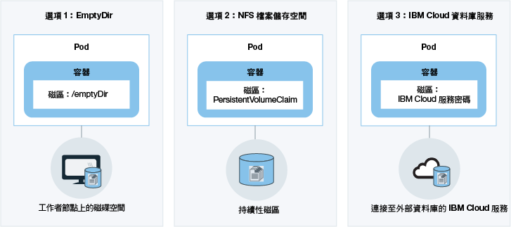

---

copyright:
  years: 2014, 2017
lastupdated: "2017-08-14"

---

{:new_window: target="_blank"}
{:shortdesc: .shortdesc}
{:screen: .screen}
{:pre: .pre}
{:table: .aria-labeledby="caption"}
{:codeblock: .codeblock}
{:tip: .tip} 
{:download: .download}


# 規劃叢集及應用程式
{: #cs_planning}

{{site.data.keyword.containershort_notm}} 提供數個選項來配置及自訂 Kubernetes 叢集，以符合組織的功能及非功能性需求。建立叢集之後，將無法變更其中部分配置。事先知道這些配置，有助於確保所有資源（例如記憶體、磁碟空間及 IP 位址）都可供開發團隊使用。
{:shortdesc}

## 比較精簡與標準叢集
{: #cs_planning_cluster_type}

您可以建立精簡叢集來熟悉及測試 Kubernetes 功能，或建立標準叢集，以開始使用完整 Kubernetes 功能來實作應用程式。
{:shortdesc}

|性質|精簡叢集|標準叢集|
|---------------|-------------|-----------------|
|[在「{{site.data.keyword.Bluemix_notm}} 公用」中提供](cs_ov.html#public_environment)|||
|[叢集內的專用網路](#cs_planning_private_network)|||
|[Nodeport 服務的公用應用程式存取](#cs_nodeport)|||
|[使用者存取管理](cs_cluster.html#cs_cluster_user)|||
|[叢集及應用程式中的 {{site.data.keyword.Bluemix_notm}} 服務存取](cs_cluster.html#cs_cluster_service)|||
|[工作者節點上用於儲存的磁碟空間](#cs_planning_apps_storage)|||
|[含磁區的持續性 NFS 檔案型儲存空間](#cs_planning_apps_storage)|||
|[負載平衡器服務的公用應用程式存取](#cs_loadbalancer)|||
|[Ingress 服務的公用應用程式存取](#cs_ingress)|||
|[可攜式公用 IP 位址](cs_apps.html#cs_cluster_ip_subnet)|||
|[在「{{site.data.keyword.Bluemix_notm}} 專用」中提供（封閉測試版）](cs_ov.html#dedicated_environment)|||
{: caption="表 1. 精簡與標準叢集的差異" caption-side="top"}

## 叢集配置
{: #cs_planning_cluster_config}

使用標準叢集，以增加應用程式可用性。當您將設定分佈到多個工作者節點及叢集時，使用者遇到應用程式關閉的可能性越低。內建功能（例如負載平衡及隔離）可提高對於潛在主機、網路或應用程式失敗的備援。
{:shortdesc}

檢閱這些可能的叢集設定，它們依遞增的可用性程度進行排序：

[](https://console.bluemix.net/docs/api/content/containers/images/cs_cluster_ha_roadmap.png)

1.  一個具有多個工作者節點的叢集
2.  在相同地區的不同位置執行的兩個叢集，各具有多個工作者節點
3.  在不同地區執行的兩個叢集，各具有多個工作者節點

進一步瞭解如何使用這些技術來增加叢集的可用性：

<dl>
<dt>包含足夠的工作者節點，以分散應用程式實例</dt>
<dd>基於高可用性，容許應用程式開發人員針對每個叢集將其容器分散到多個工作者節點。三個工作者節點可容許關閉一個工作者節點，而不會岔斷應用程式的使用。您可以指定從 [{{site.data.keyword.Bluemix_notm}} GUI](cs_cluster.html#cs_cluster_ui) 或 [CLI](cs_cluster.html#cs_cluster_cli) 建立叢集時要包含多少個工作者節點。Kubernetes 會限制您在叢集中可以有的工作者節點數目上限。如需相關資訊，請檢閱[工作者節點及 Pod 配額 ](https://kubernetes.io/docs/admin/cluster-large/)。
<pre class="codeblock">
<code>bx cs cluster-create --location &lt;dal10&gt; --workers 3 --public-vlan &lt;my_public_vlan_id&gt; --private-vlan &lt;my_private_vlan_id&gt; --machine-type &lt;u1c.2x4&gt; --name &lt;my_cluster&gt;</code>
</pre>
</dd>
<dt>將應用程式分散到叢集</dt>
<dd>建立多個叢集，各具有多個工作者節點。如果其中一個叢集的運作中斷，使用者仍然可以存取同時部署在另一個叢集中的應用程式。<p>叢集 1：</p>
<pre class="codeblock">
<code>bx cs cluster-create --location &lt;dal10&gt; --workers 3 --public-vlan &lt;my_public_vlan_id&gt; --private-vlan &lt;my_private_vlan_id&gt; --machine-type &lt;u1c.2x4&gt; --name &lt;my_cluster1&gt;</code>
</pre>
<p>叢集 2：</p>
<pre class="codeblock">
<code>bx cs cluster-create --location &lt;dal12&gt; --workers 3 --public-vlan &lt;my_public_vlan_id&gt; --private-vlan &lt;my_private_vlan_id&gt; --machine-type &lt;u1c.2x4&gt;  --name &lt;my_cluster2&gt;</code>
</pre>
</dd>
<dt>將應用程式分散到不同地區中的叢集</dt>
<dd>當您將應用程式分散到不同地區中的叢集時，可以容許根據使用者所在地區來進行負載平衡。如果一個地區的叢集、硬體，甚至整個位置關閉，資料流量會遞送至部署在另一個位置的容器。<p><strong>重要事項：</strong>配置自訂網域之後，即可使用這些指令來建立叢集。</p>
<p>位置 1：</p>
<pre class="codeblock">
<code>bx cs cluster-create --location &lt;dal10&gt; --workers 3 --public-vlan &lt;my_public_vlan_id&gt; --private-vlan &lt;my_private_vlan_id&gt; --machine-type &lt;u1c.2x4&gt; --name &lt;my_cluster1&gt;</code>
</pre>
<p>位置 2：</p>
<pre class="codeblock">
<code>bx cs cluster-create --location &lt;ams03&gt; --workers 3 --public-vlan &lt;my_public_vlan_id&gt; --private-vlan &lt;my_private_vlan_id&gt; --machine-type &lt;u1c.2x4&gt; --name &lt;my_cluster2&gt;</code>
</pre>
</dd>
</dl>


## 工作者節點配置
{: #cs_planning_worker_nodes}

Kubernetes 叢集包含虛擬機器工作者節點，並且由 Kubernetes 主節點集中進行監視及管理。叢集管理者必須決定如何設定工作者節點的叢集，以確保叢集使用者具有部署及執行叢集中應用程式的所有資源。
{:shortdesc}

當您建立標準叢集時，會代表您在 {{site.data.keyword.BluSoftlayer_full}} 中訂購以及在 {{site.data.keyword.Bluemix_notm}} 中設定工作者節點。每個工作者節點都會獲指派建立叢集之後即不得變更的唯一工作者節點 ID 及網域名稱。視您選擇的硬體隔離層次而定，工作者節點可以設定為共用或專用節點。每個工作者節點都會佈建特定機型，而此機型可決定部署至工作者節點的容器可用的 vCPU 數目、記憶體及磁碟空間。Kubernetes 會限制您在叢集中可以有的工作者節點數目上限。如需相關資訊，請檢閱[工作者節點及 Pod 配額 ](https://kubernetes.io/docs/admin/cluster-large/)。


### 工作者節點的硬體
{: #shared_dedicated_node}

每個工作者節點都會設定為實體硬體上的虛擬機器。當您在「{{site.data.keyword.Bluemix_notm}} 公用」中建立標準叢集時，必須選擇是要由多個 {{site.data.keyword.IBM_notm}} 客戶共用基礎硬體（多方承租戶）還是基礎硬體只供您專用（單一承租戶）。
{:shortdesc}

在多方承租戶設定中，會在所有部署至相同實體硬體的虛擬機器之間共用實體資源（例如 CPU 及記憶體）。為了確保每個虛擬機器都可以獨立執行，虛擬機器監視器（也稱為 Hypervisor）會將實體資源分段為隔離實體，並將它們當成專用資源配置至虛擬機器（Hypervisor 隔離）。

在單一承租戶設定中，所有實體資源都只供您專用。您可以將多個工作者節點部署為相同實體主機上的虛擬機器。與多方承租戶設定類似，Hypervisor 確保每個工作者節點都可以共用可用的實體資源。

因為基礎硬體的成本是由多個客戶分攤，所以共用節點通常會比專用節點便宜。不過，當您決定共用或專用節點時，可能會想要與法務部門討論應用程式環境所需的基礎架構隔離層次及相符性。

當您建立精簡叢集時，工作者節點會自動佈建為 {{site.data.keyword.IBM_notm}} {{site.data.keyword.BluSoftlayer_notm}} 帳戶中的共用節點。

當您在「{{site.data.keyword.Bluemix_notm}} 專用」中建立叢集時，會使用唯一設定的單一承租戶，而且所有實體資源都只供您專用。您可以將多個工作者節點部署為相同實體主機上的虛擬機器。

## 部署
{: #highly_available_apps}

將設定分佈到越多個工作者節點及叢集，使用者遇到應用程式關閉的可能性越低。
{:shortdesc}

檢閱下列依可用性增加來排序的潛在應用程式設定：

[](../api/content/containers/images/cs_app_ha_roadmap.png)

1.  含有 n+2 個 Pod 的部署，由抄本集管理。
2.  含有 n+2 個 Pod 的部署，由抄本集管理，分散於相同位置中的多個節點（反親緣性）。
3.  含有 n+2 個 Pod 的部署，由抄本集管理，分散於不同位置中的多個節點（反親緣性）。
4.  含有 n+2 個 Pod 的部署，由抄本集管理，分散於不同地區中的多個節點（反親緣性）。

進一步瞭解這些技術來增加應用程式的可用性：

<dl>
<dt>使用部署和抄本集來部署您的應用程式及其相依關係</dt>
<dd>部署是一種 Kubernetes 資源，您可以用來宣告應用程式的所有元件及其相依關係。透過說明單一元件，而不是寫下所有必要步驟和建立的順序，讓您可以專注於應用程式執行時應該呈現的樣子。</br>
當您部署多個 Pod 時，會自動為您的部署建立抄本集來監視 Pod，並確保隨時都有所需數目的 Pod 在執行。當一個 Pod 關閉時，抄本集會以新的 Pod 來取代無回應的 Pod。</br></br>
您可以使用部署來定義應用程式的更新策略，包括您要在漸進式更新期間新增的 Pod 數目，以及每次更新時可能無法使用的 Pod 數目。當您執行漸進式更新時，部署會檢查修訂版是否正常運作，並且在偵測到失敗時停止推出。</br>
部署也有可能讓您同時部署多個具有不同旗標的修訂版，所以舉例來說，您可以先測試部署，然後再決定將其推送至正式作業環境。</br></br>
每個部署都會追蹤已部署的修訂版。當您發現更新項目無法如預期般運作時，可以使用此修訂歷程來回復至舊版。</dd>
<dt>為應用程式的工作負載包含足夠的抄本，然後加兩個</dt>
<dd>為了讓應用程式具備高可用性以及更大的失敗復原力，請考慮包含多於最小值的額外抄本來處理預期工作負載。額外的抄本可以在 Pod 當機，而抄本集尚未回復當機的 Pod 時，處理工作負載。為了預防兩者同時失敗，請包含兩個額外的抄本。此設定是 N+2 型樣，其中 N 是處理送入工作負載的抄本數，而 +2 是額外的兩個抄本。</dd>
<dt>將 Pod 分散於多個節點（反親緣性）</dt>
<dd>當您建立部署時，可以將每一個 Pod 部署至相同的工作者節點。這種 Pod 存在於相同工作者節點的設定，稱為親緣性或共置。為了保護應用程式不受工作者節點故障影響，您可以使用 <strong>podAntiAffinity</strong> 選項，強制部署將 Pod 分散至多個工作者節點。此選項僅適用於標準叢集。</br></br>
<strong>附註：</strong>下列 YAML 檔案會強制將每個 Pod 部署至不同的工作者節點。當您定義的抄本多於叢集中可用的工作者節點時，只有已部署的抄本數可以滿足反親緣性需求。任何其他抄本都會維持在擱置狀態，直到有其他工作者節點新增至叢集為止。<pre class="codeblock">
<code>apiVersion: v1
kind: Service
metadata:
name: wasliberty
labels:
app: wasliberty
spec:
ports:
    # 服務應該提供服務的埠
  - port: 9080
  selector:
    app: wasliberty
  type: NodePort

---
apiVersion: extensions/v1beta1
kind: Deployment
metadata:
  name: wasliberty
spec:
  replicas: 3
  template:
    metadata:
      labels:
        app: wasliberty
      annotations:
        scheduler.alpha.kubernetes.io/affinity: >
            {
              "podAntiAffinity": {
"requiredDuringSchedulingIgnoredDuringExecution": [
                  {
                    "labelSelector": {
"matchExpressions": [
                        {
                          "key": "app",
                          "operator": "In",
                          "values": ["wasliberty"]
                        }
                      ]
                    },
                    "topologyKey": "kubernetes.io/hostname"
                 }
                ]
               }
             }
    spec:
      containers:
      - name: wasliberty
        image: registry.&lt;region&gt;.bluemix.net/ibmliberty
        ports:
          - containerPort: 9080</code></pre>

</dd>
<dt>將 Pod 分散在多個位置或地區</dt>
<dd>為了保護應用程式不受位置或地區故障的影響，您可以在另一個位置或地區建立第二個叢集，並使用部署 YAML 來為應用程式部署複製的抄本集。透過在叢集前面新增共用路徑及負載平衡器，您可以將工作負載分散至各位置及地區。如需在叢集之間共用路徑的相關資訊，請參閱<a href="https://console.bluemix.net/docs/containers/cs_cluster.html#cs_cluster" target="_blank">叢集的高可用性</a>。如需詳細資料，請檢閱<a href="https://console.bluemix.net/docs/containers/cs_planning.html#cs_planning_cluster_config" target="_blank">高可用性部署</a>的選項。</dd>
</dl>

### 最小應用程式部署
{: #minimal_app_deployment}

精簡或標準叢集中的基本應用程式部署可能包括下列元件。
{:shortdesc}

<a href="../api/content/containers/images/cs_app_tutorial_components1.png"></a>

最小應用程式的配置 Script 範例。
```
apiVersion: extensions/v1beta1
kind: Deployment
metadata:
  name: ibmliberty
spec:
  replicas: 1
  template:
    metadata:
      labels:
        app: ibmliberty
    spec:
      containers:
      - name: ibmliberty
        image: registry.<region>.bluemix.net/ibmliberty:latest
---
apiVersion: v1
kind: Service
metadata:
  name: ibmliberty-service
  labels:
    app: ibmliberty
spec:
  selector:
    run: ibmliberty
  type: NodePort
  ports:
   - protocol: TCP
     port: 9080
```
{: codeblock}

## 專用網路
{: #cs_planning_private_network}

工作者節點與 Pod 之間的安全專用網路通訊是使用專用虛擬區域網路（也稱為專用 VLAN）所實現。VLAN 會配置一組工作者節點及 Pod，就像它們已連接至相同的實體佈線。
{:shortdesc}

當您建立叢集時，每個叢集都會自動連接至專用 VLAN。專用 VLAN 會判定在建立叢集期間指派給工作者節點的專用 IP 位址。

|叢集類型|叢集之專用 VLAN 的管理員|
|------------|-------------------------------------------|
|{{site.data.keyword.Bluemix_notm}} 公用中的精簡叢集|{{site.data.keyword.IBM_notm}}|
|{{site.data.keyword.Bluemix_notm}} 公用中的標準叢集|在您的 {{site.data.keyword.BluSoftlayer_notm}} 帳戶中，就是您<p>**提示：**若要存取您帳戶中的所有 VLAN，請開啟 [VLAN 跨距 ](https://knowledgelayer.softlayer.com/procedure/enable-or-disable-vlan-spanning)。</p>|
|{{site.data.keyword.Bluemix_notm}} 專用中的標準叢集|{{site.data.keyword.IBM_notm}}|
{: caption="表 2. 專用 VLAN 管理責任" caption-side="top"}

所有已部署至工作者節點的 Pod 也會獲指派專用 IP 位址。Pod 會獲指派 172.30.0.0/16 專用位址範圍中的 IP，並且只在工作者節點之間進行遞送。
若要避免衝突，請不要在將與工作者節點通訊的任何節點上使用此 IP 範圍。使用專用 IP 位址，工作者節點及 Pod 可以在專用網路上安全地進行通訊。不過，Pod 損毀或需要重建工作者節點時，會指派新的專用 IP 位址。

因為很難追蹤必須為高可用性的應用程式的變更中專用 IP 位址，所以您可以使用內建 Kubernetes 服務探索特性，將應用程式公開為叢集的專用網路上的叢集 IP 服務。Kubernetes 服務會將一組 Pod 分組在一起，並為叢集中其他服務提供這些 Pod 的網路連線，而不公開每一個 Pod 的實際專用 IP 位址。當您建立叢集 IP 服務時，會從 10.10.10.0/24 專用位址範圍將專用 IP 位址指派給該服務。與使用 Pod 專用位址範圍相同，請不要在將與工作者節點通訊的任何節點上使用此 IP 範圍。
此 IP 位址只能在叢集內存取。您無法從網際網路存取此 IP 位址。同時，會建立服務的 DNS 查閱項目，並將其儲存在叢集的 kube-dns 元件中。DNS 項目包含服務的名稱、已建立服務的名稱空間，以及已指派專用叢集 IP 位址的鏈結。

如果叢集中的應用程式需要存取受叢集 IP 服務保護的 Pod，則可以使用已指派給服務的專用叢集 IP 位址，或使用服務的名稱來傳送要求。當您使用服務的名稱時，會在 kube-dns 元件中查閱該名稱，並將其遞送至服務的專用叢集 IP 位址。要求到達服務時，服務確保所有要求都會平均地轉遞至 Pod，但與其專用 IP 位址及部署它們的工作者節點無關。

如需如何建立叢集 IP 類型服務的相關資訊，請參閱 [Kubernetes 服務 ](https://kubernetes.io/docs/concepts/services-networking/service/#publishing-services---service-types)。


## 公用網路
{: #cs_planning_public_network}

當您建立叢集時，每個叢集都必須連接至公用 VLAN。公用 VLAN 會判定在建立叢集期間指派給工作者節點的公用 IP 位址。
{:shortdesc}

公用 VLAN 是透過 {{site.data.keyword.BluSoftlayer_notm}} 防火牆所保護，而防火牆預設不容許網際網路的入埠或出埠連線功能。雖然 Kubernetes 主節點及工作者節點都會使用其獲指派的公用 IP 位址來透過公用 VLAN 進行通訊，但是無法從網際網路聯繫。

|叢集類型|叢集之公用 VLAN 的管理員|
|------------|------------------------------------------|
|{{site.data.keyword.Bluemix_notm}} 公用中的精簡叢集|{{site.data.keyword.IBM_notm}}|
|{{site.data.keyword.Bluemix_notm}} 公用中的標準叢集|在您的 {{site.data.keyword.BluSoftlayer_notm}} 帳戶中，就是您|
|{{site.data.keyword.Bluemix_notm}} 專用中的標準叢集|{{site.data.keyword.IBM_notm}}|
{: caption="表 3. VLAN 管理責任" caption-side="top"}

視您所建立的是精簡還是標準叢集而定，您可以選擇下列將應用程式公開給大眾使用的選項。

-   [NodePort 類型服務](#cs_nodeport)（精簡及標準叢集）
-   [LoadBalancer 類型服務](#cs_loadbalancer)（僅限標準叢集）
-   [Ingress](#cs_ingress)（僅限標準叢集）


### 使用 NodePort 類型服務將應用程式公開至網際網路
{: #cs_nodeport}

公開工作者節點上的公用埠，並使用工作者節點的公用 IP 位址來公開存取您在叢集中的服務。
{:shortdesc}

[](https://console.bluemix.net/docs/api/content/containers/images/cs_nodeport.png)

當您建立 Kubernetes NodePort 類型服務來公開應用程式時，會將 30000 到 32767 範圍內的 NodePort 及內部叢集 IP 位址指派給服務。NodePort 服務是作為應用程式送入要求的外部進入點。所指派的 NodePort 會公開於叢集中每一個工作者節點的 kubeproxy 設定。每個工作者節點都會開始接聽所指派的 NodePort，來取得服務的送入要求。若要從網際網路存取服務，您可以使用在建立叢集期間所指派的任何工作者節點的公用 IP 位址，以及 `<ip_address>:<nodeport>` 格式的 NodePort。

公用要求在到達 NodePort 服務時，會自動轉遞給服務的內部叢集 IP，並從 kubeproxy 元件進一步轉遞給應用程式部署所在 Pod 的專用 IP 位址。叢集 IP 只能在叢集內存取。如果您在不同的 Pod 中執行應用程式的多個抄本，則 kubeproxy 元件會負載平衡所有抄本之間的送入要求。

**附註：**請記住，工作者節點的公用 IP 位址不是永久性的。移除或重建工作者節點時，會將新的公用 IP 位址指派給工作者節點。NodePort 類型服務可以用於測試應用程式的公用存取，也可以用於僅短時間需要公用存取時。當您需要服務的穩定公用 IP 位址及更高可用性時，請使用 [LoadBalancer 類型服務](#cs_loadbalancer)或 [Ingress](#cs_ingress) 來公開應用程式。

如需如何使用 {{site.data.keyword.containershort_notm}} 來建立 NodePort 類型服務的相關資訊，請參閱[使用 NodePort 服務類型來配置應用程式的公用存取](cs_apps.html#cs_apps_public_nodeport)。


### 使用 LoadBalancer 類型服務將應用程式公開至網際網路
{: #cs_loadbalancer}

公開埠並使用公用 IP 位址，讓負載平衡器可以存取應用程式。


[](https://console.bluemix.net/docs/api/content/containers/images/cs_loadbalancer.png)

當您建立標準叢集時，{{site.data.keyword.containershort_notm}} 會自動要求 5 個可攜式公用 IP 位址，並在建立叢集期間將它們佈建至 {{site.data.keyword.BluSoftlayer_notm}} 帳戶。其中一個可攜式 IP 位址用於 [Ingress 控制器](#cs_ingress)。建立 LoadBalancer 類型服務，即可使用 4 個可攜式公用 IP 位址將應用程式公開給大眾使用。

當您建立 Kubernetes LoadBalancer 類型服務時，會建立外部負載平衡器，並將 4 個可用公用 IP 位址的其中一個指派給它。如果沒有可用的可攜式公用 IP 位址，則建立 LoadBalancer 服務會失敗。LoadBalancer 服務是作為應用程式送入要求的外部進入點。與 NodePort 類型服務不同，您可以將任何埠指派給負載平衡器，而且未連結至特定埠範圍。指派給 LoadBalancer 服務的可攜式公用 IP 位址是永久性的，因此移除或重建工作者節點時並不會變更，這讓 LoadBalancer 服務的可用性高於 NodePort 服務。若要從網際網路存取 LoadBalancer 服務，請使用負載平衡器的公用 IP 位址以及 `<ip_address>:<port>` 格式的已指派埠。

公用要求在到達 LoadBalancer 服務時，會自動轉遞給在建立服務期間指派給 LoadBalancer 服務的內部叢集 IP 位址。叢集 IP 位址只能在叢集內存取。從叢集 IP 位址，將送入要求進一步轉遞給工作者節點的 kubeproxy 元件，接著轉遞給部署應用程式的 Pod 的專用 IP 位址。如果您在不同的 Pod 中執行應用程式的多個抄本，則 kubeproxy 元件會負載平衡所有抄本之間的送入要求。

如需如何使用 {{site.data.keyword.containershort_notm}} 來建立 LoadBalancer 類型服務的相關資訊，請參閱[使用負載平衡器服務類型來配置應用程式的公用存取](cs_apps.html#cs_apps_public_load_balancer)。


### 使用 Ingress 將應用程式公開至網際網路
{: #cs_ingress}

Ingress 可讓您公開叢集中的多個服務，並使用單一公用進入點將它們設為可公開使用。

[](https://console.bluemix.net/docs/api/content/containers/images/cs_ingress.png)

Ingress 提供唯一公用路徑，讓您可以根據個別路徑，將公用要求轉遞給叢集內外部的應用程式，而不是為您要公開給大眾使用的每一個應用程式建立負載平衡器服務。Ingress 包含兩個主要元件。Ingress 資源會定義如何遞送應用程式送入要求的規則。所有 Ingress 資源都必須向 Ingress 控制器登錄，而 Ingress 控制器會接聽送入 HTTP 或 HTTPS 服務要求，並根據針對每一個 Ingress 資源所定義的規則來轉遞要求。

當您建立標準叢集時，{{site.data.keyword.containershort_notm}} 會自動建立叢集的高可用性 Ingress 控制器，並將格式為 `<cluster_name>.<region>.containers.mybluemix.net` 的唯一公用路徑指派給它。公用路徑會鏈結至在建立叢集期間佈建至 {{site.data.keyword.BluSoftlayer_notm}} 帳戶的可攜式公用 IP 位址。

若要透過 Ingress 公開應用程式，您必須建立應用程式的 Kubernetes 服務，並藉由定義 Ingress 資源向 Ingress 控制器登錄此服務。Ingress 資源指定您要附加至公用路徑的路徑，以形成所公開應用程式的唯一 URL，例如：`mycluster.us-south.containers.mybluemix.net/myapp`。當您將此路徑輸入 Web 瀏覽器時，會將要求傳送給 Ingress 控制器的鏈結可攜式公用 IP 位址。Ingress 控制器會檢查 `mycluster` 叢集中是否有 `myapp` 路徑的遞送規則。如果找到相符規則，則會將包括個別路徑的要求轉遞給已部署應用程式的 Pod，請考慮已在原始 Ingress 資源物件中定義的規則。若要讓應用程式處理送入要求，請確定應用程式接聽 Ingress 資源中已定義的個別路徑。

您可以針對下列情境配置 Ingress 控制器來管理應用程式的送入網路資料流量：

-   使用沒有 TLS 終止的 IBM 提供的網域
-   使用具有 TLS 終止的 IBM 提供的網域及 TLS 憑證
-   使用自訂網域及 TLS 憑證來執行 TLS 終止
-   使用 IBM 提供的網域或自訂網域及 TLS 憑證來存取叢集外部的應用程式
-   使用註釋將功能新增至 Ingress 控制

如需如何搭配使用 Ingress 與 {{site.data.keyword.containershort_notm}} 的相關資訊，請參閱[使用 Ingress 控制器來配置應用程式的公用存取](cs_apps.html#cs_apps_public_ingress)。


## 使用者存取管理
{: #cs_planning_cluster_user}

您可以將叢集的存取權授與組織中的其他使用者，以確保只有授權使用者才能使用叢集，以及將應用程式部署至叢集。
{:shortdesc}

如需相關資訊，請參閱[管理 {{site.data.keyword.containershort_notm}} 中的使用者及叢集存取權](cs_cluster.html#cs_cluster_user)。


## 映像檔登錄
{: #cs_planning_images}

Docker 映像檔是您建立的每個容器的基礎。映像檔是從 Dockerfile 所建立的，該 Dockerfile 檔案包含建置映像檔的指示。Dockerfile 可能會參照其指示中個別儲存的建置構件（例如應用程式、應用程式的配置及其相依關係）。
{:shortdesc}

映像檔通常會儲存在登錄中，而該登錄可供公開存取（公用登錄）或已設定一小組使用者的有限存取（專用登錄）。公用登錄（例如 Docker Hub）可用來開始使用 Docker 及 Kubernetes 在叢集中建立第一個容器化應用程式。但是，如果是企業應用程式，則請使用專用登錄（例如 {{site.data.keyword.registryshort_notm}} 中提供的登錄）來防止未授權使用者使用及變更映像檔。叢集管理者必須設定專用登錄，以確保叢集使用者可以使用存取專用登錄的認證。

您可以搭配使用多個登錄與 {{site.data.keyword.containershort_notm}}，以將應用程式部署至叢集。

|登錄|說明|優點|
|--------|-----------|-------|
|[{{site.data.keyword.registryshort_notm}}](/docs/services/Registry/index.html)|使用此選項，您可以在 {{site.data.keyword.registryshort_notm}} 中設定您自己的安全 Docker 映像檔儲存庫，您可以在其中放心地儲存映像檔並且在叢集使用者之間進行共用。|<ul><li>管理帳戶中的映像檔存取。</li><li>使用 {{site.data.keyword.IBM_notm}} 所提供的映像檔及範例應用程式（例如 {{site.data.keyword.IBM_notm}} Liberty）作為主映像檔，並在其中新增您自己的應用程式碼。</li><li>「漏洞警告器」會自動掃描映像檔的潛在漏洞（包括修正它們的 OS 特定建議）。</li></ul>|
|任何其他專用登錄|建立 [imagePullSecret ](https://kubernetes.io/docs/concepts/containers/images/)，以將任何現有專用登錄連接至叢集。Secret 是用來將登錄 URL 及認證安全地儲存在 Kubernetes Secret 中。|<ul><li>使用現有專用登錄，而不管其來源（Docker Hub、組織所擁有的登錄或其他專用 Cloud 登錄）。</li></ul>|
|公用 Docker Hub|使用此選項，在不需要 Dockerfile 變更時，即可直接使用 Docker Hub 中的現有公用映像檔。<p>**附註：**請記住，此選項可能不符合組織的安全需求（例如存取管理、漏洞掃描或應用程式保密）。</p>|<ul><li>不需要額外設定叢集。</li><li>包括各種開放程式碼應用程式。</li></ul>|
{: caption="表 4. 公用及專用映像檔登錄選項" caption-side="top"}

在您設定映像檔登錄之後，叢集使用者可以使用映像檔，以將其應用程式部署至叢集。

如需如何存取公用或專用登錄以及使用映像檔建立容器的相關資訊，請參閱[搭配使用專用及公用映像檔登錄與 {{site.data.keyword.containershort_notm}}](cs_cluster.html#cs_apps_images)。


## 持續資料儲存空間
{: #cs_planning_apps_storage}

容器設計為短期容器。不過，您可以選擇數個選項，以在容器發生失效接手時持續保存資料，以及在容器之間共用資料。
{:shortdesc}

[](https://console.bluemix.net/docs/api/content/containers/images/cs_planning_apps_storage.png)

|選項|說明|
|------|-----------|
|選項 1：使用 `/emptyDir`，以使用工作者節點上的可用磁碟空間來持續保存資料<p>此特性適用於精簡及標準叢集。</p>|使用此選項，您可以在已指派給 Pod 的工作者節點磁碟空間上建立空磁區。該 Pod 中的容器可以讀取及寫入該磁區。因為磁區已指派給一個特定 Pod，所以無法與抄本集中的其他 Pod 共用資料。
<p>從工作者節點永久刪除所指派的 Pod 時，會移除 `/emptyDir` 磁區及其資料。</p><p>**附註：**如果 Pod 內的容器損毀，則工作者節點上仍然會有磁區中的資料。</p><p>如需相關資訊，請參閱 [Kubernetes 磁區 ](https://kubernetes.io/docs/concepts/storage/volumes/)。</p>|
|選項 2：建立持續性磁區宣告，以佈建部署的 NFS 型持續性儲存空間<p>只有標準叢集才能使用此特性。</p>|使用此選項，您可以透過無限制數目的 NFS 檔案共用及持續性磁區來持續儲存應用程式及容器資料。您可以建立[持續性磁區宣告](cs_apps.html)來起始 NFS 型檔案儲存空間的要求。{{site.data.keyword.containershort_notm}} 提供預先定義的儲存空間類別，以定義儲存空間的大小範圍、IOPS，以及磁區的讀取及寫入權。當您建立持續性磁區宣告時，可以選擇這些儲存空間類別。提交持續性磁區宣告之後，{{site.data.keyword.containershort_notm}} 會動態佈建在 NFS 型檔案儲存空間上所管理的持續性磁區。[您可以將持續性磁區宣告以磁區形式裝載至 Pod](cs_apps.html#cs_apps_volume_claim)，以容許 Pod 中的容器讀取及寫入磁區。持續性磁區可以在相同抄本集的 Pod 之間共用，或與相同叢集的其他 Pod 共用。<p>容器損毀或從工作者節點移除 Pod 時，資料不會被移除，而且仍然可以透過裝載磁區的其他 Pod 進行存取。持續性磁區宣告是在持續性儲存空間上管理，但沒有備份。如果需要資料的備份，請建立手動備份。</p><p>**附註：**持續性 NFS 檔案共用儲存空間是按月收費。如果您佈建叢集的持續性儲存空間，並立即予以移除，則仍需要支付一個月的持續性儲存空間費用，即使您只是短時間使用。</p>|
|選項 3：將 {{site.data.keyword.Bluemix_notm}} 資料庫服務連結至 Pod<p>此特性適用於精簡及標準叢集。</p>|使用此選項，您可以使用 {{site.data.keyword.Bluemix_notm}} 資料庫雲端服務來持續保存及存取資料。當您將 {{site.data.keyword.Bluemix_notm}} 服務連結至叢集中的名稱空間時，會建立 Kubernetes Secret。Kubernetes Secret 會保留服務的機密資訊（例如服務的 URL、使用者名稱及密碼）。您可以將 Secret 以 Secret 磁區形式裝載至 Pod，並使用 Secret 中的認證來存取服務。
透過將 Secret 磁區裝載至其他 Pod，您也可以在 Pod 之間共用資料。<p>容器損毀或從工作者節點移除 Pod 時，資料不會被移除，而且仍然可以透過裝載 Secret 磁區的其他 Pod 進行存取。</p><p>大部分 {{site.data.keyword.Bluemix_notm}} 資料庫服務會免費提供少量資料的磁碟空間，讓您可以測試其特性。</p><p>如需如何將 {{site.data.keyword.Bluemix_notm}} 服務連結至 Pod 的相關資訊，請參閱[在 {{site.data.keyword.containershort_notm}} 中新增應用程式的 {{site.data.keyword.Bluemix_notm}} 服務](cs_apps.html#cs_apps_service)。</p>|
{: caption="表 5. Kubernetes 叢集中部署的持續性資料儲存空間選項" caption-side="top"}


## 性能監視
{: #cs_planning_health}

您可以使用標準 Kubernetes 及 Docker 特性，來監視叢集及部署於其中之應用程式的性能。
{:shortdesc}
<dl>
<dt>{{site.data.keyword.Bluemix_notm}} 中的叢集詳細資料頁面</dt>
<dd>{{site.data.keyword.containershort_notm}} 提供叢集性能及容量以及叢集資源使用情形的相關資訊。您可以使用此 GUI 來橫向擴充叢集、使用持續性儲存空間，以及透過 {{site.data.keyword.Bluemix_notm}} 服務連結將其他功能新增至叢集。若要檢視叢集詳細資料頁面，請移至 **{{site.data.keyword.Bluemix_notm}} 儀表板**，然後選取一個叢集。</dd>
<dt>Kubernetes 儀表板</dt>
<dd>Kubernetes 儀表板是一個管理 Web 介面，可用來檢閱工作者節點的性能、尋找 Kubernetes 資源、部署容器化應用程式，以及根據記載及監視資訊來進行應用程式疑難排解。如需如何存取 Kubernetes 儀表板的相關資訊，請參閱[啟動 {{site.data.keyword.containershort_notm}} 的 Kubernetes 儀表板](cs_apps.html#cs_cli_dashboard)。</dd>
<dt>Docker 日誌</dt>
<dd>您可以運用內建 Docker 記載功能來檢閱標準 STDOUT 及 STDERR 輸出串流的活動。如需相關資訊，請參閱[檢視在 Kubernetes 叢集中執行的容器的容器日誌](/docs/services/CloudLogAnalysis/containers/logging_containers_other_logs.html#logging_containers_collect_data)。</dd>
<dt>記載及監視</dt>
<dd>{{site.data.keyword.containershort_notm}} 支援標準叢集的其他監視及記載功能。日誌及度量值位於 Kubernetes 叢集建立時所登入的 {{site.data.keyword.Bluemix_notm}} 空間。<ul><li>會自動收集叢集中所部署的所有容器的容器度量值。這些度量值會透過 Grafana 傳送並設為可供使用。如需度量值的相關資訊，請參閱 [ 的監視功能 {{site.data.keyword.containershort_notm}}](/docs/services/cloud-monitoring/containers/analyzing_metrics_bmx_ui.html#analyzing_metrics_bmx_ui)。<p>若要存取 Grafana 儀表板，請移至 `https://metrics.<region>.bluemix.net`。選取您已建立叢集的 {{site.data.keyword.Bluemix_notm}} 組織及空間。</p></li><li>容器日誌是在容器外進行監視及轉遞。您可以使用 Kibana 儀表板來存取容器的日誌。如需記載的相關資訊，請參閱 [{{site.data.keyword.containershort_notm}} 的記載功能](/docs/services/CloudLogAnalysis/index.html#getting-started-with-cla)。<p>若要存取 Kibana 儀表板，請移至 `https://logging.<region>.bluemix.net`。選取您已建立叢集的 {{site.data.keyword.Bluemix_notm}} 組織及空間。</p></li></ul></dd>
</dl>

### 其他性能監視工具
{: #concept_xrh_dhj_wz}

您可以配置其他工具來取得其他記載及監視功能。
<dl>
<dt>Prometheus</dt>
<dd>Prometheus 是一個專為 Kubernetes 所設計的開放程式碼監視、記載及警示工具，可根據 Kubernetes 記載資訊來擷取叢集、工作者節點及部署性能的詳細資訊。如需設定資訊，請參閱[整合服務與 {{site.data.keyword.containershort_notm}}](#cs_planning_integrations)。</dd>
</dl>


## 整合
{: #cs_planning_integrations}

您可以使用各種外部服務，以及具有 {{site.data.keyword.containershort_notm}} 中標準叢集的「{{site.data.keyword.Bluemix_notm}} 型錄」中的服務。
{:shortdesc}

<table summary="可存取性摘要">
<caption>表 6. Kubernetes 中叢集及應用程式的整合選項</caption>
<thead>
<tr>
<th>服務</th>
<th>說明</th>
</tr>
</thead>
<tbody>
<tr>
<td>IBM Blockchain</td>
<td>將 IBM Blockchain 的可公開使用開發環境部署至 {{site.data.keyword.containerlong_notm}} 中的 Kubernetes 叢集。使用此環境開發及自訂您自己的區塊鏈網路，以部署應用程式來共用可記錄交易歷程的不可變分類帳。如需相關資訊，請參閱<a href="https://ibm-blockchain.github.io" target="_blank">在雲端沙盤推演 IBM Blockchain 平台中開發 </a>。</td>
</tr>
<tr>
<td>Istio</td>
<td>Istio 是一種開放程式碼服務，提供方法讓開發人員連接、保護、管理及監視雲端編排平台上微服務（也稱為服務網）的網路，例如 Kubernetes。Istio 提供功能來管理網路資料流量、將負載平衡至微服務、強制執行存取原則，以及驗證服務網上的服務身分。若要在 {{site.data.keyword.containershort_notm}} 的 Kubernetes 叢集上安裝 Istio，請參閱 Istio 文件中的<a href="https://istio.io/docs/tasks/installing-istio.html" target="_blank">安裝主題 </a>。若要檢閱如何搭配使用 Istio 與 Kubernetes 的範例開發人員行程，請參閱<a href="https://developer.ibm.com/code/journey/manage-microservices-traffic-using-istio/" target="_blank">使用 Istio 管理微服務資料流量 </a>。</td>
</tr>
<tr>
<td>Prometheus</td>
<td>Prometheus 是一個專為 Kubernetes 所設計的開放程式碼監視、記載及警示工具，可根據 Kubernetes 記載資訊來擷取叢集、工作者節點及部署性能的詳細資訊。會收集叢集中所有執行中容器的 CPU、記憶體、I/O 及網路活動，並且可以用於自訂查詢或警示中，以監視叢集中的效能及工作負載。<p>若要使用 Prometheus，請執行下列動作：</p>
<ol>
<li>遵循 <a href="https://github.com/coreos/prometheus-operator/tree/master/contrib/kube-prometheus" target="_blank">CoreOS 指示 </a> 來安裝 Prometheus。
<ol>
<li>當您執行 export 指令時，請使用 kube-system 名稱空間。
<p><code>export NAMESPACE=kube-system hack/cluster-monitoring/deploy</code></p></li>
</ol>
</li>
<li>在叢集中部署 Prometheus 之後，請在 Grafana 中編輯 Prometheus 資料來源，以參照 <code>prometheus.kube-system:30900</code>。</li>
</ol>
</td>
</tr>
<tr>
<td>Weave Scope</td>
<td>Weave Scope 提供 Kubernetes 叢集內資源（包括服務、Pod、容器、處理程序、節點等項目）的視覺圖。Weave Scope 提供 CPU 及記憶體的互動式度量值，也提供工具來調整並執行至容器。<p>如需相關資訊，請參閱[使用 Weave Scope 及 {{site.data.keyword.containershort_notm}} 視覺化 Kubernetes 叢集資源](cs_cluster.html#cs_weavescope)。</p></li></ol>
</td>
</tr>
</tbody>
</table>


## 存取 {{site.data.keyword.BluSoftlayer_notm}} 組合
{: #cs_planning_unify_accounts}

若要建立標準 Kubernetes 叢集，您必須具有 {{site.data.keyword.BluSoftlayer_notm}} 組合的存取權。需要有這個存取權，才能要求付費基礎架構資源（例如，叢集的工作者節點、可攜式公用 IP 位址或持續性儲存空間）。
{:shortdesc}

啟用自動帳戶鏈結之後所建立的「{{site.data.keyword.Bluemix_notm}} 隨收隨付制」帳戶，已設定 {{site.data.keyword.BluSoftlayer_notm}} 組合的存取權，因此，您可以購買叢集的基礎架構資源，而不需要進行額外配置。

具有其他 {{site.data.keyword.Bluemix_notm}} 帳戶類型的使用者，或具有未鏈結至其 {{site.data.keyword.Bluemix_notm}} 帳戶之現有 {{site.data.keyword.BluSoftlayer_notm}} 帳戶的使用者，必須配置其帳戶以建立標準叢集。

請檢閱下表，以找出每一種帳戶類型的可用選項。

|帳戶類型|說明|建立標準叢集的可用選項|
|------------|-----------|----------------------------------------------|
|免費試用帳戶|免費試用帳戶無法存取 {{site.data.keyword.BluSoftlayer_notm}} 組合。<p>如果您有現有的 {{site.data.keyword.BluSoftlayer_notm}} 帳戶，則可以將它鏈結至免費試用帳戶。</p>|<ul><li>選項 1：[將免費試用帳戶升級至 {{site.data.keyword.Bluemix_notm}} 隨收隨付制帳戶](/docs/pricing/billable.html#upgradetopayg)，其已設定 {{site.data.keyword.BluSoftlayer_notm}} 組合存取權。</li><li>選項 2：[將免費試用帳戶鏈結至現有 {{site.data.keyword.BluSoftlayer_notm}} 帳戶](/docs/pricing/linking_accounts.html#unifyingaccounts)。<p>鏈結兩個帳戶之後，即會將免費試用帳戶自動升級至「隨收隨付制」帳戶。鏈結您的帳戶時，會透過 {{site.data.keyword.Bluemix_notm}} 針對 {{site.data.keyword.Bluemix_notm}} 及 {{site.data.keyword.BluSoftlayer_notm}} 資源進行收費。</p><p>**附註：**您鏈結的 {{site.data.keyword.BluSoftlayer_notm}} 帳戶必須已設定「超級使用者」許可權。</p></li></ul>|
|舊隨收隨付制帳戶|在自動帳戶鏈結可用之前所建立的「隨收隨付制」帳戶，沒有 {{site.data.keyword.BluSoftlayer_notm}} 組合的存取權。<p>如果您有現有 {{site.data.keyword.BluSoftlayer_notm}} 帳戶，則無法將此帳戶鏈結至舊「隨收隨付制」帳戶。</p>|<ul><li>選項 1：[建立新隨收隨付制帳戶](/docs/pricing/billable.html#billable)，其已設定 {{site.data.keyword.BluSoftlayer_notm}} 組合存取權。當您選擇此選項時，會有兩個不同的 {{site.data.keyword.Bluemix_notm}} 帳戶及計費。<p>如果您要繼續使用舊「隨收隨付制」帳戶來建立標準叢集，則可以使用新「隨收隨付制」帳戶來產生可存取 {{site.data.keyword.BluSoftlayer_notm}} 組合的 API 金鑰。然後，您必須設定舊「隨收隨付制」帳戶的 API 金鑰。如需相關資訊，請參閱[產生舊隨收隨付制及訂閱帳戶的 API 金鑰](#old_account)。請記住，{{site.data.keyword.BluSoftlayer_notm}} 資源是透過新「隨收隨付制」帳戶計費。</p></li><li>選項 2：如果您已有想要使用的現有 {{site.data.keyword.BluSoftlayer_notm}} 帳戶，則可以針對 {{site.data.keyword.Bluemix_notm}} 帳戶[設定認證](cs_cli_reference.html#cs_credentials_set)。<p>**附註：**與 {{site.data.keyword.Bluemix_notm}} 帳戶搭配使用的 {{site.data.keyword.BluSoftlayer_notm}} 帳戶必須已設定「超級使用者」許可權。</p></li></ul>|
|訂閱帳戶|訂閱帳戶未設定 {{site.data.keyword.BluSoftlayer_notm}} 組合存取權。|<ul><li>選項 1：[建立新隨收隨付制帳戶](/docs/pricing/billable.html#billable)，其已設定 {{site.data.keyword.BluSoftlayer_notm}} 組合存取權。當您選擇此選項時，會有兩個不同的 {{site.data.keyword.Bluemix_notm}} 帳戶及計費。<p>如果您要繼續使用「訂閱」帳戶來建立標準叢集，則可以使用新「隨收隨付制」帳戶來產生可存取 {{site.data.keyword.BluSoftlayer_notm}} 組合的 API 金鑰。然後，您必須設定「訂閱」帳戶的 API 金鑰。如需相關資訊，請參閱[產生舊隨收隨付制及訂閱帳戶的 API 金鑰](#old_account)。請記住，{{site.data.keyword.BluSoftlayer_notm}} 資源是透過新「隨收隨付制」帳戶計費。</p></li><li>選項 2：如果您已有想要使用的現有 {{site.data.keyword.BluSoftlayer_notm}} 帳戶，則可以針對 {{site.data.keyword.Bluemix_notm}} 帳戶[設定認證](cs_cli_reference.html#cs_credentials_set)。<p>**附註：**與 {{site.data.keyword.Bluemix_notm}} 帳戶搭配使用的 {{site.data.keyword.BluSoftlayer_notm}} 帳戶必須已設定「超級使用者」許可權。</p></li></ul>|
|{{site.data.keyword.BluSoftlayer_notm}} 帳戶，無 {{site.data.keyword.Bluemix_notm}} 帳戶|若要建立標準叢集，您必須有 {{site.data.keyword.Bluemix_notm}} 帳戶。|<ul><li>選項 1：[建立新隨收隨付制帳戶](/docs/pricing/billable.html#billable)，其已設定 {{site.data.keyword.BluSoftlayer_notm}} 組合存取權。當您選擇此選項時，會為您建立新的 {{site.data.keyword.BluSoftlayer_notm}}。您會有兩個不同的 {{site.data.keyword.BluSoftlayer_notm}} 帳戶及計費。</li><li>選項 2：[建立免費試用帳戶](/docs/pricing/free.html#pricing)，並[將它鏈結至現有 {{site.data.keyword.BluSoftlayer_notm}} 帳戶](/docs/pricing/linking_accounts.html#unifyingaccounts)。鏈結兩個帳戶之後，即會將免費試用帳戶自動升級至「隨收隨付制」帳戶。鏈結您的帳戶時，會透過 {{site.data.keyword.Bluemix_notm}} 針對 {{site.data.keyword.Bluemix_notm}} 及 {{site.data.keyword.BluSoftlayer_notm}} 資源進行收費。<p>**附註：**您鏈結的 {{site.data.keyword.BluSoftlayer_notm}} 帳戶必須已設定「超級使用者」許可權。</p></li></ul>|
{: caption="表 7. 使用未鏈結至 {{site.data.keyword.BluSoftlayer_notm}} 帳戶的帳戶建立標準叢集的可用選項" caption-side="top"}


### 產生 {{site.data.keyword.BluSoftlayer_notm}} API 金鑰，以與 {{site.data.keyword.Bluemix_notm}} 帳戶搭配使用
{: #old_account}

如果您要繼續使用舊「隨收隨付制」或「訂閱」帳戶來建立標準叢集，則必須使用新「隨收隨付制」帳戶來產生 API 金鑰，並設定舊帳戶的 API 金鑰。
{:shortdesc}

開始之前，請建立已自動設定 {{site.data.keyword.BluSoftlayer_notm}} 組合存取權的 {{site.data.keyword.Bluemix_notm}}「隨收隨付制」帳戶。

1.  使用針對新「隨收隨付制」帳戶所建立的 {{site.data.keyword.ibmid}} 及密碼，登入 [{{site.data.keyword.BluSoftlayer_notm}} 入口網站 ](https://control.softlayer.com/)。
2.  選取**帳戶**，然後選取**使用者**。
3.  按一下**產生**，以產生新「隨收隨付制」帳戶的 {{site.data.keyword.BluSoftlayer_notm}} API 金鑰。
4.  複製 API 金鑰。
5.  從 CLI 中，使用舊「隨收隨付制」或「訂閱」帳戶的 {{site.data.keyword.ibmid}} 及密碼來登入 {{site.data.keyword.Bluemix_notm}}。

  ```
  bx login
  ```
  {: pre}

6.  設定先前產生以存取 {{site.data.keyword.BluSoftlayer_notm}} 組合的 API 金鑰。請將 `<API_KEY>` 取代為 API 金鑰，並將 `<USERNAME>` 取代為新「隨收隨付制」帳戶的 {{site.data.keyword.ibmid}}。

  ```
  bx cs credentials-set --infrastructure-api-key <API_KEY> --infrastructure-username <USERNAME>
  ```
  {: pre}

7.  開始[建立標準叢集](cs_cluster.html#cs_cluster_cli)。

**附註：**若要在產生 API 金鑰之後進行檢閱，請遵循步驟 1 及 2，然後按一下 **API 金鑰**區段中的**檢視**，以查看使用者 ID 的 API 金鑰。
