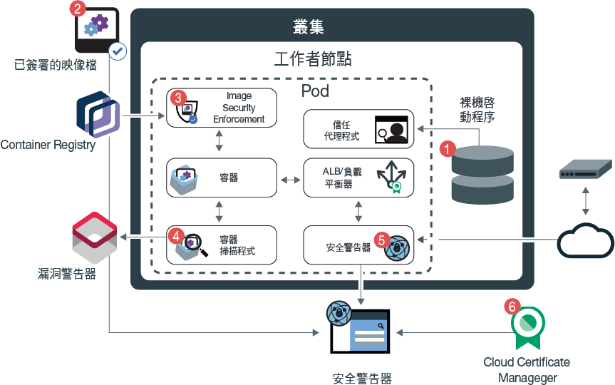

---

copyright:
  years: 2014, 2018
lastupdated: "2018-4-20"

---

{:new_window: target="_blank"}
{:shortdesc: .shortdesc}
{:screen: .screen}
{:pre: .pre}
{:table: .aria-labeledby="caption"}
{:codeblock: .codeblock}
{:tip: .tip}
{:download: .download}

# {{site.data.keyword.containerlong_notm}} 的安全
{: #security}

您可以在 {{site.data.keyword.containerlong}} 中使用內建安全特性，以進行風險分析及安全保護。這些特性可協助您保護 Kubernetes 叢集基礎架構及網路通訊、隔離運算資源，以及確保基礎架構元件和容器部署之間的安全規範。
{: shortdesc}

## 依叢集元件的安全
{: #cluster}

每一個 {{site.data.keyword.containerlong_notm}} 叢集的[主節點](#master)及[工作者節點](#worker)都有內建安全特性。
{: shortdesc}

如果您有防火牆，則需要從叢集外部存取負載平衡，或者，在組織網路原則導致無法存取公用網際網路端點時，從您的本端系統執行 `kubectl` 指令（[開啟防火牆中的埠](cs_firewall.html#firewall)）。如果您要將叢集中的應用程式連接至內部部署網路或叢集外部的其他應用程式，請[設定 VPN 連線功能](cs_vpn.html#vpn)。

在下圖中，您可以看到依 Kubernetes 主節點、工作者節點及容器映像檔分組的安全特性。

<table summary="表格中的第一列跨這兩個直欄。其餘的列應該從左到右閱讀，第一欄為伺服器位置，第二欄則為要符合的 IP 位址。">
  <thead>
    <th colspan=2> {{site.data.keyword.containershort_notm}} 中的內建叢集安全設定</th>
  </thead>
  <tbody>
    <tr>
      <td>Kubernetes 主節點</td>
      <td>每一個叢集中的 Kubernetes 主節點都是由 IBM 管理，並且具備高可用性。它包括 {{site.data.keyword.containershort_notm}} 安全設定，可確保安全規範及進出工作者節點的安全通訊。IBM 會視需要執行安全更新。專用 Kubernetes 主節點可集中控制及監視叢集中的所有 Kubernetes 資源。根據叢集中的部署需求及容量，Kubernetes 主節點會自動排定容器化應用程式，在可用的工作者節點之間進行部署。如需相關資訊，請參閱 [Kubernetes 主節點安全](#master)。</td>
    </tr>
    <tr>
      <td>工作者節點</td>
      <td>容器部署於叢集專用的工作者節點，可確保 IBM 客戶的運算、網路及儲存空間隔離。{{site.data.keyword.containershort_notm}} 提供內建安全特性，讓工作者節點在專用及公用網路上保持安全，以及確保工作者節點的安全規範。如需相關資訊，請參閱[工作者節點安全](#worker)。此外，您也可以新增 [Calico 網路原則](cs_network_policy.html#network_policies)，以進一步指定您要容許或封鎖進出工作者節點上 Pod 的網路資料流量。</td>
    </tr>
    <tr>
      <td>映像檔</td>
      <td>身為叢集管理者，您可以在 {{site.data.keyword.registryshort_notm}} 中設定您自己的安全 Docker 映像檔儲存庫，您可以在其中儲存 Docker 映像檔並且在叢集使用者之間進行共用。為了確保安全容器部署，「漏洞警告器」會掃描專用登錄中的每個映像檔。「漏洞警告器」是 {{site.data.keyword.registryshort_notm}} 的元件，可掃描以尋找潛在漏洞、提出安全建議，並提供解決漏洞的指示。如需相關資訊，請參閱 [{{site.data.keyword.containershort_notm}} 中的映像檔安全](#images)。</td>
    </tr>
  </tbody>
</table>

 

## Kubernetes 主節點
{: #master}

檢閱內建 Kubernetes 主節點安全特性，此安全特性用來保護 Kubernetes 主節點，以及保護叢集網路通訊安全。
{: shortdesc}

<dl>
  <dt>完整受管理及專用的 Kubernetes 主節點</dt>
    <dd>{{site.data.keyword.containershort_notm}} 中的每個 Kubernetes 叢集都是由 IBM 透過 IBM 擁有的 IBM Cloud 基礎架構 (SoftLayer) 帳戶所管理的專用 Kubernetes 主節點予以控制。Kubernetes 主節點已設定下列未與其他 IBM 客戶共用的專用元件。<ul><li>etcd 資料儲存庫：儲存叢集的所有 Kubernetes 資源（例如「服務」、「部署」及 Pod）。Kubernetes ConfigMap 及密碼是儲存為金鑰值組的應用程式資料，因此，Pod 中執行的應用程式可以使用它們。etcd 中的資料會儲存在 IBM 所管理的已加密磁碟上，並且每日進行備份。傳送至 Pod 時，會透過 TLS 將資料加密，以確保資料保護及完整性。</li>
      <li>kube-apiserver：提供為從工作者節點到 Kubernetes 主節點的所有要求的主要進入點。kube-apiserver 會驗證及處理要求，並且可以讀取及寫入 etcd 資料儲存庫。</li>
      <li>kube-scheduler：考量容量及效能需求、軟硬體原則限制、反親緣性規格及工作負載需求，以決定在何處部署 Pod。如果找不到符合需求的工作者節點，則不會在叢集中部署 Pod。</li>
      <li>kube-controller-manager：負責監視抄本集，以及建立對應的 Pod 來達到想要的狀態。</li>
      <li>OpenVPN：{{site.data.keyword.containershort_notm}} 特定元件，提供所有 Kubernetes 主節點與工作者節點的通訊的安全網路連線功能。</li></ul></dd>
  <dt>所有工作者節點與 Kubernetes 主節點的通訊的 TLS 安全網路連線功能</dt>
    <dd>為了保護 Kubernetes 主節點的網路通訊的安全，{{site.data.keyword.containershort_notm}} 會產生 TLS 憑證，以加密往返於每個叢集的 kube-apiserver 及 etcd 資料儲存庫元件的通訊。這些憑證絕不會在叢集或 Kubernetes 主節點元件之間共用。</dd>
  <dt>所有 Kubernetes 主節點與工作者節點的通訊的 OpenVPN 安全網路連線功能</dt>
    <dd>雖然 Kubernetes 會使用 `https` 通訊協定來保護 Kubernetes 主節點與工作者節點之間的通訊，但是預設不會提供工作者節點的鑑別。為了保護此通訊，{{site.data.keyword.containershort_notm}} 會在建立叢集時自動設定 Kubernetes 主節點與工作者節點之間的 OpenVPN 連線。</dd>
  <dt>持續 Kubernetes 主節點網路監視</dt>
    <dd>IBM 會持續監視每個 Kubernetes 主節點，以控制及重新修補處理程序層次的「拒絕服務 (DOS)」攻擊。</dd>
  <dt>Kubernetes 主節點節點安全規範</dt>
    <dd>{{site.data.keyword.containershort_notm}} 會自動掃描每個已部署 Kubernetes 主節點的節點，以尋找需要套用以確保主節點保護的 Kubernetes 及 OS 特定安全修正程式中存在的漏洞。如果找到漏洞，{{site.data.keyword.containershort_notm}} 會自動套用修正程式，並代表使用者來解決漏洞。</dd>
</dl>

 

## 工作者節點
{: #worker}

檢閱內建的工作者節點安全特性，以保護工作者節點環境，以及確保資源、網路和儲存空間隔離。
{: shortdesc}

<dl>
  <dt>工作者節點所有權</dt>
    <dd>工作者節點的所有權視您建立的叢集類型而定。
 免費叢集中的工作者節點會佈建至 IBM 所擁有的 IBM Cloud 基礎架構 (SoftLayer) 帳戶。使用者可以將應用程式部署至工作者節點，但無法變更設定，或在工作者節點上安裝其他軟體。

    
標準叢集中的工作者節點會佈建至與客戶的公用或專用 IBM Cloud 帳戶相關聯的 IBM Cloud 基礎架構 (SoftLayer) 帳戶。工作者節點是由客戶擁有。客戶可選擇變更安全設定，或在 IBM Cloud Container Service 提供的工作者節點上，安裝其他軟體。
 </dd>
  <dt>運算、網路及儲存空間基礎架構隔離</dt>
    <dd>
當您建立叢集時，IBM 會使用 IBM Cloud 基礎架構 (SoftLayer) 組合，將工作者節點佈建為虛擬機器。工作者節點專用於叢集，而且未管理其他叢集的工作負載。

    
 每個 {{site.data.keyword.Bluemix_notm}} 帳戶都已設定 IBM Cloud 基礎架構 (SoftLayer) VLAN，確保工作者節點上的優質網路效能及隔離。您也可以只將工作者節點連接至專用 VLAN，將它們指定為專用。
 
若要持續保存叢集中的資料，您可以從 IBM Cloud 基礎架構 (SoftLayer) 佈建專用 NFS 型檔案儲存空間，並運用該平台的內建資料安全特性。
</dd>
  <dt>設定安全的工作者節點</dt>
    <dd>
每個工作者節點都設定了 Ubuntu 作業系統，且工作者節點擁有者無法變更。因為工作者節點的作業系統為 Ubuntu，所以部署至工作者節點的所有容器都必須使用採用 Ubuntu 核心的 Linux 發行套件。而無法使用必須以不同方式與核心交談的 Linux 發行套件。為了保護工作者節點的作業系統不會受到潛在攻擊，每個工作者節都會以 Linux iptables 規則所強制執行的專家級防火牆設定來進行配置。

    
在 Kubernetes 上執行的所有容器都受到預先定義的 Calico 網路原則設定所保護，這些設定是在建立叢集期間，配置於每個工作者節點上。這項設定確保工作者節點與 Pod 之間的安全網路通訊。

    
工作者節點上會停用 SSH 存取。如果您具有標準叢集，且想要在工作者節點上安裝其他特性，則可以針對您要在每個工作者節點上執行的所有項目，使用 [Kubernetes 常駐程式集 ](https://kubernetes.io/docs/concepts/workloads/controllers/daemonset)，或是針對您必須執行的任何一次性動作，使用 [Kubernetes 工作 ](https://kubernetes.io/docs/concepts/workloads/controllers/jobs-run-to-completion/)。
</dd>
  <dt>Kubernetes 工作者節點安全規範</dt>
    <dd>IBM 與內部及外部安全顧問團隊合作，解決潛在的安全規範漏洞。<b>重要事項</b>：定期（例如每月）使用 `bx cs worker-update` [指令](cs_cli_reference.html#cs_worker_update)，將更新及安全修補程式部署至作業系統，以及更新 Kubernetes 版本。有可用的更新時，會在您檢視工作者節點的相關資訊時，利用如下指令通知您：`bx cs workers <cluster_name>` 或 `bx cs worker-get <cluster_name> <worker_ID>`。</dd>
  <dt>在實體（裸機）伺服器上部署節點的選項</dt>
    <dd>如果您選擇要在裸機實體伺服器（而非虛擬伺服器實例）上佈建工作者節點，則您對運算主機可以有更多控制，例如記憶體或 CPU。此設定可免除虛擬機器 Hypervisor，該 Hypervisor 將實體資源配置給在主機上執行的虛擬機器。相反地，裸機的所有資源將由工作者節點專用，因此您不需要擔心「吵雜的鄰居」共用資源或降低效能。裸機伺服器為您所專用，其所有資源都可供叢集使用。</dd>
  <dt id="trusted_compute">使用授信運算的 {{site.data.keyword.containershort_notm}}</dt>
    <dd>
當您[在支援「授信運算」的裸機伺服器上部署叢集](cs_clusters.html#clusters_ui)時，可以啟用信任。在支援「授信運算」的叢集中的每一個裸機工作者節點上（包括您新增至該叢集的未來節點），已啟用「授信平台模組 (TPM)」晶片。因此，啟用信任之後，以後您就無法針對叢集予以停用。信任伺服器會部署在主節點上，且信任代理程式會作為 Pod 部署在工作者節點上。當工作者節點啟動時，信任代理程式 Pod 會監視處理程序的每一個階段。

    
例如，如果未獲授權的使用者獲得對系統的存取權，並使用其他邏輯來修改 OS 核心以收集資料，則信任代理程式會偵測到此情況並變更節點的授信狀態，讓您知道不能再信任該工作者節點。使用「授信運算」，您可以驗證工作者節點是否遭到竄改。

    </dd>
  <dt id="encrypted_disks">已加密磁碟</dt>
    <dd>
依預設，在佈建工作者節點時，{{site.data.keyword.containershort_notm}} 會為所有工作者節點提供兩個本端 SSD 已加密資料分割區。第一個分割區未加密，而裝載至 _/var/lib/docker_ 的第二個分割區則會使用 LUKS 加密金鑰解除鎖定。每個 Kubernetes 叢集中的每一個工作者節點都有由 {{site.data.keyword.containershort_notm}} 所管理的專屬唯一 LUKS 加密金鑰。當您建立叢集或將工作者節點新增至現有叢集時，會安全地取回金鑰，然後在解除鎖定已加密磁碟之後予以捨棄。
  

    
<b>附註</b>：加密可能會影響磁碟 I/O 效能。對於需要高效能磁碟 I/O 的工作負載，請測試已啟用及停用加密的叢集，以協助您決定是否關閉加密。
</dd>
  <dt>支援 IBM Cloud 基礎架構 (SoftLayer) 網路防火牆</dt>
    <dd>{{site.data.keyword.containershort_notm}} 與所有 [IBM Cloud 基礎架構 (SoftLayer) 防火牆供應項目 ](https://www.ibm.com/cloud-computing/bluemix/network-security) 相容。在 {{site.data.keyword.Bluemix_notm}} Public 上，您可以使用自訂網路原則來設定防火牆，以提供標準叢集的專用網路安全，以及偵測及重新修補網路侵入。例如，您可能選擇設定 [Vyatta ](https://knowledgelayer.softlayer.com/topic/vyatta-1) 作為防火牆，並且封鎖不想要的資料流量。當您設定防火牆時，[也必須開啟必要埠及 IP 位址](cs_firewall.html#firewall)（針對每一個地區），讓主節點與工作者節點可以進行通訊。</dd>
  <dt>將服務維持為專用狀態，或選擇性地將服務及應用程式公開給公用網際網路使用</dt>
    <dd>您可以選擇將服務及應用程式維持為專用狀態，並運用本主題所述的內建安全特性，來確保工作者節點與 Pod 之間的安全通訊。若要將服務及應用程式公開給公用網際網路使用，您可以運用 Ingress 及負載平衡器支援，安全地將服務設為可公開使用。</dd>
  <dt>將工作者節點及應用程式安全地連接至內部部署資料中心</dt>
    <dd>
若要將工作者節點及應用程式連接至內部部署的資料中心，您可以使用 strongSwan 服務或者 Vyatta Gateway Appliance 或 Fortigate Appliance 來配置 VPN IPSec 端點。

    <ul><li><b>strongSwan IPSec VPN 服務</b>：您可以設定 [strongSwan IPSec VPN 服務 ](https://www.strongswan.org/)，以安全地連接 Kubernetes 叢集與內部部署網路。在根據業界標準網際網路通訊協定安全 (IPsec) 通訊協定套組的網際網路上，strongsWan IPSec VPN 服務提供安全的端對端通訊通道。若要設定叢集與內部部署網路之間的安全連線，您必須[在內部部署資料中心內安裝 IPsec VPN 閘道](/docs/infrastructure/iaas-vpn/set-up-ipsec-vpn.html#setting-up-an-ipsec-connection)。然後，您可以在 Kubernetes Pod 中[配置及部署 strongSwan IPSec VPN 服務](cs_vpn.html#vpn-setup)。</li>
    <li><b>Vyatta Gateway Appliance 或 Fortigate Appliance</b>：如果您有較大的叢集，且要透過 VPN 存取非 Kubernetes 資源，或要透過單一 VPN 存取多個叢集，則可以選擇設定 Vyatta Gateway Appliance 或 Fortigate Appliance 來配置 IPSec VPN 端點。若要配置 Vyatta，請參閱[使用 Vyatta 設定 VPN 連線功能](cs_vpn.html#vyatta)。</li></ul></dd>
  <dt>叢集活動的持續監視及記載</dt>
    <dd>對於標準叢集，{{site.data.keyword.containershort_notm}} 可以記載並監視所有叢集相關事件（例如新增工作者節點）、漸進式更新進度或容量使用資訊，並將其傳送至 {{site.data.keyword.loganalysislong_notm}} 及 {{site.data.keyword.monitoringlong_notm}}。如需設定記載及監視的相關資訊，請參閱[配置叢集記載](/docs/containers/cs_health.html#logging)及[配置叢集監視](/docs/containers/cs_health.html#monitoring)。</dd>
</dl>

 

## 映像檔
{: #images}

使用內建安全特性來管理映像檔的安全及完整性。
{: shortdesc}

<dl>
<dt>{{site.data.keyword.registryshort_notm}} 中的安全 Docker 專用映像檔儲存庫</dt>
  <dd>您可以在多方承租戶中設定您自己的 Docker 映像檔儲存庫、高可用性，以及由 IBM 所管理的可擴充專用映像檔儲存庫，以建置、安全地儲存 Docker 映像檔，並且在叢集使用者之間進行共用。</dd>
<dt>映像檔安全規範</dt>
  <dd>當您使用 {{site.data.keyword.registryshort_notm}} 時，可以運用「漏洞警告器」所提供的內建安全掃描。會自動掃描每個推送至您名稱空間的映像檔，以對照已知 CentOS、Debian、Red Hat 及 Ubuntu 問題資料庫，掃描漏洞。如果發現漏洞，「漏洞警告器」會提供其解決方式的指示，以確保映像檔的完整性及安全。</dd>
</dl>

若要檢視映像檔的漏洞評量，請[檢閱漏洞警告器文件](/docs/services/va/va_index.html#va_registry_cli)。

 

## 叢集內網路
{: #in_cluster_network}

透過專用虛擬區域網路 (VLAN)，得以實現工作者節點與 Pod 之間的安全、叢集內網路通訊。VLAN 會配置一組工作者節點及 Pod，就像它們已連接至相同的實體佈線。
{:shortdesc}

當您建立叢集時，每個叢集都會自動連接至專用 VLAN。專用 VLAN 會判定在建立叢集期間指派給工作者節點的專用 IP 位址。

|叢集類型|叢集之專用 VLAN 的管理員|
|------------|-------------------------------------------|
|{{site.data.keyword.Bluemix_notm}} 中的免費叢集|{{site.data.keyword.IBM_notm}}|
|{{site.data.keyword.Bluemix_notm}}中的標準叢集|在您的 IBM Cloud 基礎架構 (SoftLayer) 帳戶中時
**提示：**若要存取您帳戶中的所有 VLAN，請開啟 [VLAN 跨越](/docs/infrastructure/vlans/vlan-spanning.html#enable-or-disable-vlan-spanning)。
|

所有已部署至工作者節點的 Pod 也會獲指派專用 IP 位址。Pod 會獲指派 172.30.0.0/16 專用位址範圍中的 IP，並且只在工作者節點之間進行遞送。
若要避免衝突，請不要在將與工作者節點通訊的任何節點上使用此 IP 範圍。使用專用 IP 位址，工作者節點及 Pod 可以在專用網路上安全地進行通訊。不過，Pod 損毀或需要重建工作者節點時，會指派新的專用 IP 位址。

因為很難追蹤必須為高可用性的應用程式的變更中專用 IP 位址，所以您可以使用內建 Kubernetes 服務探索特性，將應用程式公開為叢集的專用網路上的叢集 IP 服務。Kubernetes 服務會建立一組 Pod，並為叢集中的其他服務提供這些 Pod 的網路連線，而不公開每一個 Pod 的實際專用 IP 位址。當您建立叢集 IP 服務時，會從 10.10.10.0/24 專用位址範圍將專用 IP 位址指派給該服務。與使用 Pod 專用位址範圍相同，請不要在將與工作者節點通訊的任何節點上使用此 IP 範圍。
此 IP 位址只能在叢集內存取。您無法從網際網路存取此 IP 位址。同時，會建立服務的 DNS 查閱項目，並將其儲存在叢集的 kube-dns 元件中。DNS 項目包含服務的名稱、已建立服務的名稱空間，以及已指派專用叢集 IP 位址的鏈結。

如果叢集中的應用程式需要存取受叢集 IP 服務保護的 Pod，則可以使用已指派給服務的專用叢集 IP 位址，或使用服務的名稱來傳送要求。當您使用服務的名稱時，會在 kube-dns 元件中查閱該名稱，並將其遞送至服務的專用叢集 IP 位址。要求到達服務時，服務確保所有要求都會平均地轉遞至 Pod，但與其專用 IP 位址及部署它們的工作者節點無關。

如需如何建立叢集 IP 類型服務的相關資訊，請參閱 [Kubernetes 服務 ](https://kubernetes.io/docs/concepts/services-networking/service/#publishing-services---service-types)。

如需將 Kubernetes 叢集中的應用程式安全地連接至內部部署網路的相關資訊，請參閱[設定 VPN 連線功能](cs_vpn.html#vpn)。如需公開應用程式進行外部網路通訊的相關資訊，請參閱[容許應用程式的公用存取](cs_network_planning.html#public_access)。

## 叢集信任
{: cs_trust}

依預設，{{site.data.keyword.containerlong_notm}} 提供叢集元件的許多[特性](#cluster)，以便您可以在高度安全的環境中部署容器化應用程式。擴大叢集中的信任層次，更確保在叢集內發生的事情是您預期會發生的情況。您可以使用各種方式在叢集中實作信任，如下圖所示。
{:shortdesc}

1.  **{{site.data.keyword.containerlong_notm}} 與授信運算**：在祼機叢集上，您可以啟用信任。信任代理程式會監視硬體啟動程序並報告任何變更，讓您可以驗證裸機工作者節點是否遭到竄改。使用「授信運算」，您可以將容器部署在已驗證的裸機主機上，以便您的工作負載可在授信硬體上執行。[進一步瞭解「授信運算」如何運作](#trusted_compute)。

2.  **映像檔的內容信任**：在 {{site.data.keyword.registryshort_notm}} 中啟用內容信任，以確保映像檔的完整性。使用授信內容，您可以控制誰可以將映像檔簽署為授信映像檔。在授信簽章者將映像檔推送至您的登錄之後，使用者可以取回已簽署的內容，讓他們可以驗證映像檔的來源。如需相關資訊，請參閱[簽署授信內容的映像檔](/docs/services/Registry/registry_trusted_content.html#registry_trustedcontent)。

3.  **Container Image Security Enforcement（測試版）**：使用自訂原則建立許可控制器，以便您可以在部署容器映像檔之前驗證它們。使用 Container Image Security Enforcement，您可以控制從何處部署映像檔，並確保它們符合[漏洞警告器](/docs/services/va/va_index.html)原則或[內容信任](/docs/services/Registry/registry_trusted_content.html#registry_trustedcontent)需求。如果部署不符合您所設定的原則，則安全強制執行會阻止他人修改您的叢集。如需相關資訊，請參閱[強制執行容器映像檔安全（測試版）](/docs/services/Registry/registry_security_enforce.html#security_enforce)。

4.  **容器漏洞掃描器**：依預設，「漏洞警告器」會掃描 {{site.data.keyword.registryshort_notm}} 中儲存的映像檔。若要檢查正在叢集中執行之即時容器的狀態，您可以安裝容器掃描器。如需相關資訊，請參閱[安裝容器掃描器](/docs/services/va/va_index.html#va_install_livescan)。

5.  **利用安全顧問進行網路分析（預覽）**：使用「{{site.data.keyword.Bluemix_notm}} 安全顧問」，您可以將來自 {{site.data.keyword.Bluemix_notm}} 服務（例如「漏洞警告器」及 {{site.data.keyword.cloudcerts_short}}）的安全見解集中化。當您在叢集中啟用「安全顧問」時，可以檢視可疑的送入及送出網路資料流量的相關報告。如需相關資訊，請參閱[網路分析](/docs/services/security-advisor/network-analytics.html#network-analytics)。若要安裝，請參閱[針對 Kubernetes 叢集設定可疑用戶端及伺服器 IP 的監視](/docs/services/security-advisor/setup_cluster.html)。

6.  **{{site.data.keyword.cloudcerts_long_notm}}（測試版）**：如果您在美國南部有一個叢集，且想要[使用自訂網域與 TLS 搭配來公開應用程式](https://console.bluemix.net/docs/containers/cs_ingress.html#custom_domain_cert)，則可以在 {{site.data.keyword.cloudcerts_short}} 中儲存您的 TLS 憑證。在您的「安全顧問」儀表板中，也可以報告過期或即將到期的憑證。如需相關資訊，請參閱[開始使用 {{site.data.keyword.cloudcerts_short}}](/docs/services/certificate-manager/index.html#gettingstarted)。

