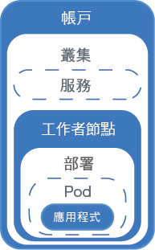
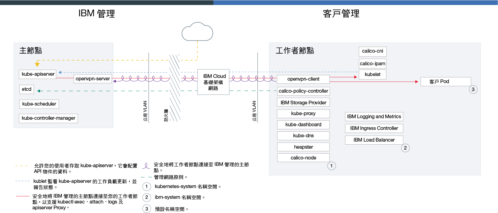

---

copyright:
  years: 2014, 2018
lastupdated: "2018-01-11"

---

{:new_window: target="_blank"}
{:shortdesc: .shortdesc}
{:screen: .screen}
{:pre: .pre}
{:table: .aria-labeledby="caption"}
{:codeblock: .codeblock}
{:tip: .tip}
{:download: .download}

# {{site.data.keyword.containerlong_notm}} 技術

## Docker 容器
{: #docker_containers}

Docker 是 dotCloud 在 2013 年發行的開放程式碼專案。Docker 內建現有 Linux 容器技術 (LXC) 特性，成為可用於快速建置、測試、部署及擴充應用程式的軟體平台。Docker 會將軟體包裝為稱為容器的標準化單元，其中包括應用程式需要執行的所有元素。
{:shortdesc}

瞭解一些基本 Docker 概念：

<dl>
<dt>映像檔</dt>
<dd>Docker 映像檔是從 Dockerfile 所建置的，而 Dockerfile 文字檔定義如何建置映像檔，以及要包含在其中的建置構件，例如應用程式、應用程式配置及其相依關係。映像檔一律是從其他映像檔建置而成，使它們可以快速配置。讓其他人對映像檔執行大量工作，然後調整映像檔以供您使用。</dd>
<dt>登錄</dt>
<dd>映像檔登錄是儲存、擷取及共用 Docker 映像檔的位置。登錄中所儲存的映像檔可公開使用（公用登錄）或供一小組使用者存取（專用登錄）。{{site.data.keyword.containershort_notm}} 提供公用映像檔（例如 ibmliberty），可用來建立第一個容器化應用程式。如果是企業應用程式，請使用專用登錄（例如 {{site.data.keyword.Bluemix_notm}} 中提供的專用登錄）來防止未獲授權的使用者使用映像檔。
</dd>
<dt>容器</dt>
<dd>每個容器都是從映像檔所建立。容器是具有其所有相依關係的已包裝應用程式，讓應用程式能夠在環境之間移動，並且不需變更即可執行。容器與虛擬機器不同，容器不會將裝置、其作業系統及基礎硬體虛擬化。只有應用程式碼、運行環境、系統工具、程式庫及設定會包裝在容器中。容器會以隔離的處理程序形式在運算主機上執行，並共用主機作業系統及其硬體資源。此方式讓容器比虛擬機器更輕量、可攜性更高且更有效率。</dd>
</dl>

### 使用容器的重要優點
{: #container_benefits}

<dl>
<dt>容器靈活多變</dt>
<dd>容器可透過為開發及正式作業部署提供標準化環境來簡化系統管理。輕量型運行環境可快速擴增及縮減部署。透過使用容器協助您在任何基礎架構上快速且可靠地部署及執行任何應用程式，可移除不同作業系統平台及其基礎基礎架構的管理複雜性。</dd>
<dt>容器很小</dt>
<dd>您可以在單一虛擬機器所需的空間量中容納許多容器。</dd>
<dt>容器具有可攜性</dt>
<dd><ul>
  <li>重複使用映像檔的各部分來建置容器。</li>
  <li>將應用程式碼從暫置環境快速移至正式作業環境。</li>
  <li>使用持續交付工具，自動執行處理程序。</li> </ul></dd>
</dl>

 

## Kubernetes 基本
{: #kubernetes_basics}

Kubernetes 是由 Google 開發作為 Borg 專案的一部分，並在 2014 年提交給開放程式碼社群。Kubernetes 結合 Google 15 年以上的下列研究：執行具有正式作業工作負載、開放程式碼貢獻及 Docker 容器管理工具的容器化基礎架構，以提供一個隔離且安全的應用程式平台，來管理可攜式、可延伸且可在失效接手時自我修復的容器。
{:shortdesc}

瞭解一些基本 Kubernetes 概念，如下圖所示。

<dl>
<dt>帳戶</dt>
<dd>您的帳戶指的是 {{site.data.keyword.Bluemix_notm}} 帳戶。</dd>

<dt>叢集</dt>
<dd>Kubernetes 叢集包含一個以上稱為工作者節點的運算主機。工作者節點是由 Kubernetes 主節點進行管理，Kubernetes 主節點會集中控制及監視叢集中的所有 Kubernetes 資源。因此，當您部署容器化應用程式的資源時，Kubernetes 主節點會考慮叢集中的部署需求及可用容量，來決定要在其上部署這些資源的工作者節點。Kubernetes 資源包括服務、部署及 Pod。</dd>

<dt>服務</dt>
<dd>服務是一種 Kubernetes 資源，可將一組 Pod 群組在一起，並提供這些 Pod 的網路連線功能，而不需要公開每一個 Pod 的實際專用 IP 位址。您可以使用服務，將您的應用程式設為可在叢集內或公用網際網路中使用。</dd>

<dt>部署</dt>
<dd>部署是一種 Kubernetes 資源，您可在其中指定執行應用程式所需的其他資源或功能的相關資訊（例如服務、持續性儲存空間或註釋）。將部署記載在配置 YAML 檔案中，然後再將其套用至叢集。Kubernetes 主節點會配置資源，並將容器部署至具有可用容量之工作者節點上的 Pod。
  
定義應用程式的更新策略，包括您要在漸進式更新期間新增的 Pod 數目，以及每次更新時可能無法使用的 Pod 數目。當您執行漸進式更新時，部署會檢查更新是否正常運作，並且在偵測到失敗時停止推出。</dd>

<dt>Pod</dt>
<dd>稱為 Pod 的 Kubernetes 資源會部署、執行及管理每個部署至叢集的容器化應用程式。Pod 代表 Kubernetes 叢集中的小型可部署單元，並且用來將必須視為單一單元的容器群組在一起。在大部分情況下，每一個容器都會部署至其專屬 Pod。不過，應用程式可能會要求將一個容器及其他協助容器部署至某個 Pod，以便使用相同的專用 IP 位址來為那些容器定址。</dd>

<dt>應用程式</dt>
<dd>應用程式可能指的是完整應用程式或應用程式的元件。您可以在個別 Pod 或個別工作者節點中部署應用程式的元件。
  
若要進一步瞭解 Kubernetes 術語，請<a href="cs_tutorials.html#cs_cluster_tutorial" target="_blank">嘗試指導教學</a>。</dd>

</dl>

 

## 服務架構
{: #architecture}

每一個工作者節點都已設定 {{site.data.keyword.IBM_notm}} 所管理的 Docker Engine、不同的運算資源、網路及磁區服務，以及提供隔離、資源管理功能及工作者節點安全相符性的內建安全特性。工作者節點會使用安全 TLS 憑證及 openVPN 連線來與主節點進行通訊。
{:shortdesc}

此圖表概述您維護的內容以及 IBM 在叢集中維護的內容。如需這些維護作業的詳細資料，請參閱[叢集管理責任](cs_why.html#responsibilities)。

 

