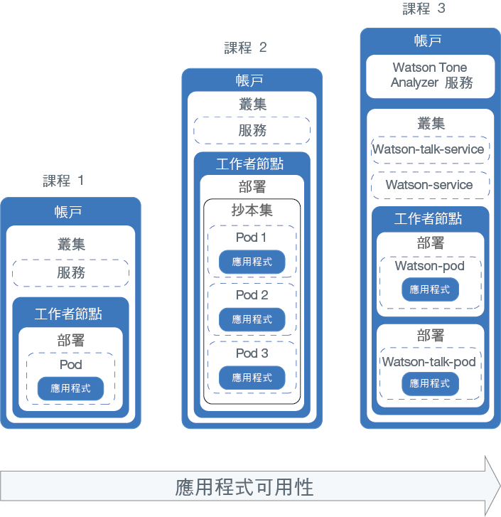
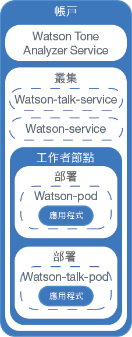

---

copyright:
  years: 2014, 2018
lastupdated: "2018-4-20"

---

{:new_window: target="_blank"}
{:shortdesc: .shortdesc}
{:screen: .screen}
{:pre: .pre}
{:table: .aria-labeledby="caption"}
{:codeblock: .codeblock}
{:tip: .tip}
{:download: .download}


# 指導教學：將應用程式部署至叢集
{: #cs_apps_tutorial}

您可以瞭解如何使用 {{site.data.keyword.containerlong}} 來部署運用 {{site.data.keyword.watson}} {{site.data.keyword.toneanalyzershort}} 的容器化應用程式。
{: shortdesc}

在此情境中，一間虛構的公關公司使用 {{site.data.keyword.Bluemix_notm}} 服務來分析其新聞稿，以及接收對其訊息基調的意見。

使用在最後指導教學中建立的 Kubernetes 叢集，公關公司的應用程式開發人員會部署應用程式的 Hello World 版本。根據本指導教學中每個課程的建置，應用程式開發人員會漸進部署同一個應用程式的較複雜版本。下圖依課程顯示每個部署的元件。



如圖所示，Kubernetes 使用數個不同類型的資源來讓您的應用程式在叢集中開始執行。在 Kubernetes 中，部署及服務會一起運作。部署包括應用程式的定義，例如用於容器的映像檔，以及必須為應用程式公開哪個埠。當您建立部署時，會針對您在部署中定義的每一個容器各建立一個 Kubernetes Pod。為了讓您的應用程式更具復原力，您可以在部署中定義相同應用程式的多個實例，並且讓 Kubernetes 自動為您建立抄本集。抄本集會監視 Pod，並確保隨時都有所需數目的 Pod 在執行。如果其中一個 Pod 變得沒有回應，就會自動重建該 Pod。

服務會將一組 Pod 分組在一起，並且為叢集中的其他服務提供這些 Pod 的網路連線，而不需公開每一個 Pod 的實際專用 IP 位址。您可以使用 Kubernetes 服務，讓叢集內的其他 Pod 能夠使用應用程式，或是將應用程式公開給網際網路使用。在本指導教學中，您將會使用 Kubernetes 服務，透過自動指派給工作者節點的公用 IP 位址以及公用埠，從網際網路存取執行中的應用程式。

為了讓應用程式的可用性更高，您可以在標準叢集中建立多個工作者節點，以執行更多的應用程式抄本。本指導教學中未討論此作業，但請記住這個概念，以便未來改進應用程式的可用性。

只有其中一個課程討論到將 {{site.data.keyword.Bluemix_notm}} 服務整合至應用程式中，但無論您想像得到的應用程式有多麼簡單或複雜，都能派上用場。

## 目標

* 瞭解基本的 Kubernetes 術語
* 將映像檔推送至 {{site.data.keyword.registryshort_notm}} 中的登錄名稱空間
* 讓應用程式可供公開存取
* 使用 Kubernetes 指令及 Script 將應用程式的單一實例部署在叢集中
* 將應用程式的多個實例部署在性能檢查期間重建的容器中
* 部署使用 {{site.data.keyword.Bluemix_notm}} 服務功能的應用程式

## 所需時間

40 分鐘

## 適用對象

以前從未在 Kubernetes 叢集中部署應用程式的軟體開發人員及網路管理者。

## 必要條件

* [指導教學：在 {{site.data.keyword.containershort_notm}} 中建立 Kubernetes 叢集](cs_tutorials.html#cs_cluster_tutorial)。

## 課程 1：將單一實例應用程式部署至 Kubernetes 叢集
{: #cs_apps_tutorial_lesson1}

在前一個指導教學中，您已建立一個具有一個工作者節點的叢集。在本課程中，您將配置一個部署，並將單一應用程式實例部署至工作者節點內的 Kubernetes。
{:shortdesc}

您藉由完成本課程而部署的元件會顯示在下圖中。


若要部署應用程式，請執行下列動作：

1.  將 [Hello World 應用程式 ](https://github.com/IBM/container-service-getting-started-wt) 的原始碼複製到您的使用者起始目錄。儲存庫在每一個以 `Lab` 為開頭的資料夾中包含不同版本的類似應用程式。每一個版本都包含下列檔案：
    * `Dockerfile`：映像檔的建置定義。
    * `app.js`：Hello World 應用程式。
    * `package.json`：應用程式的相關 meta 資料。

    ```
    git clone https://github.com/IBM/container-service-getting-started-wt.git
    ```
    {: pre}

2.  導覽至 `Lab 1` 目錄。

    ```
    cd 'container-service-getting-started-wt/Lab 1'
    ```
    {: pre}

3. 登入 {{site.data.keyword.Bluemix_notm}} CLI。系統提示時，請輸入您的 {{site.data.keyword.Bluemix_notm}} 認證。若要指定 {{site.data.keyword.Bluemix_notm}} 地區，請[包括 API 端點](cs_regions.html#bluemix_regions)。
  ```
    bx login [--sso]
    ```
  {: pre}

  **附註**：如果 login 指令失敗，您可能具有聯合 ID。請嘗試將 `--sso` 旗標附加至指令。請使用 CLI 輸出中提供的 URL 來擷取一次性密碼。

4. 在 CLI 中設定叢集的環境定義。
    1. 取得指令來設定環境變數，並下載 Kubernetes 配置檔。

        ```
        bx cs cluster-config <cluster_name_or_ID>
        ```
        {: pre}

        配置檔下載完成之後，會顯示一個指令，可讓您用來將本端 Kubernetes 配置檔的路徑設定為環境變數。
    2.  複製並貼上輸出，以設定 `KUBECONFIG` 環境變數。

        OS X 的範例：

        ```
        export KUBECONFIG=/Users/<user_name>/.bluemix/plugins/container-service/clusters/<pr_firm_cluster>/kube-config-prod-dal10-pr_firm_cluster.yml
        ```
        {: screen}

5.  登入 {{site.data.keyword.registryshort_notm}} CLI。**附註**：請確定您已[安裝](/docs/services/Registry/index.html#registry_cli_install)  container-registry 外掛程式。

    ```
    bx cr login
    ```
    {: pre}
    -   如果您忘記 {{site.data.keyword.registryshort_notm}} 中的名稱空間，請執行下列指令。

        ```
        bx cr namespace-list
        ```
        {: pre}

6. 啟動 Docker。
    * 如果您是使用 Docker CE，則不需要執行任何動作。
    * 如果您是使用 Linux，請遵循 [Docker 文件 ](https://docs.docker.com/engine/admin/)，視您使用的 Linux 發行套件而定，尋找有關如何啟動 Docker 的指示。
    * 如果您是在 Windows 或 OSX 上使用 Docker Toolbox，則可以使用 Docker Quickstart Terminal，它會為您啟動 Docker。在後續幾個步驟中，請使用 Docker Quickstart Terminal 來執行 Docker 指令，然後切回您用來設定 `KUBECONFIG` 階段作業變數的 CLI。

7.  建置 Docker 映像檔，其中包含 `Lab 1` 目錄的應用程式檔案。如果您未來需要對應用程式進行變更，請重複這些步驟，以建立另一個版本的映像檔。

    

    1.  在本端建置映像檔。指定您要使用的名稱和標籤。請務必使用您在前一個指導教學中，在 {{site.data.keyword.registryshort_notm}} 中建立的名稱空間。為映像檔標記名稱空間資訊，可以讓 Docker 知道在稍後的步驟中，要將映像檔推送到哪裡。僅在映像檔名稱中使用小寫英數字元或底線 (`_`)。請不要忘記指令尾端的句點 (`.`)。這個句點告訴 Docker 要在現行目錄中尋找 Dockerfile 及建置構件，以建置映像檔。

        ```
        docker build -t registry.<region>.bluemix.net/<namespace>/hello-world:1 .
        ```
        {: pre}

        當建置完成時，請驗證您看到下列成功訊息。
        ```
        Successfully built <image_id>
        Successfully tagged <image_tag>
        ```
        {: screen}

    2.  將映像檔推送至登錄名稱空間。

        ```
        docker push registry.<region>.bluemix.net/<namespace>/hello-world:1
        ```
        {: pre}

        輸出範例：

        ```
        The push refers to a repository [registry.ng.bluemix.net/pr_firm/hello-world]
        ea2ded433ac8: Pushed
        894eb973f4d3: Pushed
        788906ca2c7e: Pushed
        381c97ba7dc3: Pushed
        604c78617f34: Pushed
        fa18e5ffd316: Pushed
        0a5e2b2ddeaa: Pushed
        53c779688d06: Pushed
        60a0858edcd5: Pushed
        b6ca02dfe5e6: Pushed
        1: digest: sha256:0d90cb73288113bde441ae9b8901204c212c8980d6283fbc2ae5d7cf652405
        43 size: 2398
        ```
        {: screen}

8.  部署會用來管理 Pod，而 Pod 中包含應用程式的容器化實例。下列指令會將應用程式部署在單一 Pod 中。基於本指導教學的目的，部署命名為 hello-world-deployment，但您可以將它改為任何您想要的名稱。如果您使用 Docker Quickstart Terminal 來執行 Docker 指令，請務必切回到您用來設定 `KUBECONFIG` 階段作業變數的 CLI。

    ```
    kubectl run hello-world-deployment --image=registry.<region>.bluemix.net/<namespace>/hello-world:1
    ```
    {: pre}

    輸出範例：

    ```
    deployment "hello-world-deployment" created
    ```
    {: screen}

    

9.  將部署公開成為 NodePort 服務，讓全世界都可以存取此應用程式。就像您可能會公開 Cloud Foundry 應用程式的埠，您公開的 NodePort 就是工作者節點用來接聽資料流量的埠。

    ```
    kubectl expose deployment/hello-world-deployment --type=NodePort --port=8080 --name=hello-world-service --target-port=8080
    ```
    {: pre}

    輸出範例：

    ```
    service "hello-world-service" exposed
    ```
    {: screen}

    <table>
    <table summary="expose 指令參數的相關資訊。">
    <thead>
    <th colspan=2> 進一步瞭解 expose 參數</th>
    </thead>
    <tbody>
    <tr>
    <td><code>expose</code></td>
    <td>將資源公開為 Kubernetes 服務，讓它可公開地供使用者使用。</td>
    </tr>
    <tr>
    <td><code>deployment/<em>&lt;hello-world-deployment&gt;</em></code></td>
    <td>使用此服務公開之資源的資源類型及名稱。</td>
    </tr>
    <tr>
    <td><code>--name=<em>&lt;hello-world-service&gt;</em></code></td>
    <td>服務的名稱。</td>
    </tr>
    <tr>
    <td><code>--port=<em>&lt;8080&gt;</em></code></td>
    <td>服務應該提供服務的埠。</td>
    </tr>
    <tr>
    <td><code>--type=NodePort</code></td>
    <td>要建立的服務類型。</td>
    </tr>
    <tr>
    <td><code>--target-port=<em>&lt;8080&gt;</em></code></td>
    <td>服務將資料流量導向的目標埠。在這個實例中，target-port 與 port 相同，但您建立的其他應用程式可能不同。</td>
    </tr>
    </tbody></table>

10. 現在，所有部署工作都已完成，您可以在瀏覽器中測試您的應用程式。取得用來構成 URL 的詳細資料。
    1.  取得服務的相關資訊，以查看指派了哪個 NodePort。

        ```
        kubectl describe service hello-world-service
        ```
        {: pre}

        輸出範例：

        ```
        Name:                   hello-world-service
        Namespace:              default
        Labels:                 run=hello-world-deployment
        Selector:               run=hello-world-deployment
        Type:                   NodePort
        IP:                     10.xxx.xx.xxx
        Port:                   <unset> 8080/TCP
        NodePort:               <unset> 30872/TCP
        Endpoints:              172.30.xxx.xxx:8080
        Session Affinity:       None
        No events.
        ```
        {: screen}

        使用 `expose` 指令來產生 NodePort 時，即已將其隨機指派，但範圍落在 30000 到 32767 之間。在此範例中，NodePort 是 30872。

    2.  取得工作者節點在叢集中的公用 IP 位址。

        ```
       bx cs workers <cluster_name_or_ID>
       ```
        {: pre}

        輸出範例：

        ```
        bx cs workers pr_firm_cluster
        Listing cluster workers...
        OK
        ID                                                 Public IP       Private IP       Machine Type   State    Status   Location   Version
        kube-mil01-pa10c8f571c84d4ac3b52acbf50fd11788-w1   169.xx.xxx.xxx  10.xxx.xx.xxx    free           normal   Ready    mil01      1.8.11
        ```
        {: screen}

11. 開啟瀏覽器，並使用下列 URL 來查看應用程式：`http://<IP_address>:<NodePort>`。使用範例值的 URL 為 `http://169.xx.xxx.xxx:30872`。當您在瀏覽器中輸入該 URL 時，會看到下列文字。

    ```
    Hello world! Your app is up and running in a cluster!
    ```
    {: screen}

    您可以將這個 URL 提供給同事試用，或是在行動電話的瀏覽器中輸入，就會看到 Hello World 應用程式真的可以公開使用。

12. [啟動 Kubernetes 儀表板](cs_app.html#cli_dashboard)。請注意，步驟會視您的 Kubernet 版本而有所不同。

13. 在**工作負載**標籤中，您可以看到所建立的資源。完成瀏覽 Kubernetes 儀表板之後，請使用 CTRL+C 來結束 `proxy` 指令。

恭喜！您已部署第一個應用程式版本。

本課程中有太多指令？同意。那麼使用配置 Script 來為您執行某些工作怎麼樣呢？若要為第二個應用程式版本使用配置 Script，以及部署該應用程式的多個實例來建立較高的可用性，請繼續進行下一個課程。

<br />


## 課程 2：部署及更新具有更高可用性的應用程式
{: #cs_apps_tutorial_lesson2}

在本課程中，您會將 Hello World 應用程式的三個實例部署至叢集中，以獲得比第一個應用程式版本更高的可用性。
{:shortdesc}

較高的可用性代表使用者存取作業會分流至這三個實例。當有太多使用者嘗試存取相同的應用程式實例時，他們可能會注意到回應時間變慢。對您的使用者而言，多個實例代表更快的回應時間。在本課程中，您也會瞭解性能檢查及部署更新如何搭配 Kubernetes 使用。下圖包含您完成本課程時會部署的元件。


在前一個指導教學中，您已建立自己的帳戶，以及一個具有一個工作者節點的叢集。在本課程中，您將配置一個部署，並部署三個 Hello World 應用程式實例。每一個實例都會部署在 Kubernetes Pod 中，作為工作者節點中抄本集的一部分。若要讓它可公開使用，請同時建立 Kubernetes 服務。

如配置 Script 中所定義，Kubernetes 可以使用可用性檢查來查看 Pod 中的容器是否正在執行中。例如，這些檢查可能會捕捉到死鎖，也就是應用程式正在執行，但無法繼續進行的狀況。將處於此狀況的容器重新啟動，有助於讓應用程式提高可用性，而不管其錯誤。然後，Kubernetes 會使用整備檢查，以瞭解容器何時準備好，可以重新開始接受資料流量。當 Pod 的容器就緒時，就會將 Pod 視為就緒。當 Pod 就緒時，就會重新啟動。在這個應用程式版本中，每 15 秒，應用程式就會逾時。由於已在配置 Script 中配置性能檢查，當性能檢查發現應用程式有問題時，就會重建容器。

1.  在 CLI 中，導覽至 `Lab 2` 目錄。

  ```
  cd 'container-service-getting-started-wt/Lab 2'
  ```
  {: pre}

2.  如果您已啟動新的 CLI 階段作業，請登入並設定叢集環境定義。

3.  在本端將第二個應用程式版本建置並標記為映像檔。同樣地，不要忘記指令尾端的句點 (`.`)。

  ```
  docker build -t registry.<region>.bluemix.net/<namespace>/hello-world:2 .
  ```
  {: pre}

  驗證您看到成功訊息。

  ```
  Successfully built <image_id>
  ```
  {: screen}

4.  在登錄名稱空間中推送第二個映像檔版本。等待映像檔推送完成後，再繼續下一步。

  ```
  docker push registry.<region>.bluemix.net/<namespace>/hello-world:2
  ```
  {: pre}

  輸出範例：

  ```
  The push refers to a repository [registry.ng.bluemix.net/pr_firm/hello-world]
  ea2ded433ac8: Pushed
  894eb973f4d3: Pushed
  788906ca2c7e: Pushed
  381c97ba7dc3: Pushed
  604c78617f34: Pushed
  fa18e5ffd316: Pushed
  0a5e2b2ddeaa: Pushed
  53c779688d06: Pushed
  60a0858edcd5: Pushed
  b6ca02dfe5e6: Pushed
  1: digest: sha256:0d90cb73288113bde441ae9b8901204c212c8980d6283fbc2ae5d7cf652405
  43 size: 2398
  ```
  {: screen}

5.  利用文字編輯器，開啟 `Lab 2` 目錄中的 `healthcheck.yml` 檔案。此配置 Script 結合了前一個課程中的幾個步驟，以同時建立部署和服務。公關公司的應用程式開發人員可以在進行更新後使用這些 Script，或是重建 Pod 來進行問題疑難排解。
    1. 在專用登錄名稱空間中更新映像檔的詳細資料。

        ```
        image: "registry.<region>.bluemix.net/<namespace>/hello-world:2"
        ```
        {: pre}

    2.  在 **Deployment** 區段中，注意 `replicas`。replicas 是應用程式的實例數目。執行三個實例會讓應用程式的可用性高於只執行一個實例。

        ```
        replicas: 3
        ```
        {: pre}

    3.  請注意 HTTP 存活性探測，它每 5 秒會檢查一次容器的性能。

        ```
        livenessProbe:
                    httpGet:
                      path: /healthz
                      port: 8080
                    initialDelaySeconds: 5
                    periodSeconds: 5
        ```
        {: codeblock}

    4.  在 **Service** 區段中，注意 `NodePort`。不要像前一個課程那樣產生隨機的 NodePort，您可以指定在 30000 到 32767 範圍內的埠。此範例使用 30072。

6.  切回到您用來設定叢集環境定義的 CLI，並執行配置 Script。建立部署及服務之後，公關公司的使用者即可看到該應用程式。

  ```
  kubectl apply -f healthcheck.yml
  ```
  {: pre}

  輸出範例：

  ```
  deployment "hw-demo-deployment" created
  service "hw-demo-service" created
  ```
  {: screen}

7.  現在，部署工作已完成，您可以開啟瀏覽器並查看應用程式。若要構成 URL，請採用您在前一個課程中用於工作者節點的相同公用 IP 位址，並將其與配置 Script 中指定的 NodePort 結合。若要取得工作者節點的公用 IP 位址，請執行：

  ```
       bx cs workers <cluster_name_or_ID>
       ```
  {: pre}

  使用範例值的 URL 為 `http://169.xx.xxx.xxx:30072`。您可能會在瀏覽器中看到下列文字。如果沒看到這些文字，請不必擔心。此應用程式的設計即為啟動後關閉。

  ```
  Hello world! Great job getting the second stage up and running!
  ```
  {: screen}

  您也可以檢查 `http://169.xx.xxx.xxx:30072/healthz` 以瞭解狀態。

  在前 10 到 15 秒，會傳回一則 200 訊息，因此您知道應用程式順利執行中。在那 15 秒經過後，就會顯示逾時訊息。這是預期行為。

  ```
  {
    "error": "Timeout, Health check error!"
  }
  ```
  {: screen}

8.  [啟動 Kubernetes 儀表板](cs_app.html#cli_dashboard)。請注意，步驟會視您的 Kubernet 版本而有所不同。

9. 在**工作負載**標籤中，您可以看到所建立的資源。在此標籤中，您可以反覆重新整理，並看到性能檢查正常運作中。在 **Pod** 區段中，您可以看到，當 Pod 中的容器重建時，Pod 重新啟動多少次。如果您正好在儀表板中捕捉到下列錯誤，此訊息表示性能檢查捕捉到問題。請給它幾分鐘時間，然後再重新整理。您會看到每一個 Pod 的重新啟動次數有所變更。

    ```
    Liveness probe failed: HTTP probe failed with statuscode: 500
    Back-off restarting failed docker container
    Error syncing pod, skipping: failed to "StartContainer" for "hw-container" with CrashLoopBackOff: "Back-off 1m20s restarting failed container=hw-container pod=hw-demo-deployment-3090568676-3s8v1_default(458320e7-059b-11e7-8941-56171be20503)"
    ```
    {: screen}

    完成瀏覽 Kubernetes 儀表板之後，請在您的 CLI 中輸入 CTRL+C，以結束 `proxy` 指令。


恭喜！您已部署第二個應用程式版本。您必須使用的指令較少、已瞭解性能檢查如何運作，並編輯了部署，這真是太棒了！Hello World 應用程式已通過公關公司的測試。現在，您可以為公關公司部署更好用的應用程式，以開始分析新聞稿。

準備好先刪除您建立的內容後再繼續嗎？這次，您可以使用相同的配置 Script 來刪除您所建立的這兩項資源。

  ```
  kubectl delete -f healthcheck.yml
  ```
  {: pre}

  輸出範例：

  ```
deployment "hw-demo-deployment" deleted
service "hw-demo-service" deleted
```
  {: screen}

<br />


## 課程 3：部署及更新 Watson Tone Analyzer 應用程式
{: #cs_apps_tutorial_lesson3}

在前面的課程中，應用程式是在一個工作者節點中部署成單一元件。在本課程中，您可以將應用程式的兩個元件部署至使用 {{site.data.keyword.watson}} {{site.data.keyword.toneanalyzershort}} 服務的叢集。
{:shortdesc}

將元件分開在不同的容器中，可確保您在更新其中一個元件時，不會影響其他元件。然後，您將會更新應用程式，使用更多抄本擴充它，以提高可用性。下圖包含您完成本課程時會部署的元件。



在前一個指導教學中，您有自己的帳戶和一個具有一個工作者節點的叢集。在本課程中，您將在 {{site.data.keyword.Bluemix_notm}} 帳戶中建立 {{site.data.keyword.watson}} {{site.data.keyword.toneanalyzershort}} 服務的實例，並配置兩個部署，分別部署應用程式的每一個元件。每一個元件都會部署在工作者節點的 Kubernetes Pod 中。若要讓這兩個元件可公開使用，請同時對每一個元件建立一個 Kubernetes 服務。


### 課程 3a：部署 {{site.data.keyword.watson}} {{site.data.keyword.toneanalyzershort}} 應用程式
{: #lesson3a}

1.  在 CLI 中，導覽至 `Lab 3` 目錄。

  ```
  cd 'container-service-getting-started-wt/Lab 3'
  ```
  {: pre}

2.  如果您已啟動新的 CLI 階段作業，請登入並設定叢集環境定義。

3.  建置第一個 {{site.data.keyword.watson}} 映像檔。

    1.  導覽至 `watson` 目錄。

        ```
        cd watson
        ```
        {: pre}

    2.  在本端將應用程式的第一部分建置並標記為映像檔。同樣地，不要忘記指令尾端的句點 (`.`)。如果您是使用 Docker Quickstart Terminal 來執行 Docker 指令，請務必切換 CLI。

        ```
        docker build -t registry.<region>.bluemix.net/<namespace>/watson .
        ```
        {: pre}

        驗證您看到成功訊息。

        ```
        Successfully built <image_id>
        ```
        {: screen}

    3.  在專用登錄名稱空間中，將應用程式的第一部分推送為映像檔。等待映像檔推送完成後，再繼續下一步。

        ```
        docker push registry.<region>.bluemix.net/<namespace>/watson
        ```
        {: pre}

4.  建置 {{site.data.keyword.watson}}-talk 映像檔。

    1.  導覽至 `watson-talk` 目錄。

        ```
        cd 'container-service-getting-started-wt/Lab 3/watson-talk'
        ```
        {: pre}

    2.  在本端將應用程式的第二部分建置並標記為映像檔。同樣地，不要忘記指令尾端的句點 (`.`)。

        ```
        docker build -t registry.<region>.bluemix.net/<namespace>/watson-talk .
        ```
        {: pre}

        驗證您看到成功訊息。

        ```
        Successfully built <image_id>
        ```
        {: screen}

    3.  將應用程式的第二部分推送至專用登錄名稱空間。等待映像檔推送完成後，再繼續下一步。

        ```
        docker push registry.<region>.bluemix.net/<namespace>/watson-talk
        ```
        {: pre}

5.  驗證這些映像檔都已順利新增至登錄名稱空間。如果您使用 Docker Quickstart Terminal 來執行 Docker 指令，請務必切回到您用來設定 `KUBECONFIG` 階段作業變數的 CLI。

    ```
    bx cr images
    ```
    {: pre}

    輸出範例：

    ```
    Listing images...

    REPOSITORY                                      NAMESPACE  TAG      DIGEST         CREATED         SIZE     VULNERABILITY STATUS
    registry.ng.bluemix.net/namespace/hello-world   namespace  1        0d90cb732881   40 minutes ago  264 MB   OK
    registry.ng.bluemix.net/namespace/hello-world   namespace  2        c3b506bdf33e   20 minutes ago  264 MB   OK
    registry.ng.bluemix.net/namespace/watson        namespace  latest   fedbe587e174   3 minutes ago   274 MB   OK
    registry.ng.bluemix.net/namespace/watson-talk   namespace  latest   fedbe587e174   2 minutes ago   274 MB   OK
    ```
    {: screen}

6.  利用文字編輯器，開啟 `Lab 3` 目錄中的 `watson-deployment.yml` 檔案。針對應用程式的 watson 及 watson-talk 元件，此配置 Script 都有包括部署及服務。

    1.  針對這兩個部署，在登錄名稱空間中更新映像檔的詳細資料。

        watson：

        ```
        image: "registry.<region>.bluemix.net/namespace/watson"
        ```
        {: codeblock}

        watson-talk：

        ```
        image: "registry.<region>.bluemix.net/namespace/watson-talk"
        ```
        {: codeblock}

    2.  在 watson 部署的 volumes 區段中，更新您在前一個指導教學中建立的 {{site.data.keyword.watson}} {{site.data.keyword.toneanalyzershort}} 密碼名稱。將 Kubernetes 密碼當作磁區裝載至您的部署，即可讓您 Pod 中執行的容器使用 {{site.data.keyword.Bluemix_notm}} 服務認證。此指導教學中的 {{site.data.keyword.watson}} 應用程式元件已配置為使用磁區裝載路徑來查閱服務認證。

        ```
        volumes:
                - name: service-bind-volume
                  secret:
                    defaultMode: 420
                    secretName: binding-mytoneanalyzer
        ```
        {: codeblock}

        如果您忘記將該密碼命名為何，請執行下列指令。

        ```
        kubectl get secrets --namespace=default
        ```
        {: pre}

    3.  在 watson-talk 服務區段中，注意為 `NodePort` 設定的值。此範例使用 30080。

7.  執行配置 Script。

  ```
  kubectl apply -f watson-deployment.yml
  ```
  {: pre}

8.  選用項目：驗證 {{site.data.keyword.watson}} {{site.data.keyword.toneanalyzershort}} 密碼已作為磁區裝載至 Pod。

    1.  若要取得 watson pod 的名稱，請執行下列指令。

        ```
        kubectl get pods
        ```
        {: pre}

        輸出範例：

        ```
        NAME                                 READY     STATUS    RESTARTS  AGE
        watson-pod-4255222204-rdl2f          1/1       Running   0         13h
        watson-talk-pod-956939399-zlx5t      1/1       Running   0         13h
        ```
        {: screen}

    2.  取得有關 Pod 的詳細資料，並尋找密碼名稱。

        ```
        kubectl describe pod <pod_name>
        ```
        {: pre}

        輸出範例：

        ```
        Volumes:
          service-bind-volume:
            Type:       Secret (a volume populated by a Secret)
            SecretName: binding-mytoneanalyzer
          default-token-j9mgd:
            Type:       Secret (a volume populated by a Secret)
            SecretName: default-token-j9mgd
        ```
        {: codeblock}

9.  開啟瀏覽器，並分析一些文字。URL 的格式為 `http://<worker_node_IP_address>:<watson-talk-nodeport>/analyze/"<text_to_analyze>"`.

    範例：

    ```
    http://169.xx.xxx.xxx:30080/analyze/"Today is a beautiful day"
    ```
    {: screen}

    在瀏覽器中，您可以看到對您輸入文字的 JSON 回應。

10.  [啟動 Kubernetes 儀表板](cs_app.html#cli_dashboard)。請注意，步驟會視您的 Kubernet 版本而有所不同。

11. 在**工作負載**標籤中，您可以看到所建立的資源。完成瀏覽 Kubernetes 儀表板之後，請使用 CTRL+C 來結束 `proxy` 指令。

### 課程 3b. 更新執行中的 Watson Tone Analyzer 部署
{: #lesson3b}

部署執行時，您可以編輯部署來變更 Pod 範本中的值。此課程包括更新已使用的映像檔。公關公司想要變更部署裡的應用程式。

變更映像檔的名稱：

1.  開啟執行中部署的配置詳細資料。

    ```
        kubectl edit deployment/watson-talk-pod
        ```
    {: pre}

    視您的作業系統而定，可能會開啟 vi 編輯器或文字編輯器。

2.  將映像檔的名稱變更為 ibmliberty 映像檔。

    ```
        spec:
              containers:
              - image: registry.<region>.bluemix.net/ibmliberty:latest
        ```
    {: codeblock}

3.  儲存變更，並結束編輯器。

4.  將變更套用至執行中的部署。

    ```
        kubectl rollout status deployment/watson-talk-pod
        ```
    {: pre}

    等待確認推出完成。

    ```
        deployment "watson-talk-pod" successfully rolled out
        ```
    {: screen}

    當您推出變更時，Kubernetes 會建立並測試另一個 Pod。測試成功時，會移除舊的 Pod。

[測試您學到的知識，並進行隨堂測驗！](https://ibmcloud-quizzes.mybluemix.net/containers/apps_tutorial/quiz.php)

恭喜！您已部署 {{site.data.keyword.watson}} {{site.data.keyword.toneanalyzershort}} 應用程式。公關公司可以真的開始使用這個應用程式的部署，以開始分析其新聞稿。

準備好刪除您建立的內容嗎？您可以使用配置 Script 來刪除您所建立的資源。

  ```
  kubectl delete -f watson-deployment.yml
  ```
  {: pre}

  輸出範例：

  ```
deployment "watson-pod" deleted
deployment "watson-talk-pod" deleted
service "watson-service" deleted
service "watson-talk-service" deleted
```
  {: screen}

  如果您不想要保留叢集，可以同時將它刪除。

  ```
  bx cs cluster-rm <cluster_name_or_ID>
  ```
  {: pre}

## 下一步為何？
{: #next}

既然您已掌握基本觀念，就可以移至更進階的活動。請考量嘗試執行下列其中一項：

- 在儲存庫中完成更複雜的實驗
- 使用 {{site.data.keyword.containershort_notm}} [自動擴充應用程式](cs_app.html#app_scaling)
- 探索 [developerWorks ](https://developer.ibm.com/code/journey/category/container-orchestration/) 上的容器編排行程。

